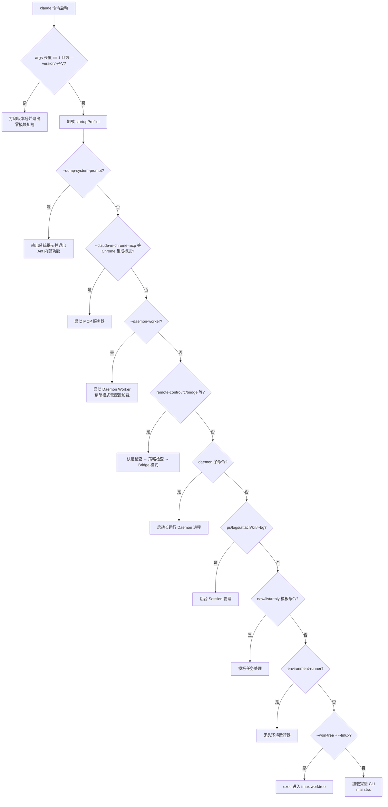

import DifficultyBadge from '@site/src/components/DifficultyBadge';
import SourceRef from '@site/src/components/SourceRef';
import ArticleComplete from '@site/src/components/ArticleComplete';

# CLI 入口：entrypoints/cli.tsx 解析

<DifficultyBadge level="进阶" />

`entrypoints/cli.tsx` 是整个 Claude Code 应用的第一道门，所有来自终端的调用都从这里进入。这个文件只有 302 行，但它的设计极其精妙——它的核心理念是**尽可能少地加载代码**，只在必要时才引入重量级模块。

## 文件的整体定位

在 Claude Code 的架构中，`entrypoints/cli.tsx` 处于最顶层的入口位置：

```
用户输入 claude 命令
       ↓
entrypoints/cli.tsx   ← 你现在在这里
       ↓
main.tsx（完整应用初始化）
       ↓
React/Ink TUI 渲染
       ↓
query.ts 核心循环
```

从文件顶部的注释可以看出这个设计意图：

```typescript
/**
 * Bootstrap entrypoint - checks for special flags before loading the full CLI.
 * All imports are dynamic to minimize module evaluation for fast paths.
 * Fast-path for --version has zero imports beyond this file.
 *
 * 引导入口 - 在加载完整 CLI 之前检查特殊标志。
 * 所有 import 都是动态的，以减少快速路径的模块加载。
 * --version 的快速路径除本文件外零模块加载。
 */
async function main(): Promise<void> {
  const args = process.argv.slice(2);
  // ...
}
```

这里揭示了一个关键设计决策：**文件内所有的 import 都是动态的（dynamic import）**，没有任何顶层静态 import 语句（除了一个 feature flag 导入）。这意味着只有实际需要走某条路径时，对应的模块才会被加载。

## 顶层副作用：环境预处理

在 `main()` 函数之前，有几段顶层代码会在模块评估时立即执行：

```typescript
// 修复 corepack 自动固定版本的 bug
process.env.COREPACK_ENABLE_AUTO_PIN = '0';

// 在 CCR（容器环境）中设置最大堆内存为 8GB
if (process.env.CLAUDE_CODE_REMOTE === 'true') {
  const existing = process.env.NODE_OPTIONS || '';
  process.env.NODE_OPTIONS = existing
    ? `${existing} --max-old-space-size=8192`
    : '--max-old-space-size=8192';
}

// 消融基线实验（Anthropic 内部研究用）
if (feature('ABLATION_BASELINE') && process.env.CLAUDE_CODE_ABLATION_BASELINE) {
  for (const k of ['CLAUDE_CODE_SIMPLE', 'CLAUDE_CODE_DISABLE_THINKING', ...]) {
    process.env[k] ??= '1'; // 仅在未设置时才赋值
  }
}
```

这些代码必须在任何模块被加载之前执行，因为某些工具（如 `BashTool`）会在 import 时就将环境变量捕获为模块级常量。

## main() 函数的决策树结构

`main()` 函数的核心是一个**级联的 if-else 链**，每个分支对应一种命令类型，匹配后立即处理并 `return`，不会继续往下走。

以下是整个决策树的结构：



## 关键路径详解

### 1. --version 的极简路径

```typescript
// 快速路径：--version/-v/-V 完全不需要加载任何模块
if (args.length === 1 && (args[0] === '--version' || args[0] === '-v' || args[0] === '-V')) {
  // MACRO.VERSION 在构建时内联（不是运行时查询）
  console.log(`${MACRO.VERSION} (Claude Code)`);
  return; // 直接返回，函数结束
}
```

注意 `MACRO.VERSION` 是构建时内联的宏，类似 C 语言的 `#define`，版本号在编译时就已经被替换进了字节码，因此连读取 `package.json` 都不需要。

### 2. Daemon Worker 的精简路径

```typescript
// 精简路径：daemon worker 不需要配置加载，保持精简
if (feature('DAEMON') && args[0] === '--daemon-worker') {
  const { runDaemonWorker } = await import('../daemon/workerRegistry.js');
  await runDaemonWorker(args[1]); // args[1] 是 worker 类型
  return;
}
```

注意这里没有调用 `enableConfigs()`，没有初始化分析 sinks——因为 daemon worker 需要尽可能精简，由 supervisor 进程频繁派生。

### 3. Bridge 模式的认证检查链

```typescript
if (feature('BRIDGE_MODE') && (args[0] === 'remote-control' || ...)) {
  enableConfigs();  // 需要读取配置

  // 认证检查必须在 GrowthBook 功能门控之前
  // 原因：没有认证，GrowthBook 无法获取用户上下文，会返回陈旧的默认值
  const { getClaudeAIOAuthTokens } = await import('../utils/auth.js');
  if (!getClaudeAIOAuthTokens()?.accessToken) {
    exitWithError(BRIDGE_LOGIN_ERROR);
  }

  // 检查功能门控（GrowthBook）
  const disabledReason = await getBridgeDisabledReason();
  if (disabledReason) exitWithError(`Error: ${disabledReason}`);

  // 检查版本兼容性
  const versionError = checkBridgeMinVersion();
  if (versionError) exitWithError(versionError);

  // 检查企业策略
  await waitForPolicyLimitsToLoad();
  if (!isPolicyAllowed('allow_remote_control')) {
    exitWithError("Error: Remote Control is disabled by your organization's policy.");
  }

  await bridgeMain(args.slice(1));
  return;
}
```

这段代码揭示了一个重要的认证顺序：先检查 OAuth Token → 再查 GrowthBook 功能门控 → 再检查版本 → 最后检查策略。

### 4. 加载完整 CLI

当所有特殊路径都不匹配时，才会走到最后的完整 CLI 加载：

```typescript
// 开始捕获早期输入（用户在 CLI 完全加载前可能已经开始打字）
const { startCapturingEarlyInput } = await import('../utils/earlyInput.js');
startCapturingEarlyInput();

profileCheckpoint('cli_before_main_import');

// 动态 import main.tsx（这会触发大量模块的加载）
const { main: cliMain } = await import('../main.js');

profileCheckpoint('cli_after_main_import');
await cliMain();
profileCheckpoint('cli_after_main_complete');
```

`startCapturingEarlyInput()` 是一个有趣的细节——在 main.tsx 加载期间（可能需要数百毫秒），用户可能已经开始输入命令，这些早期输入会被缓存下来，等 UI 渲染完毕后再回放。

## feature() 门控机制

代码中大量使用了 `feature('XXX')` 这样的调用：

```typescript
if (feature('DAEMON') && args[0] === 'daemon') { ... }
if (feature('BG_SESSIONS') && ...) { ... }
if (feature('BRIDGE_MODE') && ...) { ... }
```

`feature()` 是来自 `bun:bundle` 的构建时函数，它在编译期间进行**死代码消除（DCE）**。如果某个功能 flag 被禁用，整个 `if` 块会从编译产物中被完全移除，不会留下任何运行时开销。这就是为什么注释中强调 "feature() must stay inline for build-time dead code elimination"。

## 启动性能分析

文件中有多处 `profileCheckpoint()` 调用：

```typescript
profileCheckpoint('cli_entry');
profileCheckpoint('cli_before_main_import');
profileCheckpoint('cli_after_main_import');
profileCheckpoint('cli_after_main_complete');
```

这些是启动性能分析的打点，Anthropic 工程团队用于测量不同阶段的耗时。通过 `CLAUDE_CODE_STARTUP_PROFILE=1` 环境变量可以启用这个功能（虽然外部版本不一定开放）。

## 和 main.tsx 的关系

`cli.tsx` 与 `main.tsx` 的职责分工非常清晰：

| 文件 | 职责 |
|------|------|
| `cli.tsx` | 命令分发路由，快速路径处理，最小化模块加载 |
| `main.tsx` | 完整应用初始化，Auth/Settings/MCP/Plugin 加载，commander 命令定义，React/Ink UI 启动 |

`cli.tsx` 是"哨兵"，`main.tsx` 才是"城堡"。只有真正需要交互式会话或完整功能时，才会进入 `main.tsx`。

关于 `main.tsx` 的详细分析，请参见[文章11：main.tsx 初始化顺序](./main-init)。

<SourceRef file="source/src/entrypoints/cli.tsx" lines="1-302" />

<ArticleComplete />
