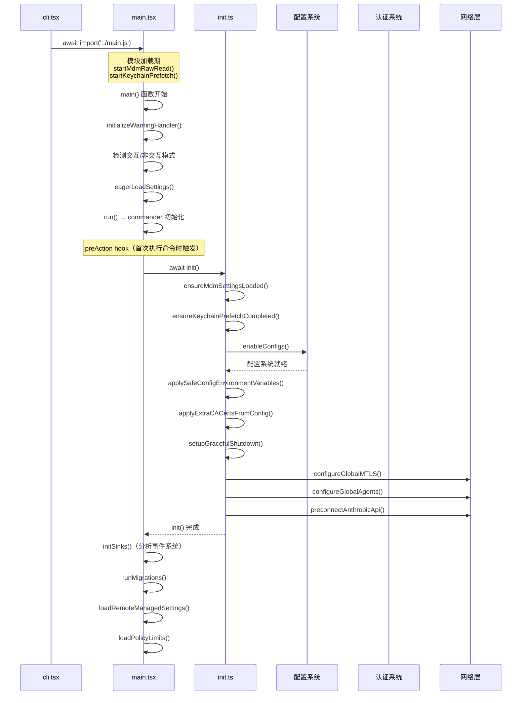

import DifficultyBadge from '@site/src/components/DifficultyBadge';
import SourceRef from '@site/src/components/SourceRef';
import ArticleComplete from '@site/src/components/ArticleComplete';

# main.tsx：Auth、Settings、MCP、插件的初始化顺序

<DifficultyBadge level="进阶" />

当 `cli.tsx` 判定需要启动完整 Claude Code 应用时，它会动态加载 `main.tsx`。这个文件是整个应用的"总指挥"，负责协调所有子系统的初始化。`main.tsx` 的 import 区就有超过 200 行——光是依赖声明就已经足够说明它的复杂度。

本文将带你梳理这个复杂的初始化流程，理解每个组件为什么要在特定的顺序被初始化。

## main.tsx 的整体结构

`main.tsx` 可以分为三个层次：

1. **模块加载期（顶层副作用）**：文件被 import 时立即执行的代码
2. **`init()` 函数**：底层基础设施初始化（在 `entrypoints/init.ts` 中定义）
3. **`main()` / `run()` 函数**：commander 命令注册和应用启动

## 第一层：模块加载期的并发预取

`main.tsx` 顶部有一段特殊的注释，解释了前几行代码为何必须是文件中最早执行的内容：

```typescript
// 这些副作用必须在所有其他 import 之前运行：
// 1. profileCheckpoint 在重量级模块开始评估之前标记入口时间点
// 2. startMdmRawRead 触发 MDM（移动设备管理）子进程，使其与后续 135ms 的 import 并发运行
// 3. startKeychainPrefetch 同时触发两个 macOS Keychain 读取（OAuth + legacy API key）
//    否则这两个读取会在 applySafeConfigEnvironmentVariables() 内部串行执行（约 65ms）
import { profileCheckpoint, profileReport } from './utils/startupProfiler.js';
profileCheckpoint('main_tsx_entry');  // 立即打点，记录进入时间

import { startMdmRawRead } from './utils/settings/mdm/rawRead.js';
startMdmRawRead();  // 触发 MDM 读取（非阻塞）

import { ensureKeychainPrefetchCompleted, startKeychainPrefetch } from './utils/secureStorage/keychainPrefetch.js';
startKeychainPrefetch();  // 触发 Keychain 预取（非阻塞）
```

这是一个精心的并发优化：在 Node.js/Bun 加载后续数百个模块（约需 135ms）的同时，系统调用（MDM 子进程、Keychain 读取）已经在后台并行运行了。当最终需要这些数据时，它们往往已经就绪。

## 第二层：init() 函数的初始化序列

`init()` 函数（定义在 `entrypoints/init.ts`）是用 `memoize` 包装的——这意味着它只会执行一次，无论被调用多少次。

```typescript
// init() 用 memoize 保证幂等性
export const init = memoize(async (): Promise<void> => {
  // 初始化序列...
})
```

### 初始化顺序的关键性

`init()` 内部的操作顺序经过仔细设计，每一步都依赖前一步的结果：



### 为什么 Keychain 必须在 Settings 之前？

```typescript
// preAction hook 中，等待预取完成
await Promise.all([ensureMdmSettingsLoaded(), ensureKeychainPrefetchCompleted()]);
await init();
```

`ensureKeychainPrefetchCompleted()` 必须在 `init()` 之前完成，因为 `init()` 会调用 `applySafeConfigEnvironmentVariables()`，而这个函数内部会调用 `isRemoteManagedSettingsEligible()`，后者会触发同步的 Keychain 读取（约 65ms）。如果 Keychain 预取已经完成，这个同步读取就是免费的——只是读取已缓存的结果。

## 第三层：run() 函数与 commander 命令树

在 `main()` 函数的尾部，`run()` 被调用来构建 commander 命令树：

```typescript
export async function main() {
  profileCheckpoint('main_function_start');

  // Windows 安全：防止从当前目录执行命令（PATH 劫持攻击）
  process.env.NoDefaultCurrentDirectoryInExePath = '1';

  initializeWarningHandler();
  // ...

  // 提前解析 settings 标志
  eagerLoadSettings();
  profileCheckpoint('main_before_run');
  await run();
}
```

`run()` 函数创建了一个 `CommanderCommand` 实例，并通过链式调用注册了所有的命令和选项：

```typescript
async function run(): Promise<CommanderCommand> {
  const program = new CommanderCommand()
    .configureHelp(createSortedHelpConfig())
    .enablePositionalOptions();

  // preAction hook：每次执行命令前触发
  program.hook('preAction', async thisCommand => {
    await Promise.all([ensureMdmSettingsLoaded(), ensureKeychainPrefetchCompleted()]);
    await init();            // 基础设施初始化
    initSinks();             // 分析事件系统
    runMigrations();         // 数据迁移
    void loadRemoteManagedSettings();  // 企业远程设置（非阻塞）
    void loadPolicyLimits();           // 策略限制（非阻塞）
  });

  // 注册主命令及所有选项（约 50+ 个选项）
  program
    .name('claude')
    .description('Claude Code - ...')
    .argument('[prompt]', 'Your prompt', String)
    .option('-p, --print', '...')
    .option('--model <model>', '...')
    // ...（50+ 个选项）
```

### preAction Hook 的设计意图

`preAction` hook 是一个关键设计：

```typescript
// 使用 preAction hook 在执行命令时运行初始化，而不是在显示帮助时
// 这避免了使用环境变量信号的需要
program.hook('preAction', async thisCommand => {
  // ...
});
```

这个设计确保了：
- 运行 `claude --help` 时**不会**触发 init，速度更快
- 运行任何实际命令时，init 会在命令执行前自动触发
- init 的幂等性（memoize）保证即使 hook 被多次触发也不会重复初始化

## Auth 认证的初始化时机

认证（Auth）不是在 `init()` 里初始化的，而是**延迟到需要时按需加载**。这与 Settings 的提前加载形成鲜明对比：

```typescript
// Settings 在 init() 中提前加载（startup profiling 显示这很快）
enableConfigs();  // 读取并验证所有配置文件

// Auth 在需要时按需获取（如 bridge 模式）
const { getClaudeAIOAuthTokens } = await import('../utils/auth.js');
if (!getClaudeAIOAuthTokens()?.accessToken) { ... }
```

在完整的交互式 REPL 路径中，Auth 的实际验证发生在第一次 API 调用时——用户完全可以在不验证认证的情况下先打开 Claude Code，Auth 错误只在真正需要调用 API 时才会出现。

当然，`startKeychainPrefetch()` 在模块加载期就已经开始从 Keychain 中预取 OAuth Token，所以当 Auth 最终被需要时，Token 通常已经可用。

## MCP 服务器的初始化

MCP（Model Context Protocol）服务器的连接不在 `init()` 中发生，而是更晚的阶段——在 REPL（交互式命令行界面）启动后：

```typescript
// MCP 在 main.tsx 的 setup() 阶段按需加载
const mcpConfig = getMcpServerConfig();
if (mcpConfig.servers.length > 0) {
  void getMcpToolsCommandsAndResources(/* ... */);
}
```

MCP 初始化被延迟的原因是：
1. MCP 服务器可能需要较长时间才能响应（网络延迟、服务器冷启动）
2. 用户不应该因为 MCP 连接而感受到 Claude Code 启动变慢
3. MCP 工具在第一次交互时才真正需要，不是启动时

## 插件（Plugin）的加载

插件加载采用了两阶段策略：

```typescript
// 第一阶段：启动时只读缓存（非阻塞）
void loadAllPluginsCacheOnly().then(({ enabled, errors }) => {
  // 仅用于遥测上报，不阻塞主流程
  logPluginsEnabledForSession(enabled, managedNames, getPluginSeedDirs());
  logPluginLoadErrors(errors, managedNames);
});

// 第二阶段：完整加载（在需要时）
const plugins = await initializeVersionedPlugins();
```

注意这里的 `void` 关键字——它明确表示这是一个"发射后忘记（fire and forget）"的操作，不会阻塞主流程。

## startDeferredPrefetches()：渲染后的后台预取

`main.tsx` 导出了一个特殊函数，在第一次 UI 渲染**之后**才被调用：

```typescript
export function startDeferredPrefetches(): void {
  // 这些操作在首次渲染后运行，不阻塞初始绘制
  // 但它们的子进程和异步工作仍然与 CPU 竞争
  if (isBareMode()) return; // --bare 模式跳过所有预取

  // 进程派生型预取（用户还在打字，这些在后台运行）
  void initUser();               // 用户信息（订阅状态等）
  void getUserContext();         // CLAUDE.md 内容
  prefetchSystemContextIfSafe(); // Git status（安全后才运行）
  void getRelevantTips();        // 提示/技巧

  // 分析和功能开关初始化
  void initializeAnalyticsGates();
  void prefetchOfficialMcpUrls();
  void refreshModelCapabilities();

  // 文件变更检测器（用于热更新 settings 和 skills）
  void settingsChangeDetector.initialize();
  void skillChangeDetector.initialize();
}
```

这个设计的巧妙之处在于：用户看到 UI 出现的瞬间，后台已经在悄悄地准备他的第一个请求所需的所有上下文了。

## 数据迁移

每次 Claude Code 启动时，`runMigrations()` 会检查是否需要执行数据迁移：

```typescript
const CURRENT_MIGRATION_VERSION = 11; // 当前迁移版本

function runMigrations(): void {
  if (getGlobalConfig().migrationVersion !== CURRENT_MIGRATION_VERSION) {
    migrateAutoUpdatesToSettings();          // 迁移自动更新设置
    migrateBypassPermissionsAcceptedToSettings(); // 迁移权限设置
    migrateSonnet1mToSonnet45();             // 模型名称迁移
    migrateLegacyOpusToCurrent();            // Opus 版本迁移
    migrateSonnet45ToSonnet46();             // Sonnet 版本迁移
    // ...更多迁移...

    // 保存新版本号（只有在版本号还是旧的情况下才更新，保证幂等性）
    saveGlobalConfig(prev =>
      prev.migrationVersion === CURRENT_MIGRATION_VERSION
        ? prev
        : { ...prev, migrationVersion: CURRENT_MIGRATION_VERSION }
    );
  }
}
```

迁移的主要工作是模型名称升级（当旧模型被弃用时，用户配置中的旧名称需要自动替换为新名称）。

## 初始化顺序总结

将所有层次汇总，Claude Code 完整的初始化时序如下：

| 阶段 | 时机 | 内容 |
|------|------|------|
| 模块加载期 | import main.tsx 时 | MDM 预取、Keychain 预取、性能打点 |
| main() 开始 | 立即 | 警告处理器、SIGINT 处理、早期输入捕获 |
| eagerLoadSettings() | 立即 | 提前解析 --settings 标志 |
| preAction hook | 首次命令执行前 | MDM/Keychain 等待、init()、sinks、迁移 |
| init() | preAction 中 | 配置、环境变量、网络层（mTLS/代理）、API 预连接 |
| commander 解析 | 命令执行时 | 解析用户输入的所有标志和参数 |
| setup() / REPL | 交互会话开始 | Auth 验证、MCP 连接、工具加载 |
| startDeferredPrefetches() | 首次渲染后 | 用户信息、Git status、CLAUDE.md、功能开关 |

这种分层、并发、延迟加载的设计，让 Claude Code 在功能丰富的同时保持了较快的启动速度。

<SourceRef file="source/src/main.tsx" lines="1-856" />
<SourceRef file="source/src/entrypoints/init.ts" lines="57-238" />

<ArticleComplete />
