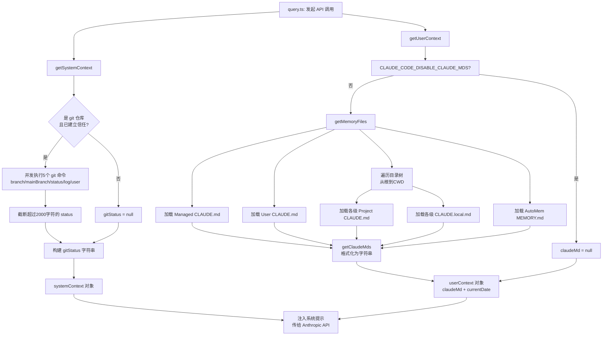

import DifficultyBadge from '@site/src/components/DifficultyBadge';
import SourceRef from '@site/src/components/SourceRef';
import ArticleComplete from '@site/src/components/ArticleComplete';

# 系统提示是怎么注入的：context.ts 详解

<DifficultyBadge level="深度" />

每次你和 Claude Code 对话，Claude 都能"知道"你的工作目录、当前 git 状态、你的自定义指令（CLAUDE.md）和今天的日期。这些信息是如何被收集、格式化、注入到对话中的？本文将深入解析 `context.ts` 和 `utils/claudemd.ts` 的工作原理。

## 系统上下文的两种类型

`context.ts` 导出了两个核心函数，它们共同构建了 Claude 在每次对话中所能看到的上下文：

```typescript
// 系统上下文：与用户无关的环境信息（git status 等）
export const getSystemContext = memoize(
  async (): Promise<{ [k: string]: string }> => { ... }
)

// 用户上下文：用户自定义的指令和动态信息（CLAUDE.md、当前日期等）
export const getUserContext = memoize(
  async (): Promise<{ [k: string]: string }> => { ... }
)
```

两个函数都用了 `lodash-es/memoize` 包装，这意味着它们在一次会话中只会实际执行一次，后续调用直接返回缓存结果。

## getSystemContext()：收集系统级信息

### Git 状态收集

系统上下文的核心是 git 状态。当 Claude 看到你的代码仓库时，它能知道：

```typescript
export const getGitStatus = memoize(async (): Promise<string | null> => {
  const isGit = await getIsGit();
  if (!isGit) return null; // 不是 git 仓库，跳过

  // 并发执行所有 git 命令，提高性能
  const [branch, mainBranch, status, log, userName] = await Promise.all([
    getBranch(),           // 当前分支名
    getDefaultBranch(),    // 主分支名（用于 PR）
    execFileNoThrow(gitExe(), ['--no-optional-locks', 'status', '--short'], ...)
      .then(({ stdout }) => stdout.trim()),  // 文件变更状态
    execFileNoThrow(gitExe(), ['--no-optional-locks', 'log', '--oneline', '-n', '5'], ...)
      .then(({ stdout }) => stdout.trim()),  // 最近 5 条提交
    execFileNoThrow(gitExe(), ['config', 'user.name'], ...)
      .then(({ stdout }) => stdout.trim()),  // git 用户名
  ]);

  // 状态超过 2000 字符时截断（防止 token 爆炸）
  const truncatedStatus = status.length > MAX_STATUS_CHARS
    ? status.substring(0, MAX_STATUS_CHARS) + '\n... (truncated...)'
    : status;

  // 构建最终的 git 状态字符串
  return [
    `This is the git status at the start of the conversation. Note that this status is a snapshot in time, and will not update during the conversation.`,
    `Current branch: ${branch}`,
    `Main branch (you will usually use this for PRs): ${mainBranch}`,
    ...(userName ? [`Git user: ${userName}`] : []),
    `Status:\n${truncatedStatus || '(clean)'}`,
    `Recent commits:\n${log}`,
  ].join('\n\n');
});
```

注意几个设计细节：

1. **`--no-optional-locks`**：防止 git status 获取 `index.lock` 文件，避免和并发 git 操作冲突
2. **并发执行**：5 个 git 命令通过 `Promise.all` 并发运行，总耗时取决于最慢的那个
3. **字符截断**：2000 字符的上限防止大型仓库的 git status 消耗过多 token
4. **快照注释**：明确告诉 Claude 这是会话开始时的快照，不会实时更新

### 系统上下文何时跳过 Git 状态？

```typescript
export const getSystemContext = memoize(async () => {
  // 两种情况跳过 git status：
  // 1. CCR（云端运行）环境：resume 时重新收集 git status 是不必要的开销
  // 2. git 指令被禁用（通过 settings 配置）
  const gitStatus =
    isEnvTruthy(process.env.CLAUDE_CODE_REMOTE) ||
    !shouldIncludeGitInstructions()
      ? null
      : await getGitStatus();

  return {
    ...(gitStatus && { gitStatus }),
    // 缓存破坏注入（仅 Anthropic 内部功能）
    ...(feature('BREAK_CACHE_COMMAND') && injection
      ? { cacheBreaker: `[CACHE_BREAKER: ${injection}]` }
      : {}),
  };
});
```

### 安全考虑：信任建立后才收集

在 `main.tsx` 中有一个重要的安全机制：

```typescript
function prefetchSystemContextIfSafe(): void {
  const isNonInteractiveSession = getIsNonInteractiveSession();

  // 非交互模式（-p/--print）：跳过信任对话，直接收集
  if (isNonInteractiveSession) {
    void getSystemContext();
    return;
  }

  // 交互模式：只有用户接受信任对话后才收集 git status
  const hasTrust = checkHasTrustDialogAccepted();
  if (hasTrust) {
    void getSystemContext(); // 安全，可以收集
  }
  // 否则等待信任建立后再收集
}
```

为什么需要这个检查？因为 **git 命令可能执行任意代码**。`core.fsmonitor`、`diff.external`、`.gitattributes` 中的 filter 驱动等 git hook 都可以被项目的 `.gitconfig` 触发。在用户明确信任某个工作目录之前，不应该为它执行 git 命令。

## getUserContext()：收集用户自定义信息

用户上下文包含两类信息：

```typescript
export const getUserContext = memoize(async () => {
  // 判断是否应该禁用 CLAUDE.md 读取
  const shouldDisableClaudeMd =
    isEnvTruthy(process.env.CLAUDE_CODE_DISABLE_CLAUDE_MDS) ||
    (isBareMode() && getAdditionalDirectoriesForClaudeMd().length === 0);

  // 读取所有相关的 CLAUDE.md 文件（可能触发大量文件系统操作）
  const claudeMd = shouldDisableClaudeMd
    ? null
    : getClaudeMds(filterInjectedMemoryFiles(await getMemoryFiles()));

  // 缓存 CLAUDE.md 内容（auto-mode 分类器需要访问这个）
  setCachedClaudeMdContent(claudeMd || null);

  return {
    ...(claudeMd && { claudeMd }),
    currentDate: `Today's date is ${getLocalISODate()}.`, // 总是注入当前日期
  };
});
```

## CLAUDE.md 的加载机制：claudemd.ts 深度解析

CLAUDE.md 的读取是整个上下文系统中最复杂的部分，由 `utils/claudemd.ts` 实现。

### 文件类型与优先级

`claudemd.ts` 顶部的注释精确描述了文件加载顺序：

```
文件加载顺序（从低优先级到高优先级）：

1. Managed（托管内存）  /etc/claude-code/CLAUDE.md
   ↓ 企业管理员设置的全局指令，所有用户共享

2. User（用户内存）     ~/.claude/CLAUDE.md
   ↓ 用户的私有全局指令，适用于所有项目

3. Project（项目内存）  ./CLAUDE.md 或 ./.claude/CLAUDE.md
   ↓ 检入代码库的项目指令，从根目录到当前目录逐级加载

4. Local（本地内存）    ./CLAUDE.local.md
   ↓ 用户私有的项目指令，通常 gitignore
```

**越晚加载的文件优先级越高**——Claude 会更关注后面的指令。这意味着项目级的 CLAUDE.md 会覆盖用户级的通用设置。

### getMemoryFiles()：目录遍历的核心逻辑

```typescript
export const getMemoryFiles = memoize(
  async (forceIncludeExternal = false): Promise<MemoryFileInfo[]> => {
    const result: MemoryFileInfo[] = [];
    const processedPaths = new Set<string>(); // 防止重复处理

    // 1. 加载 Managed 内存（企业策略）
    result.push(...await processMemoryFile(managedClaudeMd, 'Managed', ...));

    // 2. 加载 User 内存（如果 userSettings 未被禁用）
    if (isSettingSourceEnabled('userSettings')) {
      result.push(...await processMemoryFile(userClaudeMd, 'User', ...));
    }

    // 3. 从根目录向下遍历到 CWD，收集所有 Project 和 Local 内存
    const dirs: string[] = [];
    let currentDir = getOriginalCwd();

    // 向上收集所有父目录
    while (currentDir !== parse(currentDir).root) {
      dirs.push(currentDir);
      currentDir = dirname(currentDir);
    }

    // 从根目录向下遍历（反转），确保父目录先于子目录加载
    for (const dir of dirs.reverse()) {
      // Project: CLAUDE.md
      if (isSettingSourceEnabled('projectSettings') && !skipProject) {
        result.push(...await processMemoryFile(join(dir, 'CLAUDE.md'), 'Project', ...));
        result.push(...await processMemoryFile(join(dir, '.claude', 'CLAUDE.md'), 'Project', ...));
        result.push(...await processMdRules({ rulesDir: join(dir, '.claude', 'rules'), ... }));
      }

      // Local: CLAUDE.local.md
      if (isSettingSourceEnabled('localSettings')) {
        result.push(...await processMemoryFile(join(dir, 'CLAUDE.local.md'), 'Local', ...));
      }
    }

    // 4. AutoMem（自动内存，Claude 自己维护的记忆）
    if (isAutoMemoryEnabled()) {
      result.push(await safelyReadMemoryFileAsync(getAutoMemEntrypoint(), 'AutoMem'));
    }

    return result;
  }
);
```

这里有一个精妙的遍历设计：从 CWD **向上**收集所有父目录路径，然后**反转**后从根向下处理。这样确保了"离 CWD 越近的文件越晚加载，优先级越高"。

### @include 指令的递归解析

CLAUDE.md 文件支持 `@path` 语法来包含其他文件：

```markdown
# 我的项目规范

@./coding-standards.md
@./api-conventions.md
```

这个功能由 `extractIncludePathsFromTokens()` 实现，使用 `marked` 库进行 Markdown 词法分析：

```typescript
function extractIncludePathsFromTokens(tokens, basePath): string[] {
  const absolutePaths = new Set<string>();

  function extractPathsFromText(textContent: string) {
    // 匹配 @path 语法（支持空格转义）
    const includeRegex = /(?:^|\s)@((?:[^\s\\]|\\ )+)/g;
    while ((match = includeRegex.exec(textContent)) !== null) {
      let path = match[1];

      // 支持 @./relative, @~/home, @/absolute 格式
      if (isValidPath(path)) {
        const resolvedPath = expandPath(path, dirname(basePath));
        absolutePaths.add(resolvedPath);
      }
    }
  }

  function processElements(elements) {
    for (const element of elements) {
      // 跳过代码块中的 @path（防止误匹配）
      if (element.type === 'code' || element.type === 'codespan') continue;
      if (element.type === 'text') extractPathsFromText(element.text || '');
      if (element.tokens) processElements(element.tokens);
    }
  }

  processElements(tokens);
  return [...absolutePaths];
}
```

注意：代码块（`code` 和 `codespan`）中的 `@path` 会被跳过，防止示例代码中的路径被误解析为 include 指令。最大嵌套深度为 5（`MAX_INCLUDE_DEPTH = 5`），防止循环引用导致无限递归。

### getClaudeMds()：格式化为系统提示

收集到所有内存文件后，`getClaudeMds()` 将它们格式化为最终的系统提示字符串：

```typescript
const MEMORY_INSTRUCTION_PROMPT =
  'Codebase and user instructions are shown below. Be sure to adhere to these instructions. IMPORTANT: These instructions OVERRIDE any default behavior and you MUST follow them exactly as written.'

export const getClaudeMds = (memoryFiles: MemoryFileInfo[]): string => {
  const memories: string[] = [];

  for (const file of memoryFiles) {
    if (file.content) {
      // 不同类型的文件有不同的描述标签
      const description =
        file.type === 'Project'
          ? ' (project instructions, checked into the codebase)'
          : file.type === 'Local'
            ? " (user's private project instructions, not checked in)"
            : file.type === 'AutoMem'
              ? " (user's auto-memory, persists across conversations)"
              : " (user's private global instructions for all projects)";

      // 每个文件都带有路径和类型描述
      memories.push(`Contents of ${file.path}${description}:\n\n${file.content.trim()}`);
    }
  }

  if (memories.length === 0) return '';

  // 最终格式：指令前言 + 所有文件内容
  return `${MEMORY_INSTRUCTION_PROMPT}\n\n${memories.join('\n\n')}`;
};
```

最终的 `claudeMd` 字段看起来像：

```
Codebase and user instructions are shown below. Be sure to adhere to these instructions. IMPORTANT: These instructions OVERRIDE any default behavior and you MUST follow them exactly as written.

Contents of /Users/alice/.claude/CLAUDE.md (user's private global instructions for all projects):

请用中文回复...

Contents of /Users/alice/project/CLAUDE.md (project instructions, checked into the codebase):

# Project Guidelines
...
```

## 系统提示的完整构建流程

将所有部分结合起来，系统提示的构建流程如下：



## 缓存机制与缓存失效

`getSystemContext` 和 `getUserContext` 都是用 `memoize` 缓存的，但缓存可以被主动清除：

```typescript
export function setSystemPromptInjection(value: string | null): void {
  systemPromptInjection = value;
  // 注入变化时立即清除两个缓存
  getUserContext.cache.clear?.();
  getSystemContext.cache.clear?.();
}
```

`getMemoryFiles` 也有专门的缓存管理函数：

```typescript
// 仅清除缓存（不触发 InstructionsLoaded hook）
export function clearMemoryFileCaches(): void {
  getMemoryFiles.cache?.clear?.();
}

// 清除缓存并允许触发 InstructionsLoaded hook（用于 /compact 等场景）
export function resetGetMemoryFilesCache(
  reason: InstructionsLoadReason = 'session_start',
): void {
  nextEagerLoadReason = reason;
  shouldFireHook = true;
  clearMemoryFileCaches();
}
```

这两个函数的区别很微妙：`clearMemoryFileCaches()` 只是让下次调用重新读取文件；而 `resetGetMemoryFilesCache()` 还会在下次读取后触发 `InstructionsLoaded` hook，通知外部系统"指令已被重新加载"（例如在 context compact 之后）。

## HTML 注释的特殊处理

`parseMemoryFileContent()` 会在词法分析时剥离 Markdown 文件中的 HTML 注释：

```typescript
function stripHtmlComments(content: string): { content: string; stripped: boolean } {
  if (!content.includes('<!--')) return { content, stripped: false };
  return stripHtmlCommentsFromTokens(new Lexer({ gfm: false }).lex(content));
}
```

这允许 CLAUDE.md 的作者用 HTML 注释写"给自己看"的注释，这些注释不会被发送给 Claude：

```markdown
<!-- 这段注释只有人类维护者能看到，不会进入系统提示 -->
# 项目规范

请用 TypeScript 严格模式...
```

这是一个贴心的设计——让 CLAUDE.md 既能作为机器指令，也能作为人类可读的文档。

## 性能优化：预取策略

在 `main.tsx` 的 `startDeferredPrefetches()` 中，系统在用户还在阅读 UI 的时候就开始预取上下文：

```typescript
export function startDeferredPrefetches(): void {
  // 用户第一个请求之前，这些数据已经在后台准备好了
  void getUserContext();          // 开始读取所有 CLAUDE.md 文件
  prefetchSystemContextIfSafe();  // 开始收集 git status（安全时才运行）
}
```

由于 `memoize` 的缓存特性，即使 `getUserContext()` 和 `getSystemContext()` 在多处被调用，实际的文件系统操作只会发生一次。预取确保了当 `query.ts` 真正需要上下文时，数据已经就绪，不会阻塞第一次 API 调用。

## 总结

`context.ts` 和 `claudemd.ts` 共同实现了一个精心设计的上下文收集系统：

| 特性 | 实现方式 |
|------|----------|
| 高性能 | memoize 缓存 + 并发 git 命令 + 启动时预取 |
| 安全 | 信任建立后才收集 git status |
| 灵活 | 多层次 CLAUDE.md（企业/用户/项目/本地）|
| 可扩展 | @include 指令支持文件组合 |
| 可维护 | HTML 注释过滤让指令文件兼作文档 |

每次你发出一个请求，Claude 收到的第一批信息就包含了这个系统精心收集的上下文——这正是 Claude Code "了解你的项目"的秘密所在。

<SourceRef file="source/src/context.ts" lines="1-190" />
<SourceRef file="source/src/utils/claudemd.ts" lines="1-1195" />

<ArticleComplete />
