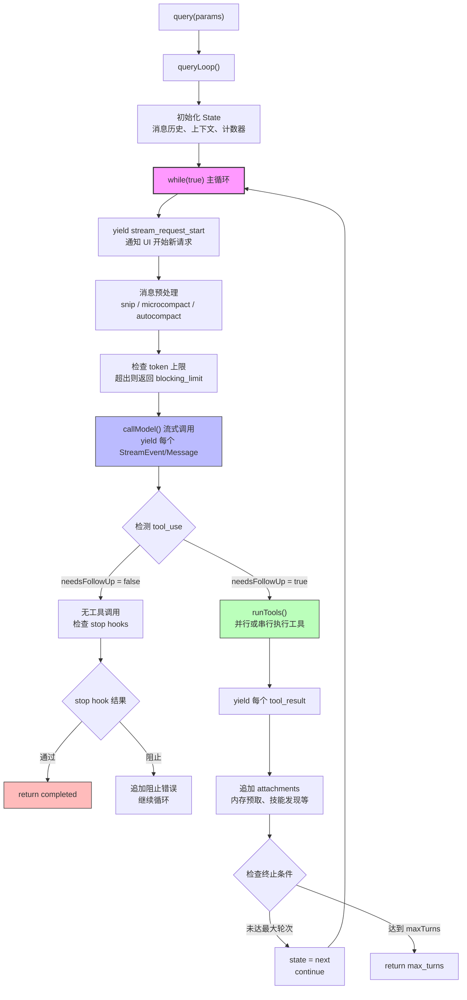

import DifficultyBadge from '@site/src/components/DifficultyBadge';
import SourceRef from '@site/src/components/SourceRef';
import ArticleComplete from '@site/src/components/ArticleComplete';

# query.ts 总览：一个生成器函数驱动一切

<DifficultyBadge level="进阶" />

如果说 Claude Code 是一台机器，那 `query.ts` 就是它的发动机。整个 AI↔工具交互循环——从接收用户输入、调用 Claude API、执行工具，到把结果反馈给 Claude 继续思考——都运行在这一个文件的 1729 行代码里。

理解 `query.ts`，就是理解 Claude Code 如何"思考和行动"的全部秘密。

## 为什么选择 JavaScript 生成器函数？

`query.ts` 的核心导出是一个**异步生成器函数**（Async Generator Function）：

```typescript
// source/src/query.ts，第 219 行
export async function* query(
  params: QueryParams,
): AsyncGenerator<
  | StreamEvent       // 流式事件（token 流）
  | RequestStartEvent // 请求开始事件
  | Message           // 完整消息（assistant/user/system）
  | TombstoneMessage  // 废弃消息标记
  | ToolUseSummaryMessage, // 工具使用摘要
  Terminal  // 返回值：循环终止原因
> {
  const consumedCommandUuids: string[] = []
  const terminal = yield* queryLoop(params, consumedCommandUuids)
  // 完成后通知命令生命周期
  for (const uuid of consumedCommandUuids) {
    notifyCommandLifecycle(uuid, 'completed')
  }
  return terminal
}
```

这个设计有三个核心优势：

**1. 逐步推送（Push-based Streaming）**

生成器函数用 `yield` 逐条推送消息，调用方无需等待整个 AI 响应完成就能处理数据。这让 UI 层可以实时展示 token 流，极大提升用户体验。

**2. 外部可控的迭代**

生成器把"产生值"和"消费值"解耦。UI 层（`useQuery` hook）消费每个 yield 出来的消息并立即渲染，而生成器内部继续运行下一轮工具调用和 API 请求——两者并不互相阻塞。

**3. 自然的资源清理语义**

当用户按下 Ctrl+C 时，生成器会收到 `.return()` 调用，通过 `using` 语句自动触发资源清理（内存预取、AbortController 等）。这在普通 async 函数里很难干净地实现。

## QueryParams：查询循环的完整输入

```typescript
// source/src/query.ts，第 181 行
export type QueryParams = {
  messages: Message[]           // 已有对话历史
  systemPrompt: SystemPrompt    // 系统提示词
  userContext: { [k: string]: string }   // 用户上下文键值对
  systemContext: { [k: string]: string } // 系统上下文键值对
  canUseTool: CanUseToolFn      // 权限判断函数
  toolUseContext: ToolUseContext // 工具执行上下文（包含工具列表、MCP 等）
  fallbackModel?: string        // 备用模型（主模型不可用时）
  querySource: QuerySource      // 调用来源标识（repl/sdk/agent 等）
  maxOutputTokensOverride?: number // 输出 token 限制覆盖
  maxTurns?: number             // 最大轮次限制（防止无限循环）
  skipCacheWrite?: boolean      // 跳过提示缓存写入
  taskBudget?: { total: number } // 任务级 token 预算
  deps?: QueryDeps              // 依赖注入（用于测试）
}
```

`querySource` 是一个关键参数，它标识请求从哪里发起，影响权限判断、日志记录、消息队列处理等行为。常见值包括：
- `repl_main_thread` — 交互式 REPL 主线程
- `agent:xxx` — Agent 工具发起的子代理
- `compact` — 上下文压缩任务
- `sdk` — SDK 直接调用

## 循环状态机：State 对象

查询循环在 `while(true)` 内部维护一个可变状态对象：

```typescript
// source/src/query.ts，第 204 行
type State = {
  messages: Message[]             // 当前对话消息列表（每轮更新）
  toolUseContext: ToolUseContext   // 工具执行上下文
  autoCompactTracking: AutoCompactTrackingState | undefined // 自动压缩追踪
  maxOutputTokensRecoveryCount: number  // 输出 token 恢复尝试次数
  hasAttemptedReactiveCompact: boolean  // 是否已尝试响应式压缩
  maxOutputTokensOverride: number | undefined  // token 上限覆盖值
  pendingToolUseSummary: Promise<ToolUseSummaryMessage | null> | undefined
  stopHookActive: boolean | undefined  // stop hook 是否活跃
  turnCount: number                    // 当前轮次计数
  transition: Continue | undefined     // 上次迭代的继续原因
}
```

每次迭代开始时，循环从 `state` 解构出本轮所需变量；每次循环继续时，通过 `state = { ...next }` 整体替换状态，避免了零散的变量赋值导致的状态不一致问题。

## ReAct 模式：Reasoning + Acting

Claude Code 的查询循环实现了 AI 领域的 **ReAct 范式**（Reasoning + Acting）：

- **Reasoning（推理）**：Claude 接收消息历史，生成包含分析、思考的文本响应
- **Acting（行动）**：当 Claude 的响应包含工具调用（`tool_use` 块）时，系统执行对应工具
- **观察反馈**：工具执行结果作为 `tool_result` 消息追加到历史，触发下一轮推理

这个"推理→行动→观察→推理"的循环不断重复，直到 Claude 认为任务完成（返回 `end_turn`）或达到退出条件。

## 整体架构图

下面是 `query.ts` 查询循环的完整架构：



## query() 与 queryLoop() 的分工

顶层 `query()` 函数只做两件事：
1. 委托给 `queryLoop()` 执行实际循环
2. 循环正常完成后，遍历已消费的命令 UUID，逐一通知命令生命周期系统"已完成"

```typescript
// source/src/query.ts，第 219-239 行
export async function* query(params: QueryParams): ... {
  const consumedCommandUuids: string[] = []

  // yield* 把 queryLoop 的所有 yield 透传给外部
  const terminal = yield* queryLoop(params, consumedCommandUuids)

  // 仅当 queryLoop 正常 return 时执行（throw 或 .return() 会跳过这里）
  for (const uuid of consumedCommandUuids) {
    notifyCommandLifecycle(uuid, 'completed')
  }
  return terminal
}
```

这个分层设计让命令生命周期通知只在正常完成时触发，而在错误或用户中断时自然跳过——符合"started-without-completed"语义。

## Terminal：循环的退出原因

`query()` 的返回值类型 `Terminal` 枚举了所有可能的退出原因：

| 退出原因 | 场景 |
|---------|------|
| `completed` | 正常完成，Claude 返回 `end_turn` |
| `max_turns` | 达到最大轮次限制 |
| `blocking_limit` | 上下文 token 超出阻塞限制 |
| `aborted_streaming` | 流式响应期间用户中断 |
| `aborted_tools` | 工具执行期间用户中断 |
| `model_error` | 模型调用出错 |
| `prompt_too_long` | 提示词过长且无法恢复 |
| `image_error` | 图片处理错误 |
| `stop_hook_prevented` | stop hook 阻止继续执行 |
| `hook_stopped` | 工具钩子停止了后续执行 |

这些返回值让调用方可以根据不同退出原因做不同的 UI 处理——比如在达到最大轮次时显示提示，在模型错误时展示错误信息。

## 依赖注入：QueryDeps

`query()` 接受可选的 `deps` 参数，这是一个经典的依赖注入模式：

```typescript
// source/src/query/deps.ts
export type QueryDeps = {
  callModel: typeof callModelFn   // AI 模型调用（可被 mock）
  autocompact: typeof autocompactFn // 自动压缩（可被 mock）
  microcompact: typeof microcompactFn // 微压缩
  uuid: () => string              // UUID 生成（可被 mock）
}
```

生产环境使用 `productionDeps()`，测试环境可以注入 mock 实现，在不发出真实 API 请求的情况下测试完整的循环逻辑。

## 小结

`query.ts` 的设计哲学：**用一个无限循环驱动一切，用生成器函数解耦生产与消费，用状态对象保持一致性，用清晰的退出原因让上层感知结果。**

下一篇文章将深入 `normalizeMessagesForAPI()`，理解消息在进入 API 调用前经历了哪些格式转换。

<SourceRef file="source/src/query.ts" lines="181-239" />

<ArticleComplete />
