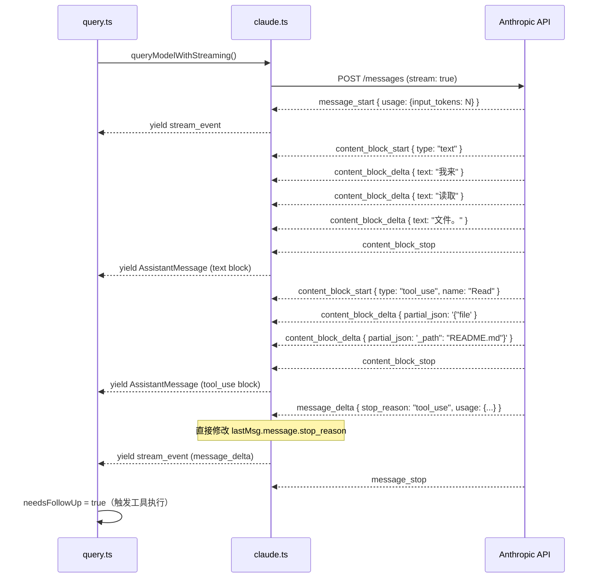

import DifficultyBadge from '@site/src/components/DifficultyBadge';
import SourceRef from '@site/src/components/SourceRef';
import ArticleComplete from '@site/src/components/ArticleComplete';

# 调用 Claude Streaming API 的完整流程

<DifficultyBadge level="深度" />

每次 Claude Code 需要 AI 响应时，都会发起一个流式 API 请求（Streaming API Call）。这个请求不是简单的 HTTP POST——它涉及模型选择、beta 特性协商、工具注入、提示缓存控制、重试逻辑等十多个子系统。本文带你走完这条完整的调用路径。

## 调用入口：query.ts 中的 callModel

在 `queryLoop()` 的主循环中，API 调用通过依赖注入的 `deps.callModel` 发起：

```typescript
// source/src/query.ts，第 659 行
for await (const message of deps.callModel({
  // 消息历史（已经过 normalizeMessagesForAPI 处理）
  messages: prependUserContext(messagesForQuery, userContext),
  systemPrompt: fullSystemPrompt,
  thinkingConfig: toolUseContext.options.thinkingConfig,
  tools: toolUseContext.options.tools,
  signal: toolUseContext.abortController.signal,  // 支持取消
  options: {
    model: currentModel,           // 当前使用的模型
    fallbackModel,                 // 备用模型（主模型不可用时）
    maxOutputTokensOverride,       // token 上限覆盖
    querySource,                   // 请求来源标识
    mcpTools: appState.mcp.tools,  // MCP 工具列表
    taskBudget: params.taskBudget, // 任务级 token 预算
    // ...更多选项
  },
})) {
  // 处理每个流式事件
}
```

`callModel` 在生产环境指向 `queryModelWithStreaming()`（位于 `services/api/claude.ts`），它是实际向 Anthropic API 发出请求的函数。

## API 请求参数的构建

在 `claude.ts` 内部，`queryModelWithStreaming` 调用 `queryModel`，后者负责把所有参数组装成标准的 API 请求体。关键参数包括：

### 模型与输出限制

```typescript
// 动态决定使用的模型
const resolvedModel = normalizeModelStringForAPI(
  options.fallbackModel ?? options.model
)

// 输出 token 上限
const maxOutputTokens = options.maxOutputTokensOverride
  ?? getModelMaxOutputTokens(resolvedModel)
  ?? CAPPED_DEFAULT_MAX_TOKENS  // 默认上限（约 8192）
```

### 工具定义注入

```typescript
// 将内部 Tool 对象转换为 API 期望的 schema 格式
const apiTools: BetaToolUnion[] = tools
  .filter(t => !isDeferredTool(t))  // 过滤掉延迟加载的工具
  .map(t => toolToAPISchema(t))      // 转换为 JSON Schema 格式
```

每个工具的 JSON Schema 描述（名称、参数定义、描述）会随请求发送给 Claude，让它知道可以调用哪些工具以及如何调用。

### Beta 特性协商

Claude Code 使用了多个 beta 特性，通过请求头声明：

```typescript
// source/src/services/api/claude.ts
const betas = getMergedBetas([
  getModelBetas(resolvedModel),    // 模型专属 beta（如 thinking）
  PROMPT_CACHING_SCOPE_BETA_HEADER,  // 提示缓存
  CONTEXT_MANAGEMENT_BETA_HEADER,    // 上下文管理
  getToolSearchBetaHeader(),         // 工具搜索
  // ...
])
```

### 系统提示组装

```typescript
// 系统提示拆分为两个缓存段
const [sysPromptPrefix, sysPromptSuffix] = splitSysPromptPrefix(
  fullSystemPrompt
)

// 前缀（稳定内容，使用 5分钟缓存）
{ type: 'text', text: sysPromptPrefix, cache_control: { type: 'ephemeral' } }
// 后缀（动态内容，使用 1小时缓存或不缓存）
{ type: 'text', text: sysPromptSuffix }
```

提示缓存（Prompt Caching）是减少成本和延迟的关键优化。系统提示通常包含大量稳定内容（工具定义、CLAUDE.md 等），缓存后可复用于同一会话的后续请求。

## 流式响应的处理机制

API 返回的是一个 Server-Sent Events（SSE）流。Claude Code 通过 `@anthropic-ai/sdk` 的流式接口消费这个流：

```typescript
// source/src/services/api/claude.ts（简化）
const stream: Stream<BetaRawMessageStreamEvent> = await client.beta.messages.stream({
  model: resolvedModel,
  messages: apiMessages,
  system: systemBlocks,
  tools: apiTools,
  max_tokens: maxOutputTokens,
  stream: true,
  // ...
})
```

流中的每个事件（`BetaRawMessageStreamEvent`）被逐一处理：

```typescript
for await (const part of stream) {
  switch (part.type) {
    case 'message_start':
      // 初始化消息框架（usage 为 0，stop_reason 为 null）
      partialMessage = initializeMessageFromStart(part)
      break

    case 'content_block_start':
      // 开始一个新的内容块（text/tool_use/thinking 等）
      currentBlock = initBlock(part.content_block)
      break

    case 'content_block_delta':
      // 累积 token（text delta、tool_use input delta 等）
      applyDelta(currentBlock, part.delta)
      break

    case 'content_block_stop':
      // 内容块完成——如果是 tool_use，此时 input JSON 已完整
      finalizeBlock(currentBlock)
      // 构造完整的 AssistantMessage 并 yield 给 query.ts
      yield buildAssistantMessage(partialMessage, finalizedBlocks)
      break

    case 'message_delta':
      // 接收最终的 usage 统计和 stop_reason
      stopReason = part.delta.stop_reason
      // 直接修改已 yield 的消息对象（见注释中关于引用一致性的说明）
      lastMsg.message.usage = usage
      lastMsg.message.stop_reason = stopReason

      if (stopReason === 'max_tokens') {
        yield createAssistantAPIErrorMessage({ apiError: 'max_output_tokens' })
      }
      break
  }
}
```

### 关键实现细节：直接属性修改

注意 `message_delta` 处理中有一个重要设计：

```typescript
// source/src/services/api/claude.ts，第 2236-2248 行
// IMPORTANT: Use direct property mutation, not object replacement.
// The transcript write queue holds a reference to message.message
// and serializes it lazily (100ms flush interval). Object
// replacement ({ ...lastMsg.message, usage }) would disconnect
// the queued reference; direct mutation ensures the transcript
// captures the final values.
lastMsg.message.usage = usage        // 直接修改，而非 { ...msg, usage }
lastMsg.message.stop_reason = stopReason
```

由于消息被异步写入到会话文件（transcript），直接修改引用而非创建新对象，可以确保后台写入队列持有的引用总能看到最终值。

## 流式响应时序图



## 错误处理机制

### 限流（Rate Limit / 529）

```typescript
// source/src/services/api/withRetry.ts
// 对 529（过载）错误自动重试，带指数退避
if (is529Error(error)) {
  await sleep(retryDelayMs)
  continue  // 重试
}
```

Claude Code 用 `withRetry` 包装器自动处理 429（速率限制）和 529（服务过载）错误，使用指数退避策略逐步增大重试间隔。

### 模型降级（Fallback）

```typescript
// source/src/query.ts，第 894-950 行
} catch (innerError) {
  if (innerError instanceof FallbackTriggeredError && fallbackModel) {
    // 主模型不可用时，切换到备用模型重试
    currentModel = fallbackModel
    attemptWithFallback = true

    // 通知用户模型已切换
    yield createSystemMessage(
      `Switched to ${renderModelName(innerError.fallbackModel)} due to high demand`,
      'warning',
    )
    continue
  }
  throw innerError
}
```

当主模型（如 claude-opus-4-5）不可用时，系统会切换到 `fallbackModel` 并通知用户。

### Prompt Too Long（上下文超长）

```typescript
// source/src/services/api/claude.ts（简化）
// API 返回 413 / invalid_request_error 时
yield createAssistantAPIErrorMessage({
  content: PROMPT_TOO_LONG_ERROR_MESSAGE,
  error: 'invalid_request',
})
```

这类错误会被 `query.ts` 的上层逻辑捕获，触发自动压缩（autocompact）或响应式压缩（reactive compact），尝试缩短上下文后重试。

### 超时与连接问题

```typescript
// 流式空闲超时：超过 N 秒没有收到新 token
// 触发后降级到非流式请求（non-streaming fallback）
if (streamIdleAborted) {
  // Fall back to non-streaming retry
}

// 连接超时
} catch (error) {
  if (error instanceof APIConnectionTimeoutError) {
    // 重试
  }
}
```

## 非流式降级路径

Claude Code 在某些情况下会使用非流式 API（`stream: false`）作为降级：

1. 流式连接空闲超时（长时间没有新 token）
2. 特定网络环境不支持 SSE

非流式请求通过 `executeNonStreamingRequest()` 发送，拿到完整的 `BetaMessage` 后再"假装"逐步 yield，保持上层接口一致。

## 提示缓存的工作原理

Claude API 支持对固定内容进行提示缓存，避免重复计算同样的 token。Claude Code 在三个位置插入 `cache_control: { type: 'ephemeral' }` 标记：

1. **系统提示前缀**：工具定义、CLAUDE.md 等稳定内容（5分钟缓存）
2. **工具列表末尾**：所有工具 schema（保持整个工具列表可缓存）
3. **消息历史中的特定位置**：对话历史的固定部分

当相同前缀的内容命中缓存时，API 返回的 `usage.cache_read_input_tokens > 0`，这部分 token 的计费比正常 token 便宜约 90%。

## 完整调用栈回顾

```
query.ts: queryLoop()
  └── deps.callModel()
        └── queryModelWithStreaming()  [claude.ts]
              └── withStreamingVCR()   [vcr.ts — 测试录制/回放]
                    └── queryModel()   [claude.ts]
                          ├── 构建 API 请求参数
                          ├── getAnthropicClient()
                          ├── client.beta.messages.stream()
                          └── for await (part of stream) → yield AssistantMessage
```

每一层都有自己的职责：VCR 层负责测试录制回放，`queryModel` 负责构建参数和处理流，`queryModelWithStreaming` 提供统一的生成器接口。

<SourceRef file="source/src/services/api/claude.ts" lines="752-2304" />
<SourceRef file="source/src/query.ts" lines="650-870" />

<ArticleComplete />
