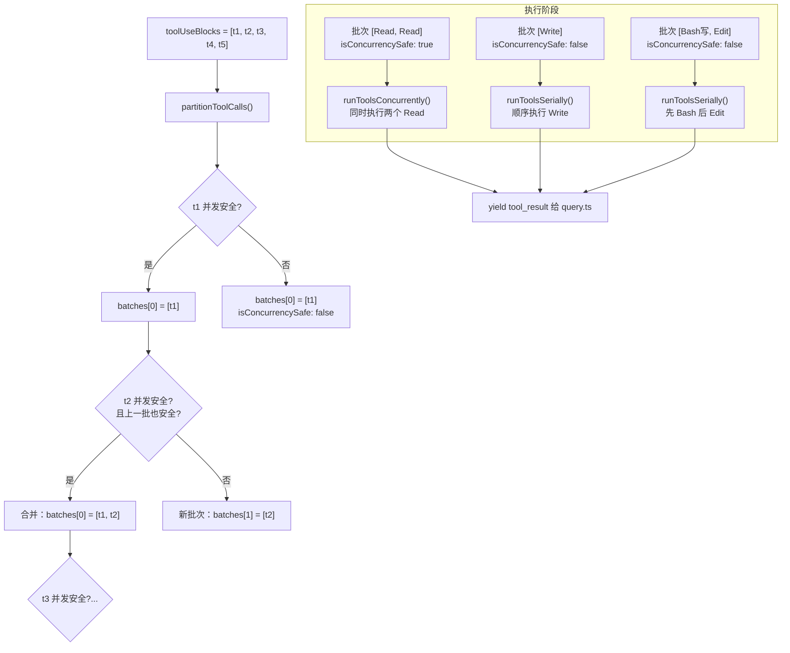

import DifficultyBadge from '@site/src/components/DifficultyBadge';
import SourceRef from '@site/src/components/SourceRef';
import ArticleComplete from '@site/src/components/ArticleComplete';

# runTools()：工具并行与串行的决策逻辑

<DifficultyBadge level="深度" />

当 Claude 在一次响应中请求多个工具时，该如何执行它们？同时并发执行可以节省时间，但并发执行写文件或修改状态的工具可能产生冲突。Claude Code 通过一套精巧的批次划分算法，在安全性和性能之间取得平衡。

## runTools() 的整体设计

`runTools()` 位于 `source/src/services/tools/toolOrchestration.ts`，是工具调度的核心：

```typescript
// source/src/services/tools/toolOrchestration.ts，第 19 行
export async function* runTools(
  toolUseMessages: ToolUseBlock[],     // Claude 请求的所有工具调用
  assistantMessages: AssistantMessage[], // 包含工具调用的 assistant messages
  canUseTool: CanUseToolFn,             // 权限检查函数
  toolUseContext: ToolUseContext,       // 工具执行上下文
): AsyncGenerator<MessageUpdate, void> {
  let currentContext = toolUseContext

  // 第一步：将工具调用列表划分为批次
  for (const { isConcurrencySafe, blocks } of partitionToolCalls(
    toolUseMessages,
    currentContext,
  )) {
    if (isConcurrencySafe) {
      // 批次内全部是只读工具：并发执行
      for await (const update of runToolsConcurrently(blocks, ...)) {
        yield update
      }
    } else {
      // 批次包含写入工具：串行执行
      for await (const update of runToolsSerially(blocks, ...)) {
        yield update
      }
    }
  }
}
```

整个函数是一个异步生成器，逐批处理工具调用，每个工具的执行结果通过 `yield` 实时推送给 `query.ts`。

## partitionToolCalls()：批次划分算法

划分算法的核心目标：**将连续的只读工具合并为可并发的批次，将写入工具单独作为一批串行执行**。

```typescript
// source/src/services/tools/toolOrchestration.ts，第 91 行
function partitionToolCalls(
  toolUseMessages: ToolUseBlock[],
  toolUseContext: ToolUseContext,
): Batch[] {
  return toolUseMessages.reduce((acc: Batch[], toolUse) => {
    const tool = findToolByName(toolUseContext.options.tools, toolUse.name)
    const parsedInput = tool?.inputSchema.safeParse(toolUse.input)

    // 判断此工具是否并发安全
    const isConcurrencySafe = parsedInput?.success
      ? (() => {
          try {
            return Boolean(tool?.isConcurrencySafe(parsedInput.data))
          } catch {
            // 解析失败时保守处理：串行
            return false
          }
        })()
      : false

    // 若当前工具和上一批都是并发安全的，合并入同一批
    if (isConcurrencySafe && acc[acc.length - 1]?.isConcurrencySafe) {
      acc[acc.length - 1]!.blocks.push(toolUse)
    } else {
      // 否则开启新批次
      acc.push({ isConcurrencySafe, blocks: [toolUse] })
    }
    return acc
  }, [])
}
```

### 分批示例

假设 Claude 请求了 5 个工具，按顺序为：`[Read, Read, Bash(写), Write, Read]`：

```
输入：[Read, Read, Bash(写), Write, Read]

划分结果：
  批次 1：[Read, Read]    → isConcurrencySafe: true  → 并发执行
  批次 2：[Bash(写)]      → isConcurrencySafe: false → 串行执行
  批次 3：[Write]         → isConcurrencySafe: false → 串行执行
  批次 4：[Read]          → isConcurrencySafe: true  → 并发执行（只有一个工具，并发与串行等价）
```

注意批次 2 和 3 各自独立，因为 `Bash（写）` 和 `Write` 都不是并发安全的，它们之间也不能合并。

## isConcurrencySafe()：工具声明自己是否安全

每个工具通过实现 `isConcurrencySafe()` 方法来声明自己在给定输入下是否可以并发执行：

```typescript
// source/src/Tool.ts（接口定义）
interface Tool<Input, Output> {
  // ...
  isConcurrencySafe(input: Input): boolean
  // ...
}
```

这是一个基于输入参数的动态判断，同一个工具在不同输入下可能给出不同答案。

### Read 工具：始终并发安全

```typescript
// source/src/tools/ReadTool/ReadTool.ts（示例）
isConcurrencySafe(input: ReadInput): boolean {
  return true  // 读文件不会修改状态，始终安全
}
```

### Bash 工具：根据命令分析

```typescript
// source/src/tools/BashTool/BashTool.ts（简化）
isConcurrencySafe(input: BashInput): boolean {
  // 分析命令是否是只读的
  // 例如：ls, cat, grep 等是只读的；rm, mv, git commit 等不是
  return isReadOnlyBashCommand(input.command)
}
```

### Write/Edit 工具：始终不安全

```typescript
// source/src/tools/WriteTool/WriteTool.ts（示例）
isConcurrencySafe(_input: WriteInput): boolean {
  return false  // 写文件始终不安全（可能冲突）
}
```

## 并发执行：runToolsConcurrently()

```typescript
// source/src/services/tools/toolOrchestration.ts，第 152 行
async function* runToolsConcurrently(
  toolUseMessages: ToolUseBlock[],
  assistantMessages: AssistantMessage[],
  canUseTool: CanUseToolFn,
  toolUseContext: ToolUseContext,
): AsyncGenerator<MessageUpdateLazy, void> {
  // all() 是一个并发执行多个异步生成器的工具函数
  // 最大并发数由 CLAUDE_CODE_MAX_TOOL_USE_CONCURRENCY 环境变量控制（默认 10）
  yield* all(
    toolUseMessages.map(async function* (toolUse) {
      toolUseContext.setInProgressToolUseIDs(prev =>
        new Set(prev).add(toolUse.id),
      )
      yield* runToolUse(
        toolUse,
        // 找到包含这个 tool_use block 的 assistant message
        assistantMessages.find(msg =>
          msg.message.content.some(
            c => c.type === 'tool_use' && c.id === toolUse.id,
          ),
        )!,
        canUseTool,
        toolUseContext,
      )
      markToolUseAsComplete(toolUseContext, toolUse.id)
    }),
    getMaxToolUseConcurrency(),  // 默认 10
  )
}
```

`all()` 函数（`utils/generators.ts`）实现了一个有界并发的生成器合并器：同时运行最多 N 个生成器，任何一个产出值时立即 yield 给消费方。这意味着：
- 10 个 `Read` 工具调用同时发起，哪个先完成就先 yield 其结果
- 消费方（`query.ts`）会实时收到每个工具的结果，而不用等最慢的那个

### 上下文修改的延迟应用

并发执行有一个微妙之处：某些工具执行后需要修改 `toolUseContext`（比如更新文件状态追踪）。如果在并发执行过程中立即应用这些修改，可能导致竞态条件。

`runToolsConcurrently` 的解决方案：

```typescript
// 收集所有上下文修改器，不立即应用
const queuedContextModifiers: Record<
  string,
  ((context: ToolUseContext) => ToolUseContext)[]
> = {}

for await (const update of runToolsConcurrently(blocks, ...)) {
  if (update.contextModifier) {
    // 存入队列，等所有工具都完成后再按顺序应用
    queuedContextModifiers[update.toolUseID].push(update.modifyContext)
  }
  yield { message: update.message, newContext: currentContext }
}

// 所有工具完成后，按 tool_use 顺序应用上下文修改
for (const block of blocks) {
  for (const modifier of queuedContextModifiers[block.id] ?? []) {
    currentContext = modifier(currentContext)
  }
}
```

## 串行执行：runToolsSerially()

```typescript
// source/src/services/tools/toolOrchestration.ts，第 118 行
async function* runToolsSerially(
  toolUseMessages: ToolUseBlock[],
  assistantMessages: AssistantMessage[],
  canUseTool: CanUseToolFn,
  toolUseContext: ToolUseContext,
): AsyncGenerator<MessageUpdate, void> {
  let currentContext = toolUseContext

  for (const toolUse of toolUseMessages) {
    // 标记为进行中
    toolUseContext.setInProgressToolUseIDs(prev =>
      new Set(prev).add(toolUse.id),
    )

    // 依次等待每个工具执行完成
    for await (const update of runToolUse(
      toolUse,
      assistantMessages.find(...)!,
      canUseTool,
      currentContext,  // 使用最新的上下文（前一个工具可能已修改它）
    )) {
      if (update.contextModifier) {
        // 立即应用上下文修改（下一个工具能看到）
        currentContext = update.contextModifier.modifyContext(currentContext)
      }
      yield { message: update.message, newContext: currentContext }
    }

    markToolUseAsComplete(toolUseContext, toolUse.id)
  }
}
```

串行执行的关键区别：上下文修改**立即**应用，下一个工具执行时使用的是已更新的上下文。这对于文件写入工具很重要——第一个 `Write` 工具写完文件后，第二个 `Write` 工具能看到正确的文件状态。

## 并行/串行决策流程图



## 错误处理

工具执行过程中的错误不会终止整个工具执行批次。每个工具的 `runToolUse()` 内部都有错误捕获，将错误转换为 `is_error: true` 的 `tool_result`：

```typescript
// source/src/services/tools/toolExecution.ts（简化）
try {
  const result = await tool.call(input, context)
  yield { message: createSuccessToolResult(toolUse.id, result) }
} catch (error) {
  yield {
    message: createErrorToolResult(toolUse.id, error.message),
  }
}
```

这样，即使某个工具调用失败，Claude 也能看到错误信息并决定如何处理（重试、换一种方式、或者报告给用户）。

## 最大并发数控制

```typescript
// source/src/services/tools/toolOrchestration.ts，第 8 行
function getMaxToolUseConcurrency(): number {
  return (
    parseInt(process.env.CLAUDE_CODE_MAX_TOOL_USE_CONCURRENCY || '', 10) || 10
  )
}
```

默认最大并发数为 10，可通过环境变量 `CLAUDE_CODE_MAX_TOOL_USE_CONCURRENCY` 调整。在资源受限的环境中可以降低这个值，在高性能环境中可以适当提高。

## 设计原则总结

`runTools()` 的设计体现了几个核心原则：

1. **保守优先**：当无法确认工具是否并发安全时（解析失败、工具不存在），默认串行执行
2. **工具自治**：每个工具自己声明并发安全性，而非由调度器维护一个全局黑名单
3. **动态判断**：`isConcurrencySafe` 接受输入参数，允许同一工具在不同输入下给出不同答案
4. **结果实时推送**：无论并行还是串行，每个工具结果都通过生成器立即 yield，不等整批完成

<SourceRef file="source/src/services/tools/toolOrchestration.ts" lines="1-200" />

<ArticleComplete />
