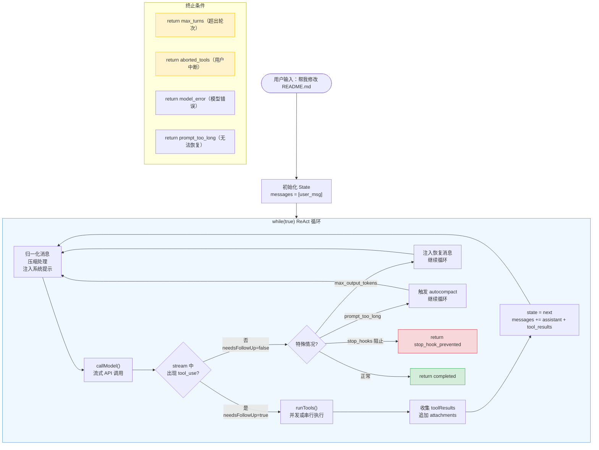

import DifficultyBadge from '@site/src/components/DifficultyBadge';
import SourceRef from '@site/src/components/SourceRef';
import ArticleComplete from '@site/src/components/ArticleComplete';

# tool_result 追加与循环继续：完整的 ReAct 循环

<DifficultyBadge level="深度" />

工具执行完成后，结果需要被"反馈"给 Claude。这个反馈过程不是简单地把结果塞进一条消息——它涉及格式标准化、消息历史更新、以及触发下一轮 API 调用。本文带你走完 ReAct 循环的最后一段路，并通过一个完整示例展示整个循环的演变过程。

## tool_result 的生成与格式化

工具执行完成后，`runTools()` / `StreamingToolExecutor` 产出的每条更新消息经过以下处理：

```typescript
// source/src/query.ts，第 1384-1407 行
for await (const update of toolUpdates) {
  if (update.message) {
    // 1. 立即 yield 给 UI 层展示（用户能看到工具执行进度）
    yield update.message

    // 2. 收集用于下一轮 API 调用的 tool_result 消息
    toolResults.push(
      // normalizeMessagesForAPI 把内部消息格式转换为 API 格式
      // 只取 type === 'user' 的消息（tool_result 被包装为用户消息）
      ...normalizeMessagesForAPI(
        [update.message],
        toolUseContext.options.tools,
      ).filter(m => m.type === 'user'),
    )
  }
  // 3. 若工具执行修改了上下文（如新增了 MCP 工具），更新 context
  if (update.newContext) {
    updatedToolUseContext = {
      ...update.newContext,
      queryTracking,
    }
  }
}
```

`toolResults` 数组收集了所有规范化后的工具结果消息，它们的格式大致如下：

```typescript
// tool_result 在 API 格式中的结构
{
  role: "user",
  content: [
    {
      type: "tool_result",
      tool_use_id: "toolu_01ABC",   // 与 tool_use block 的 id 对应
      content: "文件内容...",         // 工具返回的结果
      is_error: false               // 成功时为 false，失败时为 true
    }
  ]
}
```

## 追加 Attachments：记忆与技能注入

工具执行完成后，系统还会尝试注入附加上下文（attachments）：

```typescript
// source/src/query.ts，第 1580-1590 行
for await (const attachment of getAttachmentMessages(
  null,
  updatedToolUseContext,
  null,
  queuedCommandsSnapshot,
  [...messagesForQuery, ...assistantMessages, ...toolResults],
  querySource,
)) {
  yield attachment       // 通知 UI
  toolResults.push(attachment)  // 加入下轮消息历史
}
```

这些 attachments 可能包括：
- **内存文件内容**：CLAUDE.md、~/.claude/MEMORY.md 中的相关片段
- **技能发现结果**：发现了可复用的技能/模板
- **任务通知**：后台子代理发回的完成通知
- **文件变更**：用户在对话期间修改的文件

## 工具刷新：动态更新可用工具列表

每轮工具执行完成后，系统会刷新工具列表：

```typescript
// source/src/query.ts，第 1659-1671 行
if (updatedToolUseContext.options.refreshTools) {
  const refreshedTools = updatedToolUseContext.options.refreshTools()
  if (refreshedTools !== updatedToolUseContext.options.tools) {
    updatedToolUseContext = {
      ...updatedToolUseContext,
      options: {
        ...updatedToolUseContext.options,
        tools: refreshedTools,
      },
    }
  }
}
```

这保证了刚连接的 MCP 服务器提供的工具能在下一轮对话中立即可用。

## 循环继续：构建下一轮 State

一切准备就绪后，通过更新 `state` 对象来触发下一轮迭代：

```typescript
// source/src/query.ts，第 1715-1727 行
const next: State = {
  // 下一轮的消息历史 = 本轮消息 + AI 响应 + 工具结果 + 附件
  messages: [...messagesForQuery, ...assistantMessages, ...toolResults],

  toolUseContext: toolUseContextWithQueryTracking,
  autoCompactTracking: tracking,
  turnCount: nextTurnCount,        // 轮次计数 +1

  // 重置恢复计数器（每轮重新计）
  maxOutputTokensRecoveryCount: 0,
  hasAttemptedReactiveCompact: false,

  pendingToolUseSummary: nextPendingToolUseSummary,
  maxOutputTokensOverride: undefined,
  stopHookActive,
  transition: { reason: 'next_turn' },  // 标记这是正常的下一轮
}
state = next
// while(true) 的 continue 触发下一次迭代
```

关键在于 `messages` 的构建：它将本轮所有消息（历史 + AI 响应 + 工具结果）合并，作为下一轮 API 调用的完整上下文。这就是 ReAct 模式中"观察"阶段的体现——Claude 在下一轮能看到所有工具的执行结果。

## 循环终止条件

ReAct 循环在以下情况下终止：

### 1. 正常完成（end_turn）

```typescript
// source/src/query.ts，第 1062-1357 行
if (!needsFollowUp) {
  // Claude 没有请求工具，也没有特殊情况
  // 经过 stop hooks 等检查后...
  return { reason: 'completed' }
}
```

当 Claude 的响应不包含任何 `tool_use` block 时，`needsFollowUp` 为 `false`，循环正常结束。

### 2. 最大轮次限制（maxTurns）

```typescript
// source/src/query.ts，第 1704-1712 行
if (maxTurns && nextTurnCount > maxTurns) {
  yield createAttachmentMessage({
    type: 'max_turns_reached',
    maxTurns,
    turnCount: nextTurnCount,
  })
  return { reason: 'max_turns', turnCount: nextTurnCount }
}
```

`maxTurns` 防止无限循环。SDK 调用者通常会设置这个值（如 `maxTurns: 10`）来限制自动化任务的深度。

### 3. 用户中断（Ctrl+C）

```typescript
// source/src/query.ts，第 1485-1515 行
if (toolUseContext.abortController.signal.aborted) {
  // 生成缺失的 tool_result（保持对话历史完整性）
  yield createUserInterruptionMessage({ toolUse: true })
  return { reason: 'aborted_tools' }
}
```

### 4. Stop Hooks 阻止

```typescript
// source/src/query.ts，第 1519-1521 行
if (shouldPreventContinuation) {
  return { reason: 'hook_stopped' }
}
```

用户配置的 stop hooks（`~/.claude/hooks.json` 中的 `post_tool_use` hooks）可以在每轮工具执行后决定是否继续。

### 5. 上下文超长（prompt_too_long）

当消息历史过长，经过自动压缩仍无法解决时：

```typescript
return { reason: 'prompt_too_long' }
```

## 完整的 ReAct 循环示例

下面是一个真实场景：用户请求"帮我查看 README.md 的内容，然后在文件开头添加一行 '# 项目文档'"。

### 初始对话历史

```
messages = [
  { role: "user", content: "帮我查看 README.md 的内容，然后在文件开头添加一行 '# 项目文档'" }
]
```

### 第 1 轮：Claude 请求 Read 工具

**API 请求（发送）：**
```json
{
  "messages": [
    { "role": "user", "content": "帮我查看 README.md 的内容..." }
  ]
}
```

**API 响应（接收）：**
```json
{
  "role": "assistant",
  "content": [
    { "type": "text", "text": "好的，我先读取文件内容。" },
    {
      "type": "tool_use",
      "id": "toolu_01",
      "name": "Read",
      "input": { "file_path": "README.md" }
    }
  ],
  "stop_reason": "tool_use"
}
```

**needsFollowUp = true**，执行 Read 工具。

**工具执行结果：**
```
# 现有项目
这是一个示例项目。
```

**本轮结束后，消息历史更新为：**
```
messages = [
  { role: "user",      content: "帮我查看 README.md..." },
  { role: "assistant", content: [text("好的，我先读取文件内容。"), tool_use(Read)] },
  { role: "user",      content: [tool_result("toolu_01", "# 现有项目\n...")] }
]
```

### 第 2 轮：Claude 请求 Write 工具

**API 请求（发送）：包含完整上下文（3 条消息）**

**API 响应（接收）：**
```json
{
  "role": "assistant",
  "content": [
    { "type": "text", "text": "好的，我现在在文件开头添加标题行。" },
    {
      "type": "tool_use",
      "id": "toolu_02",
      "name": "Write",
      "input": {
        "file_path": "README.md",
        "content": "# 项目文档\n\n# 现有项目\n这是一个示例项目。"
      }
    }
  ],
  "stop_reason": "tool_use"
}
```

**needsFollowUp = true**，执行 Write 工具（串行，isConcurrencySafe = false）。

**工具执行结果：**
```
文件已写入成功
```

**本轮结束后，消息历史更新为：**
```
messages = [
  { role: "user",      content: "帮我查看 README.md..." },
  { role: "assistant", content: [text("好的，我先读取文件内容。"), tool_use(Read)] },
  { role: "user",      content: [tool_result("toolu_01", "# 现有项目\n...")] },
  { role: "assistant", content: [text("好的，我现在在文件开头添加标题行。"), tool_use(Write)] },
  { role: "user",      content: [tool_result("toolu_02", "文件已写入成功")] }
]
```

### 第 3 轮：Claude 完成任务

**API 请求（发送）：包含完整上下文（5 条消息）**

**API 响应（接收）：**
```json
{
  "role": "assistant",
  "content": [
    {
      "type": "text",
      "text": "已完成！文件开头已成功添加 '# 项目文档' 这一行。"
    }
  ],
  "stop_reason": "end_turn"
}
```

**needsFollowUp = false**，循环结束，返回 `{ reason: 'completed' }`。

## 完整 ReAct 循环 Mermaid 图



## 消息历史的增长规律

每完成一轮工具调用，消息历史增长 2 条：
1. 一条 `assistant` 消息（包含思考文本 + tool_use blocks）
2. 一条 `user` 消息（包含 tool_result blocks）

随着对话继续，消息历史不断增长，最终触发自动压缩（autocompact）来控制上下文大小。这是 Claude Code 能处理大型任务的关键机制——它不是简单地截断历史，而是通过智能压缩保留重要信息。

## 轮次计数与调试

`turnCount` 在 `state` 对象中追踪当前轮次：

```typescript
const nextTurnCount = turnCount + 1

// 在 maxTurns 检查中使用
if (maxTurns && nextTurnCount > maxTurns) {
  return { reason: 'max_turns', turnCount: nextTurnCount }
}
```

通过 `CLAUDE_CODE_MAX_TURNS` 环境变量或 SDK 的 `maxTurns` 参数，可以控制自动任务的最大深度。默认情况下没有限制（无限循环直到 Claude 主动结束）。

## 小结

ReAct 循环的本质是一个**消息历史不断增长的有状态迭代**：

1. 每轮迭代发送完整的消息历史给 Claude
2. Claude 返回思考和工具调用请求
3. 系统执行工具，把结果追加到消息历史
4. 重复，直到 Claude 认为任务完成

这个设计的优雅之处在于，Claude 的"记忆"就是消息历史本身。每轮迭代，Claude 能看到所有之前的行动和结果，这让它能够基于完整上下文做出准确的决策，最终完成复杂的多步骤任务。

<SourceRef file="source/src/query.ts" lines="1360-1728" />

<ArticleComplete />
