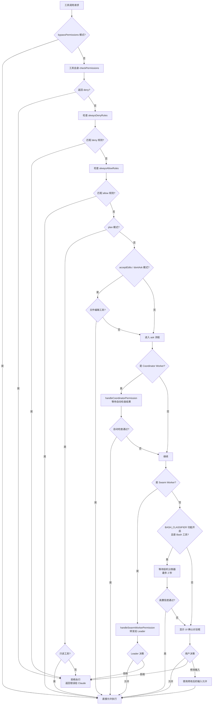

import DifficultyBadge from '@site/src/components/DifficultyBadge';
import SourceRef from '@site/src/components/SourceRef';
import ArticleComplete from '@site/src/components/ArticleComplete';

# 权限决策链：deny → allow → canUseTool → 自动分类器 → UI 提示

<DifficultyBadge level="深度" />

当 Claude 决定调用一个工具时，这个调用请求要经历一条精心设计的"决策链"才能最终执行——或者被拒绝。理解这条决策链，是理解 Claude Code 安全模型的核心。

## 决策的起点：`hasPermissionsToUseTool`

整个权限检查从 `source/src/utils/permissions/permissions.ts` 中的 `hasPermissionsToUseTool` 函数开始。这个函数接受工具对象、输入参数、工具使用上下文等信息，最终返回一个 `PermissionResult`。

`PermissionResult` 有三种可能的 `behavior` 值：
- **`allow`**：直接放行
- **`deny`**：直接拒绝，返回错误消息给 Claude
- **`ask`**：需要更多决策（进入后续流程）

## 完整决策流程图



## 第一关：bypassPermissions 模式检查

如果当前权限模式是 `bypassPermissions`，决策链在最开始就会直接返回 `allow`，完全跳过后续所有检查。这是整条链中唯一一处"完全绕过"的机制。

```typescript
// source/src/utils/permissions/permissions.ts（简化逻辑）
if (toolPermissionContext.mode === 'bypassPermissions') {
  return { behavior: 'allow' }
}
```

## 第二关：工具自身的 `checkPermissions`

每个工具都实现了 `Tool` 接口，其中包含 `checkPermissions` 方法。这是工具级别的权限逻辑，由工具开发者自定义。

例如 `BashTool` 的权限检查会分析命令内容：
- 检查是否包含危险的 shell 模式（如 `rm -rf /`）
- 检查输出重定向（写入敏感位置）
- 检查命令是否在允许的目录范围内

```typescript
// Tool 接口定义（source/src/Tool.ts）
export type Tool<Input, Output, P> = {
  checkPermissions(
    input: Input,
    context: ToolUseContext,
  ): Promise<PermissionResult>
  // ...
}
```

如果 `checkPermissions` 返回 `deny`，决策链立即终止，不进入后续规则检查。

## 第三关：deny 规则匹配

`alwaysDenyRules` 是用户或管理员配置的"绝对禁止"规则列表。来源可以是：
- 用户设置（`~/.claude/settings.json`）
- 项目设置（`.claude/settings.json`）
- CLI 参数传入的规则
- 会话内通过 `/permissions` 命令添加的规则

规则的数据结构：

```typescript
// source/src/types/permissions.ts
export type PermissionRule = {
  source: PermissionRuleSource      // 规则来源
  ruleBehavior: PermissionBehavior  // 'allow' | 'deny' | 'ask'
  ruleValue: PermissionRuleValue    // { toolName, ruleContent? }
}

export type PermissionRuleValue = {
  toolName: string      // 工具名，如 'Bash'
  ruleContent?: string  // 可选的内容匹配，如 'rm *'
}
```

规则匹配采用权限规则语法（Permission Rule Syntax）：
- `Bash` — 匹配所有 Bash 工具调用
- `Bash(git *)` — 匹配以 `git` 开头的 Bash 命令
- `Write(~/important/*)` — 匹配写入特定目录的操作

如果任何 deny 规则匹配当前工具调用，立即返回 `deny`。

## 第四关：allow 规则匹配

`alwaysAllowRules` 是用户配置的"无需确认"白名单。这些规则通常在用户选择"本会话始终允许"时自动添加。

```typescript
export type ToolPermissionContext = {
  readonly alwaysAllowRules: ToolPermissionRulesBySource  // allow 规则
  readonly alwaysDenyRules: ToolPermissionRulesBySource   // deny 规则
  readonly alwaysAskRules: ToolPermissionRulesBySource    // 强制询问规则
}
```

allow 规则还支持 `ruleContent` 字段，实现精细的匹配：
- `Bash(npm test)` — 只自动允许 `npm test`，其他 npm 命令仍需确认

如果 allow 规则匹配，立即返回 `allow`，不再继续检查。

## 第五关：模式级别的决策

当规则都未匹配时，根据当前权限模式做出"默认决策"：

**`plan` 模式：**
```
只读工具 → allow
写入/执行工具 → deny（计划模式禁止任何写操作）
```

**`acceptEdits` 模式：**
```
文件编辑工具（Write/Edit/MultiEdit）→ allow
其他工具 → ask（继续后续流程）
```

**`dontAsk` 模式：**
```
所有工具 → allow（不弹对话框，但 deny 规则已经在第三关拦截）
```

**`default` 模式：**
```
只读工具 → allow
其他工具 → ask（继续后续流程）
```

## 第六关：协调器权限检查（Coordinator Pattern）

当 Claude Code 以 Coordinator 模式运行时（`awaitAutomatedChecksBeforeDialog` 为 `true`），后台 Worker 在触发 UI 对话框之前会先进行自动检查。

```typescript
// source/src/hooks/useCanUseTool.tsx
if (appState.toolPermissionContext.awaitAutomatedChecksBeforeDialog) {
  const coordinatorDecision = await handleCoordinatorPermission({
    ctx,
    pendingClassifierCheck: result.pendingClassifierCheck,
    permissionMode: appState.toolPermissionContext.mode,
  })
  if (coordinatorDecision) {
    resolve(coordinatorDecision)
    return  // 自动决策，不打扰用户
  }
}
```

这个设计的目的：**后台任务应该尽量不打扰用户，只有在自动检查无法决策时才显示对话框。**

## 第七关：Swarm Worker 权限转发

在 Swarm 模式（多 Agent 协作）中，Worker Agent 没有直接与用户交互的权限。当 Worker 需要用户确认时，它会通过 mailbox 机制将请求转发给 Leader Agent：

```typescript
const swarmDecision = await handleSwarmWorkerPermission({
  ctx,
  description,
  pendingClassifierCheck: result.pendingClassifierCheck,
})
if (swarmDecision) {
  resolve(swarmDecision)
  return
}
```

## 第八关：投机分类器（Speculative Classifier）

这是 Claude Code 的一个智能优化：对于 Bash 工具，系统会在用户思考的同时**后台预先运行 AI 分类器**。

工作原理：
1. 当工具调用到达"需要确认"阶段时，立即异步启动分类器
2. 分类器分析命令的危险程度（使用 Claude API）
3. 等待最多 2 秒（grace period）
4. 如果分类器以"高置信度"判断为安全，**直接放行，不显示对话框**

```typescript
// 等待投机分类器结果，最多 2 秒
const raceResult = await Promise.race([
  speculativePromise.then(r => ({ type: 'result', result: r })),
  new Promise(res => setTimeout(res, 2000, { type: 'timeout' })),
])

if (raceResult.type === 'result' &&
    raceResult.result.matches &&
    raceResult.result.confidence === 'high') {
  // 分类器高置信度通过，跳过对话框
  resolve(ctx.buildAllow(input, {
    decisionReason: { type: 'classifier', classifier: 'bash_allow', ... }
  }))
  return
}
```

## 第九关：UI 确认对话框

当所有自动化检查都无法做出决策时，系统最终显示 UI 对话框请求用户确认。`handleInteractivePermission` 负责这个流程：

```typescript
handleInteractivePermission({
  ctx,
  description,   // 工具的描述信息（显示给用户）
  result,         // ask 决策包含的附加建议
  bridgeCallbacks,   // IDE 集成回调
  channelCallbacks,  // Kairos 频道回调
}, resolve)
```

用户在对话框中可以：
- **允许一次**：仅本次允许
- **本会话始终允许**：添加到 `alwaysAllowRules`（session 级别）
- **永久允许**：持久化到 settings.json
- **拒绝**：返回 deny 结果

## 决策结果的传播

无论通过哪个环节做出决策，最终结果都会封装为 `PermissionDecision` 对象返回：

```typescript
// source/src/types/permissions.ts
export type PermissionDecision<Input> =
  | PermissionAllowDecision<Input>  // behavior: 'allow'
  | PermissionAskDecision<Input>    // behavior: 'ask'（仅中间状态）
  | PermissionDenyDecision          // behavior: 'deny'

export type PermissionDecisionReason =
  | { type: 'rule'; rule: PermissionRule }       // 规则匹配
  | { type: 'mode'; mode: PermissionMode }       // 模式决策
  | { type: 'hook'; hookName: string; ... }      // Hook 决策
  | { type: 'classifier'; classifier: string; }  // 分类器决策
  // ...更多类型
```

`decisionReason` 字段记录了"为什么做出这个决策"，用于：
- 日志记录和调试
- UI 展示（让用户知道为什么允许/拒绝）
- 分析工具的 `/permissions` 视图

## 小结

这条决策链体现了 Claude Code 的设计哲学：**安全优先，效率次之，自动化辅助人工决策**。每一关都有明确的职责：

1. 全局模式决定整体行为
2. 工具自身负责领域特定的安全检查
3. 用户规则实现细粒度控制
4. AI 分类器减少不必要的人工干预
5. UI 确认作为最后的安全网

<SourceRef file="source/src/hooks/useCanUseTool.tsx" lines="1-203" />
<SourceRef file="source/src/utils/permissions/permissions.ts" lines="1-100" />
<SourceRef file="source/src/types/permissions.ts" lines="150-325" />

<ArticleComplete />
