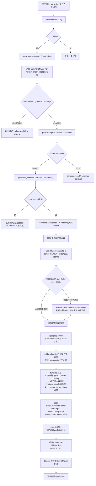

import DifficultyBadge from '@site/src/components/DifficultyBadge';
import SourceRef from '@site/src/components/SourceRef';
import ArticleComplete from '@site/src/components/ArticleComplete';

# 技能执行流程：从 /skill-name 到实际运行

<DifficultyBadge level="进阶" />

## 完整流程概览

当用户输入 `/pr-review 关注性能问题` 时，这个简单的命令会触发一条复杂的执行链路。下面的流程图展示了从用户输入到 AI 最终响应的完整过程：



## 第一步：解析斜杠命令

用户输入首先进入 `processSlashCommand()`，调用 `parseSlashCommand()` 提取命令名和参数：

```typescript
// source/src/utils/processUserInput/processSlashCommand.tsx，第 309-330 行
export async function processSlashCommand(
  inputString: string,
  ...
): Promise<ProcessUserInputBaseResult> {
  // 解析 "/pr-review 关注性能问题" → { commandName: 'pr-review', args: '关注性能问题' }
  const parsed = parseSlashCommand(inputString)
  if (!parsed) {
    return { messages: [...], shouldQuery: false, resultText: 'Commands are in the form `/command [args]`' }
  }

  const { commandName, args: parsedArgs, isMcp } = parsed

  // 检查命令是否存在
  if (!hasCommand(commandName, context.options.commands)) {
    // 如果像一个命令名（不是文件路径），报告未知技能错误
    if (looksLikeCommand(commandName) && !isFilePath) {
      return { ..., resultText: `Unknown skill: ${commandName}` }
    }
    // 否则当作普通输入处理（用户可能在输入 /path/to/file）
    return { messages: [createUserMessage(inputString)], shouldQuery: true }
  }

  // 命令存在，继续处理
  const { messages, ... } = await getMessagesForSlashCommand(commandName, parsedArgs, ...)
}
```

**关键逻辑**：如果命令名看起来像文件路径（`/etc/hosts`），系统不会报错，而是当作普通用户输入处理。只有当输入符合命令格式但命令不存在时，才报告"Unknown skill"。

## 第二步：命令查找与类型分发

`findCommand()` 在所有已注册的命令中查找匹配项。找到后，根据 `command.type` 分支处理：

```typescript
// source/src/types/command.ts 中的命令类型定义
type Command = PromptCommand | LocalCommand | LocalJSXCommand
//             ^技能类型      ^本地JS执行   ^带UI的本地命令
```

对于技能（`type === 'prompt'`），进入 `getMessagesForPromptSlashCommand()`。

## 第三步：getPromptForCommand 获取提示词内容

这是技能执行的核心：

```typescript
// source/src/utils/processUserInput/processSlashCommand.tsx，第 869 行
const result = await command.getPromptForCommand(args, context)
```

不同类型的技能，`getPromptForCommand` 的实现不同：

**文件型技能**（`loadedFrom === 'skills'`）：
```typescript
async getPromptForCommand(args, toolUseContext) {
  // 1. 前缀 Base directory 信息
  let finalContent = baseDir
    ? `Base directory for this skill: ${baseDir}\n\n${markdownContent}`
    : markdownContent

  // 2. 参数替换
  finalContent = substituteArguments(finalContent, args, true, argumentNames)

  // 3. 替换特殊变量
  finalContent = finalContent.replace(/\$\{CLAUDE_SKILL_DIR\}/g, skillDir)
  finalContent = finalContent.replace(/\$\{CLAUDE_SESSION_ID\}/g, getSessionId())

  // 4. 执行内联 shell 命令（MCP 技能跳过此步）
  if (loadedFrom !== 'mcp') {
    finalContent = await executeShellCommandsInPrompt(finalContent, ...)
  }

  return [{ type: 'text', text: finalContent }]
},
```

**内置技能**（`loadedFrom === 'bundled'`）：
```typescript
async getPromptForCommand(args, context) {
  // 可以访问运行时上下文：消息历史、会话状态等
  const messages = context.getAppState().messages
  const sessionMemory = await getSessionMemoryContent(...)
  // 动态生成提示词
  return [{ type: 'text', text: buildPrompt(args, messages, sessionMemory) }]
},
```

## 第四步：参数替换——$ARGUMENTS 占位符

`substituteArguments()` 支持多种参数占位符格式：

```typescript
// source/src/utils/argumentSubstitution.ts

// 支持的占位符格式：
// $ARGUMENTS        → 完整参数字符串
// $ARGUMENTS[0]     → 第一个参数（按空格分隔）
// $0, $1, $2        → 短格式索引参数
// $name, $target    → 命名参数（需在 frontmatter 定义 arguments: name target）
```

**示例**：

技能 front matter 定义了命名参数：
```yaml
---
arguments: env branch
description: Deploy to environment
---
Deploy $branch to $env environment.
If no environment specified, deploy to staging.
```

调用 `/deploy production main` 后，提示词变为：
```
Deploy main to production environment.
If no environment specified, deploy to staging.
```

如果技能文件没有任何 `$ARGUMENTS` 占位符，但用户提供了参数，系统会自动在提示词末尾追加：
```
ARGUMENTS: production main
```

这确保用户的参数不会被默默丢弃。

## 第五步：内联 Shell 命令执行

SKILL.md 支持通过 `!`` `` ` 语法在提示词加载时执行 shell 命令，并将输出嵌入提示词中：

```markdown
---
description: 代码审查
---

# 代码审查

当前分支: !`git branch --show-current`
最近提交: !`git log --oneline -5`
文件变更数: !`git diff --stat | tail -1`

请审查以下变更...
```

当技能被调用时，这些命令会立即执行，输出会替换对应的语法块。Claude 收到的提示词看起来是：

```
当前分支: feature/auth-improvement
最近提交: abc123 Add OAuth support
         def456 Fix login bug
         ...
文件变更数: 12 files changed, 234 insertions(+), 45 deletions(-)

请审查以下变更...
```

**注意**：这一步**仅对非 MCP 技能**执行。MCP 技能因安全原因跳过内联命令执行。

## 第六步：构建对话消息

技能提示词最终被构建成一组结构化的消息，注入到对话上下文：

```typescript
// source/src/utils/processUserInput/processSlashCommand.tsx，第 886-918 行

// 1. 元数据消息：标识这是一个技能调用
const metadata = formatCommandLoadingMetadata(command, args)
// → "<command-message>pr-review</command-message>\n<command-name>/pr-review</command-name>"

// 2. 主内容消息（技能提示词 + 用户图片等）
const mainMessageContent = [...imageContentBlocks, ...result]

// 3. @-mention 附件消息（技能内容中可能引用了 @file.ts）
const attachmentMessages = await toArray(getAttachmentMessages(...))

// 4. 工具权限消息：扩展当前会话的 allowedTools
const additionalAllowedTools = parseToolListFromCLI(command.allowedTools ?? [])

const messages = [
  createUserMessage({ content: metadata }),          // 元数据
  createUserMessage({ content: mainMessageContent, isMeta: true }),  // 提示词
  ...attachmentMessages,                             // 附件
  createAttachmentMessage({                          // 权限扩展
    type: 'command_permissions',
    allowedTools: additionalAllowedTools,
    model: command.model,
  }),
]
```

`command_permissions` 消息的作用是在这次技能调用期间临时扩展工具权限。例如一个 `/deploy` 技能声明了 `allowed-tools: Bash`，用户在不允许 Bash 的上下文中调用它时，这条消息会临时授权 Bash 工具的使用。

## 第七步：技能 hooks 注册

如果技能的 front matter 定义了 `hooks`，它们会在技能调用时被注册到当前会话：

```typescript
// source/src/utils/processUserInput/processSlashCommand.tsx，第 871-878 行
const hooksAllowedForThisSkill =
  !isRestrictedToPluginOnly('hooks') || isSourceAdminTrusted(command.source)

if (command.hooks && hooksAllowedForThisSkill) {
  const sessionId = getSessionId()
  registerSkillHooks(
    context.setAppState,
    sessionId,
    command.hooks,
    command.name,
    command.skillRoot,
  )
}
```

这允许技能声明它自己的 pre/post-tool hooks，例如在每次工具调用后自动记录日志，或在特定条件下中止操作。

## 技能执行 vs 普通对话的差异

| 维度 | 普通对话 | 技能调用 |
|------|---------|---------|
| 进入 query() 的消息结构 | 单条 user message | 多条：元数据 + 提示词 + 附件 + 权限 |
| allowedTools | 继承会话默认设置 | 可通过 `command_permissions` 临时扩展 |
| model | 继承会话设置 | 可通过 front matter 覆盖（`model: claude-opus-4-5`） |
| effort 级别 | 继承会话设置 | 可通过 front matter 覆盖 |
| hooks | 无额外注册 | 技能可声明专属 hooks |
| 参数处理 | 用户手动表达 | `$ARGUMENTS` 占位符自动替换 |
| shell 预处理 | 无 | `!`` `` ` 语法内联执行（本地技能） |
| 技能记录 | 无 | `addInvokedSkill()` 记录到 compaction 系统 |

## 技能的 fork 执行模式

部分技能通过设置 `context: fork` 在**子代理**中运行，而非内联到当前对话：

```yaml
---
description: 在子代理中运行的复杂任务
context: fork
agent: general-purpose
---
```

当 `executionContext === 'fork'` 时，技能不是将提示词注入当前对话，而是创建一个独立的子代理（通过 `forkedAgent.ts`），子代理有自己的对话历史、工具权限和 token 预算。执行完成后，结果会返回给父代理。

这种模式适合复杂、长耗时的任务，避免消耗父代理的 context window 预算。

<SourceRef file="source/src/utils/processUserInput/processSlashCommand.tsx" lines="827-920" />

<ArticleComplete />
