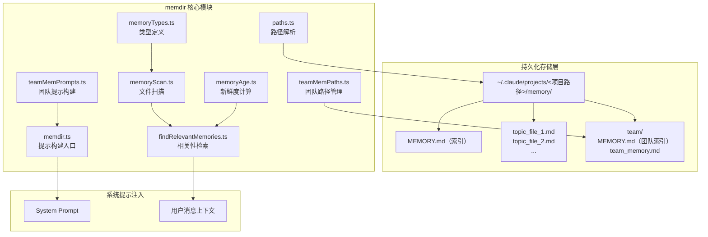

import DifficultyBadge from '@site/src/components/DifficultyBadge';
import SourceRef from '@site/src/components/SourceRef';
import ArticleComplete from '@site/src/components/ArticleComplete';

# Claude Code 的"记忆"是什么？memdir 设计理念

<DifficultyBadge level="入门" />

## 引言：AI 的遗忘问题

大语言模型有一个本质的限制：每次对话都是独立的。昨天告诉 Claude "我们团队不用 Jest，用 Vitest"，今天打开新会话，它又不记得了。你需要不断重复解释上下文，这是一种低效的协作方式。

Claude Code v2.1.88 引入了 **memdir 记忆系统**，目标是让 AI 助手真正拥有跨会话的持久记忆。这篇文章将解释这套系统的设计理念和整体架构。

## 两种"记忆"的根本区别

在理解 memdir 之前，需要先区分两种截然不同的记忆形式：

### 会话内上下文（Session Context）

在单次对话中，Claude 能"记住"本次对话的所有内容——这是 LLM 的 context window 机制。当你说"刚才那个函数有个 bug"，Claude 知道你指的是哪个函数，因为它就在当前上下文里。

这种"记忆"是**临时的**：会话结束，上下文清空，一切归零。

### 跨会话持久记忆（Persistent Memory）

memdir 系统解决的是另一个问题：如何让 AI 在**不同会话之间**保留重要信息。

```
会话 A:  用户说 "我是后端工程师，主要写 Go"
         → Claude 将此写入记忆文件

会话 B:  用户问 "帮我看看这段代码"
         → Claude 读取记忆，知道用户是 Go 工程师
         → 用 Go 惯用语解释，不用从零介绍
```

## 以文件系统为记忆载体

memdir 最核心的设计决策：**用普通文件（Markdown 文件）作为记忆的存储载体**。

这个选择看似简单，却有深刻的理由：

1. **可读性**：用户可以直接用文本编辑器查看、修改、删除记忆
2. **可版本控制**：团队记忆可以纳入 Git 管理
3. **透明性**：AI 做了什么记录，用户一目了然
4. **可移植性**：记忆文件可以备份、迁移

每条记忆都是一个独立的 `.md` 文件，包含 YAML frontmatter 元数据和正文内容：

```markdown
---
name: user_is_go_engineer
description: 用户是后端工程师，主要使用 Go 语言，对 React 不熟悉
type: user
---

用户是有 10 年经验的 Go 工程师，首次接触这个项目的 React 前端部分。
在解释前端代码时，用后端类比（goroutine → async/await，interface → component props）。

**Why:** 用户明确告知 Go 背景，希望从已知知识出发理解新概念
**How to apply:** 每当解释前端概念时，优先使用 Go 的对应概念作为桥梁
```

## 记忆系统架构概览



## 记忆的三个层次

memdir 系统设计了三个层次的记忆，对应不同的共享范围：

### 个人记忆（Private Memory）

存储在 `~/.claude/projects/<项目路径>/memory/` 下，只有当前用户可见。

记录：
- 用户的角色和技术背景
- 个人工作偏好（"不要用 mock，用真实数据库测试"）
- 用户给出的反馈和修正

### 项目记忆（Project Context Memory）

也存储在个人记忆目录下，但类型标注为 `project`，记录项目级别的上下文：

- 当前进行中的工作和目标
- 团队决策和技术选型的理由
- 截止日期和里程碑
- 已知的 bug 和技术债

### 团队记忆（Team Memory）

存储在 `~/.claude/projects/<项目路径>/memory/team/` 下，通过服务端同步在团队成员间共享。

记录：
- 整个团队需要遵守的编码规范
- 项目级别的技术决策
- 共享的外部资源指针（Linear、Grafana 等）

## 与 CLAUDE.md 的关系和区别

很多用户可能已经了解 CLAUDE.md——在项目根目录放一个 Markdown 文件，Claude 会自动读取作为上下文。那么 memdir 系统和 CLAUDE.md 有什么区别？

| 维度 | CLAUDE.md | memdir 记忆 |
|------|-----------|------------|
| **写入者** | 人类手动编写 | Claude 自动写入 |
| **内容性质** | 静态的项目说明 | 动态的交互积累 |
| **典型内容** | 代码规范、架构说明 | 用户偏好、项目进展 |
| **更新频率** | 低（手动维护） | 高（每次对话后更新） |
| **存储位置** | 项目目录内 | `~/.claude/` 外部 |
| **版本控制** | 通常纳入 Git | 个人记忆不纳入 Git |

源码中对这个区别有明确的说明：

```typescript
// source/src/memdir/memoryTypes.ts
/**
 * Memories are constrained to four types capturing context NOT derivable
 * from the current project state. Code patterns, architecture, git history,
 * and file structure are derivable (via grep/git/CLAUDE.md) and should NOT
 * be saved as memories.
 */
```

**核心原则**：凡是可以通过读代码、读 Git 历史、读 CLAUDE.md 推导出来的信息，**不应该**存入记忆。记忆只存放"不可推导"的上下文——用户的个人特征、交互中形成的偏好、项目状态的当前快照。

## 目录结构实例

实际运行时，`~/.claude/` 下的记忆目录结构如下：

```
~/.claude/
└── projects/
    └── Users-admin-projects-myapp/    # 基于项目路径生成的键名
        └── memory/
            ├── MEMORY.md              # 索引文件（记忆目录）
            ├── user_role.md           # 用户角色记忆
            ├── feedback_testing.md    # 测试偏好反馈
            ├── project_migration.md   # 当前项目迁移任务
            ├── reference_linear.md    # Linear 项目指针
            ├── logs/                  # 日志模式（KAIROS 功能）
            │   └── 2026/
            │       └── 04/
            │           └── 2026-04-01.md
            └── team/                  # 团队记忆（TEAMMEM 功能）
                ├── MEMORY.md
                └── team_coding_standards.md
```

## 记忆系统的设计哲学

memdir 的设计体现了几个重要的软件工程原则：

### 1. 可观察性（Observability）

记忆是透明的。用户随时可以 `ls ~/.claude/projects/*/memory/` 查看所有记忆文件，没有黑箱。

### 2. 用户控制权（User Agency）

用户可以：
- 直接编辑记忆文件
- 使用 `/forget` 删除特定记忆
- 通过环境变量 `CLAUDE_CODE_DISABLE_AUTO_MEMORY=1` 完全禁用记忆
- 在 settings.json 中配置 `autoMemoryEnabled: false`

### 3. 安全第一（Security First）

路径验证、symlink 检测、路径穿越防护——`teamMemPaths.ts` 中有大量安全相关代码，确保团队记忆不会被恶意项目利用来读写敏感目录。

### 4. 渐进降级（Graceful Degradation）

记忆系统的每个功能都有独立的 feature flag 控制（`TEAMMEM`、`KAIROS`、`EXTRACT_MEMORIES` 等），新功能可以通过 GrowthBook 远端配置逐步推送，出问题时可以快速关闭。

## 小结

memdir 是 Claude Code 从"无状态工具"向"有记忆助手"演化的关键基础设施。它的设计理念可以用一句话概括：

> **用文件系统作为记忆的载体，用 AI 模型的判断力决定什么值得记忆，用结构化分类确保记忆的可用性。**

接下来的文章将深入每个模块的实现细节。

<SourceRef file="source/src/memdir/memoryTypes.ts" lines="1-21" />
<SourceRef file="source/src/memdir/paths.ts" lines="22-94" />
<SourceRef file="source/src/memdir/memdir.ts" lines="34-48" />

<ArticleComplete />
