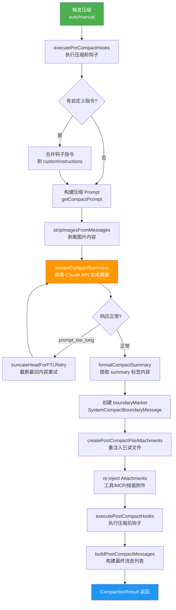

import DifficultyBadge from '@site/src/components/DifficultyBadge';
import SourceRef from '@site/src/components/SourceRef';
import ArticleComplete from '@site/src/components/ArticleComplete';

# compact.ts 总览：压缩引擎的核心设计

<DifficultyBadge level="深度" />

`compact.ts` 是 Claude Code 上下文管理系统的心脏，包含了整个压缩流程的核心逻辑。它实现了一个优雅而复杂的设计：**用 Claude 自身来理解和压缩 Claude 的对话历史**。

## 整体架构一览

在阅读源码之前，先看一张完整的压缩流程图：



## 核心数据结构：CompactionResult

压缩函数的返回值是 `CompactionResult`，它定义了压缩后的完整状态：

```typescript
// source/src/services/compact/compact.ts
export interface CompactionResult {
  // 压缩边界标记（SystemCompactBoundaryMessage）
  boundaryMarker: SystemMessage

  // 压缩摘要消息（一条或多条 UserMessage）
  summaryMessages: UserMessage[]

  // 重新注入的附件（已读文件、工具定义等）
  attachments: AttachmentMessage[]

  // 压缩钩子产生的结果消息
  hookResults: HookResultMessage[]

  // 需要保留的原始消息（session memory compact 使用）
  messagesToKeep?: Message[]

  // 向用户展示的信息（来自钩子）
  userDisplayMessage?: string

  // 压缩前 token 数
  preCompactTokenCount?: number

  // 压缩后 token 数
  postCompactTokenCount?: number

  // 用于 API 统计的 token 消耗
  compactionUsage?: ReturnType<typeof getTokenUsage>
}
```

压缩后的消息列表按照固定顺序拼接：

```typescript
export function buildPostCompactMessages(result: CompactionResult): Message[] {
  return [
    result.boundaryMarker,    // ① 边界标记（系统消息，不发给 API）
    ...result.summaryMessages, // ② 对话摘要（替代完整历史）
    ...(result.messagesToKeep ?? []), // ③ 保留的原始消息（可选）
    ...result.attachments,    // ④ 重注入的附件
    ...result.hookResults,    // ⑤ 钩子结果
  ]
}
```

## Meta-Compression：用 Claude 压缩 Claude

压缩的核心思路是 **meta-compression**：启动一个独立的 Claude 实例（forked agent），将完整对话历史发给它，要求生成结构化摘要。

```typescript
// source/src/services/compact/compact.ts（简化）
export async function compactConversation(
  messages: Message[],
  context: ToolUseContext,
  cacheSafeParams: CacheSafeParams,
  suppressFollowUpQuestions: boolean,
  customInstructions?: string,
  isAutoCompact: boolean = false,
): Promise<CompactionResult> {

  // 1. 执行 pre_compact hooks
  const hookResult = await executePreCompactHooks(
    { trigger: isAutoCompact ? 'auto' : 'manual', customInstructions },
    context.abortController.signal,
  )

  // 2. 构建压缩 prompt（包含详细的摘要格式要求）
  const compactPrompt = getCompactPrompt(customInstructions)
  const summaryRequest = createUserMessage({ content: compactPrompt })

  // 3. 剥离图片（图片不需要进入摘要，且可能导致 prompt_too_long）
  const cleanMessages = stripImagesFromMessages(messages)

  // 4. 调用 Claude API 流式生成摘要
  let summaryResponse = await streamCompactSummary({ ... })

  // 5. 从响应中提取 <summary> 标签内容
  const summary = formatCompactSummary(
    getAssistantMessageText(summaryResponse)
  )

  // ... 后续重建消息列表
}
```

## 压缩 Prompt 的设计：prompt.ts

压缩质量的关键在于 prompt 设计。`prompt.ts` 中的 `BASE_COMPACT_PROMPT` 极为精细：

```typescript
// source/src/services/compact/prompt.ts（核心摘要格式要求）
const BASE_COMPACT_PROMPT = `Your task is to create a detailed summary of the conversation...

Your summary should include the following sections:

1. Primary Request and Intent: 捕获用户所有明确的请求和意图
2. Key Technical Concepts: 重要技术概念、技术栈、框架
3. Files and Code Sections: 列举检查/修改/创建的文件，包含完整代码片段
4. Errors and fixes: 遇到的所有错误和解决方案
5. Problem Solving: 已解决的问题和进行中的排查
6. All user messages: 列出所有用户消息（非工具结果）
7. Pending Tasks: 明确被要求的待完成任务
8. Current Work: 压缩前正在进行的详细工作描述
9. Optional Next Step: 与最近工作直接相关的下一步`
```

值得注意的是这条 `NO_TOOLS_PREAMBLE` 指令：

```typescript
const NO_TOOLS_PREAMBLE = `CRITICAL: Respond with TEXT ONLY. Do NOT call any tools.

- Do NOT use Read, Bash, Grep, Glob, Edit, Write, or ANY other tool.
- You already have all the context you need in the conversation above.
- Tool calls will be REJECTED and will waste your only turn — you will fail the task.
- Your entire response must be plain text: an <analysis> block followed by a <summary> block.
`
```

为什么需要这条指令？因为 Claude 被设计成"主动使用工具"，在分析代码时可能会尝试调用 `FileRead` 或 `Bash`。但在压缩阶段，所有需要的上下文已经在传入的消息历史里了，工具调用只会浪费宝贵的 token 配额。注释中也提到这个问题在 Sonnet 4.6+ 自适应思考模型上更明显，出现概率达 2.79%。

## 图片剥离：stripImagesFromMessages

压缩前有一个关键的预处理步骤：剥离所有图片内容。

```typescript
export function stripImagesFromMessages(messages: Message[]): Message[] {
  return messages.map(message => {
    if (message.type !== 'user') return message

    const content = message.message.content
    // 将 image 块替换为文本标记
    const newContent = content.flatMap(block => {
      if (block.type === 'image') {
        return [{ type: 'text' as const, text: '[image]' }]
      }
      if (block.type === 'document') {
        return [{ type: 'text' as const, text: '[document]' }]
      }
      // 也处理 tool_result 内嵌的图片
      if (block.type === 'tool_result' && Array.isArray(block.content)) {
        // ...
      }
      return [block]
    })
    // ...
  })
}
```

原因是：图片本身对"生成文字摘要"没有帮助，但会占用大量 token（每张约 2000 tokens），甚至可能导致压缩请求本身也触发 `prompt_too_long` 错误——这会陷入"压缩失败→无法继续工作"的死锁。

## prompt_too_long 的降级重试

如果连压缩请求本身都超出 token 限制（极罕见但存在），`compact.ts` 实现了 `truncateHeadForPTLRetry` 降级策略：

```typescript
// source/src/services/compact/compact.ts
export function truncateHeadForPTLRetry(
  messages: Message[],
  ptlResponse: AssistantMessage,
): Message[] | null {
  // 按 API 轮次分组消息
  const groups = groupMessagesByApiRound(input)
  if (groups.length < 2) return null

  // 从 API 响应中解析超出的 token 数
  const tokenGap = getPromptTooLongTokenGap(ptlResponse)

  // 计算需要丢弃多少轮历史
  let dropCount: number
  if (tokenGap !== undefined) {
    // 精确计算：丢弃足够覆盖 tokenGap 的最旧消息组
    let acc = 0
    dropCount = 0
    for (const g of groups) {
      acc += roughTokenCountEstimationForMessages(g)
      dropCount++
      if (acc >= tokenGap) break
    }
  } else {
    // 降级：粗略丢弃 20% 的消息组
    dropCount = Math.max(1, Math.floor(groups.length * 0.2))
  }

  return groups.slice(dropCount).flat()
}
```

整个重试循环最多执行 `MAX_PTL_RETRIES = 3` 次：

```typescript
let ptlAttempts = 0
for (;;) {
  summaryResponse = await streamCompactSummary({ ... })
  if (!summary?.startsWith(PROMPT_TOO_LONG_ERROR_MESSAGE)) break

  ptlAttempts++
  const truncated = ptlAttempts <= MAX_PTL_RETRIES
    ? truncateHeadForPTLRetry(messagesToSummarize, summaryResponse)
    : null

  if (!truncated) throw new Error(ERROR_MESSAGE_PROMPT_TOO_LONG)
  messagesToSummarize = truncated
}
```

## 压缩后的状态恢复

压缩结束后，Claude 不仅得到了一个摘要，还需要重建完整的工作上下文。`compact.ts` 实现了多项状态恢复：

### 1. 重注入已读文件

```typescript
// 压缩前保存文件状态
const preCompactReadFileState = cacheToObject(context.readFileState)

// 清空缓存（摘要替代了文件内容）
context.readFileState.clear()

// 重新注入最近读过的文件（最多 5 个，每个最多 5000 tokens）
const fileAttachments = await createPostCompactFileAttachments(
  preCompactReadFileState,
  context,
  POST_COMPACT_MAX_FILES_TO_RESTORE,  // = 5
)
```

常量定义：

```typescript
export const POST_COMPACT_MAX_FILES_TO_RESTORE = 5
export const POST_COMPACT_TOKEN_BUDGET = 50_000
export const POST_COMPACT_MAX_TOKENS_PER_FILE = 5_000
export const POST_COMPACT_MAX_TOKENS_PER_SKILL = 5_000
export const POST_COMPACT_SKILLS_TOKEN_BUDGET = 25_000
```

### 2. 重注入工具/MCP/技能定义

```typescript
// 重新注入工具定义差量（让模型知道有哪些工具）
for (const att of getDeferredToolsDeltaAttachment(
  context.options.tools,
  context.options.mainLoopModel,
  [],  // 空历史 = 发全量定义
  { callSite: 'compact_full' },
)) {
  postCompactFileAttachments.push(createAttachmentMessage(att))
}

// 重新注入 MCP 工具指令
for (const att of getMcpInstructionsDeltaAttachment(...)) {
  postCompactFileAttachments.push(...)
}
```

这确保了压缩后模型仍然知道可以使用哪些工具，以及如何使用 MCP 服务。

## 压缩边界标记

每次压缩都会插入一个 `SystemCompactBoundaryMessage`，它是对话历史中的"分水岭"：

```typescript
const boundaryMarker = createCompactBoundaryMessage({
  preCompactTokenCount,
  postCompactTokenCount,
  // ... 其他元数据
})
```

这个标记在 UI 层面会渲染为分割线，让用户知道"这里发生了一次压缩"，之前的内容已经被摘要替代。在存储层面，它用于 `getMessagesAfterCompactBoundary()` 找到最近的完整会话起点。

<SourceRef file="source/src/services/compact/compact.ts" lines="299-490" />
<SourceRef file="source/src/services/compact/prompt.ts" lines="1-130" />

<ArticleComplete />
