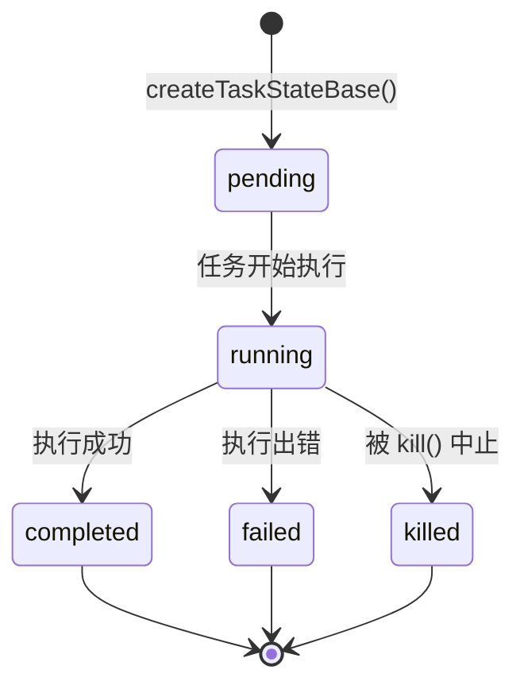

import DifficultyBadge from '@site/src/components/DifficultyBadge';
import SourceRef from '@site/src/components/SourceRef';
import ArticleComplete from '@site/src/components/ArticleComplete';

# Task 类型全景：7 种任务类型设计哲学

<DifficultyBadge level="进阶" />

在 Claude Code 的架构中，"任务（Task）"是比工具调用更高层次的抽象。工具调用是同步的、无状态的——调用一次，立刻得到结果；而任务是异步的、有生命周期的——任务可以创建、运行、暂停、失败、完成，并在整个过程中持续报告状态。

本文将系统地梳理 Claude Code v2.1.88 中定义的 7 种任务类型，分析每种类型背后的设计哲学。

## 为什么需要 Task 抽象？

在没有 Task 系统之前，AI 模型执行复杂操作的方式是：一次对话轮次里发出多个工具调用，等待全部完成，再继续下一轮。这种方式有几个明显的局限：

1. **无法并行**：所有工具调用虽然可以并发执行，但 AI 必须等待全部完成才能继续推理
2. **无法后台运行**：执行 shell 命令时，AI 只能等命令结束，无法同时处理其他工作
3. **无法委托**：AI 自己执行所有事情，无法把子任务交给另一个 AI 实例处理
4. **无法监控**：没有统一的方式查看哪些操作正在进行、哪些已完成

Task 系统解决了这些问题。每个 Task 都有唯一 ID、状态机（pending → running → completed/failed/killed）、输出文件，以及通过 `<task-notification>` XML 向父代理汇报结果的机制。

## TaskType 的完整定义

源码中，所有任务类型以联合类型形式定义：

```typescript
// source/src/Task.ts
export type TaskType =
  | 'local_bash'
  | 'local_agent'
  | 'remote_agent'
  | 'in_process_teammate'
  | 'local_workflow'
  | 'monitor_mcp'
  | 'dream'
```

每种类型都有对应的 ID 前缀，方便快速识别任务来源：

```typescript
const TASK_ID_PREFIXES: Record<string, string> = {
  local_bash: 'b',          // b_xxxxxxxx
  local_agent: 'a',         // a_xxxxxxxx
  remote_agent: 'r',        // r_xxxxxxxx
  in_process_teammate: 't', // t_xxxxxxxx
  local_workflow: 'w',      // w_xxxxxxxx
  monitor_mcp: 'm',         // m_xxxxxxxx
  dream: 'd',               // d_xxxxxxxx
}
```

这个设计让运维人员仅凭 ID 首字母就能判断任务类型，便于调试和日志分析。

## 7 种任务类型对比表

| 类型 | ID 前缀 | 执行位置 | 执行主体 | 主要用途 | 典型场景 |
|------|---------|---------|---------|---------|---------|
| `local_bash` | `b` | 本地进程 | Shell 子进程 | 后台执行 shell 命令 | 运行测试、构建项目 |
| `local_agent` | `a` | 本地进程 | 独立 AI 实例 | 子代理完成子任务 | Agent 工具创建的子 AI |
| `remote_agent` | `r` | 远程服务器 | CCR 云端实例 | 在云端执行长时间任务 | 大型 PR 代码审查 |
| `in_process_teammate` | `t` | 本地进程内 | AI 实例（AsyncLocalStorage 隔离） | Swarm 协作模式的队友 | 多 AI 协作编程 |
| `local_workflow` | `w` | 本地进程 | 工作流引擎 | 执行预定义脚本流程 | CI/CD 自动化 |
| `monitor_mcp` | `m` | 本地进程 | MCP 监控 | 持续监听 MCP 服务事件 | 文件变更监控 |
| `dream` | `d` | 本地进程 | 推测性执行引擎 | 预测性后台推断 | 自动建议、预测下一步 |

## 各任务类型详解

### local_bash：后台 Shell 任务

这是最基础的任务类型。当 AI 需要运行一个耗时的 shell 命令（例如运行测试套件、构建项目、安装依赖），而又不想阻塞主对话时，就会创建 `local_bash` 任务。

**设计哲学**：Shell 命令的执行时间不可预测（几秒到几分钟），必须以异步方式运行。任务的输出写入磁盘文件，AI 可以随时通过 TaskOutput 工具读取最新输出。

**生命周期特点**：
- 有 stall 检测机制（45 秒无新输出且命令看起来在等待键盘输入）
- 支持超时设置
- 任务完成后通过 `<task-notification>` 通知父代理

### local_agent：本地子代理

这是整个 Task 系统最核心的类型。当主 AI（父代理）通过 `AgentTool` 创建子任务时，就会生成一个 `local_agent` 任务。子代理拥有独立的消息历史、独立的工具权限上下文，完成后向父代理汇报。

**设计哲学**：把复杂任务分解给专门的子代理处理，父代理做协调，子代理做执行。这是"分而治之"在 AI 领域的应用。

### remote_agent：远程代理

CCR（Claude Code Remote）架构下，任务可以被发送到远程云端执行。远程代理适合需要运行很长时间的任务（比如全量代码审查、大型重构），本地用户无需保持连接。

**设计哲学**：本地资源有限，云端资源按需扩展。远程代理让"离线后台处理"成为可能。

### in_process_teammate：进程内队友

这是 Swarm 协作模式的核心实现。与 `local_agent` 不同，`in_process_teammate` 运行在**同一个 Node.js 进程内**，通过 `AsyncLocalStorage` 实现上下文隔离，并支持邮箱（mailbox）通信。

**设计哲学**：多个 AI 实例像"队友"一样协作，共享部分上下文，有团队身份（`agentName@teamName`）。

### local_workflow：工作流任务

用于执行预先定义好的工作流脚本。与 `local_bash` 不同，工作流是结构化的，有明确的步骤和分支逻辑。

**设计哲学**：将固定的自动化流程（如 CI/CD pipeline）封装成任务，确保可重复、可审计。

### monitor_mcp：MCP 监控任务

持续监听 MCP（Model Context Protocol）服务发出的事件。类似于 watch 模式，长期运行、事件驱动。

**设计哲学**：AI 应该能感知外部环境的变化（文件修改、服务状态更新），而不是只能被动响应用户输入。

### dream：梦境推测任务

这是最实验性的类型。Dream 任务在后台进行"推测性执行"——预测用户接下来可能需要什么，提前计算，以减少未来的响应延迟。

**设计哲学**：像人脑一样，在"空闲时"提前思考可能的下一步，让响应更流畅。

## Task 的通用生命周期

所有 Task 类型共享统一的状态机：



`isTerminalTaskStatus()` 函数判断任务是否到达终态：

```typescript
export function isTerminalTaskStatus(status: TaskStatus): boolean {
  return status === 'completed' || status === 'failed' || status === 'killed'
}
```

一旦进入终态，任务就不会再转换状态。这个函数被用于多处关键逻辑：
- 防止向已终止的队友注入消息
- 从 AppState 中清理已完成的任务
- 孤儿清理路径（orphan cleanup）

## Task 与工具调用的核心区别

| 维度 | 工具调用 (Tool Call) | 任务 (Task) |
|------|---------------------|------------|
| 执行方式 | 同步/有限并发 | 异步后台执行 |
| 状态追踪 | 无（只有结果） | 完整状态机 |
| 输出持久化 | 临时（在消息内） | 持久化到磁盘文件 |
| 取消机制 | AbortController | `kill()` 方法 |
| 通知机制 | 工具调用结果 | `<task-notification>` XML |
| 生命周期 | 一次调用 | 创建→运行→完成 |
| 嵌套能力 | 不支持 | 支持（子任务创建子任务） |

## TaskStateBase：所有任务的公共字段

每种任务类型都继承自 `TaskStateBase`：

```typescript
export type TaskStateBase = {
  id: string          // 唯一 ID（前缀 + 8位随机字符）
  type: TaskType      // 任务类型
  status: TaskStatus  // 当前状态
  description: string // 人类可读描述
  toolUseId?: string  // 触发此任务的工具调用 ID
  startTime: number   // 创建时间戳
  endTime?: number    // 结束时间戳
  totalPausedMs?: number // 暂停总时长（用于精确计算运行时间）
  outputFile: string  // 输出文件路径（任务 stdout/stderr 写入此处）
  outputOffset: number // 已读取的输出偏移量
  notified: boolean   // 是否已发送 task-notification 给父代理
}
```

`outputFile` 是关键字段——每个任务都有专属的磁盘文件，所有输出异步写入，父代理可以随时通过 `TaskOutputTool` 读取最新内容，而不会阻塞任务执行本身。

## 小结

Claude Code 的 Task 系统体现了一个重要的工程哲学：**AI 应该像工程团队一样工作**，有分工、有协作、有状态追踪、有异步并行。7 种任务类型覆盖了从本地 shell 脚本到云端远程执行、从独立子代理到多 AI 协同的完整场景，为构建复杂的 AI 工作流提供了坚实的基础。

<SourceRef file="source/src/Task.ts" lines="1-125" />

<ArticleComplete />
