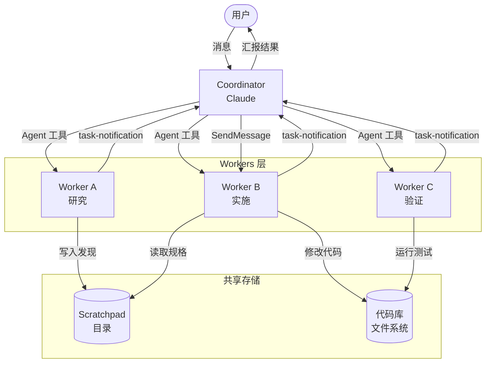

import DifficultyBadge from '@site/src/components/DifficultyBadge';
import SourceRef from '@site/src/components/SourceRef';
import ArticleComplete from '@site/src/components/ArticleComplete';

# Coordinator 模式：主循环变协调器，Worker 汇报机制

<DifficultyBadge level="深度" />

Coordinator 模式是 Claude Code 最强大的并行执行架构。当开启 `CLAUDE_CODE_COORDINATOR_MODE=1` 时，Claude 不再亲自执行代码编辑、文件读写等工作，而是变成一个**纯协调器**（orchestrator）：它负责分解任务、指派工人（Worker）、汇总结果，并与用户保持沟通。

## 什么是 Coordinator 模式？

在普通模式下：
```
用户  ←→  Claude（直接使用工具执行所有工作）
```

在 Coordinator 模式下：
```
用户  ←→  Coordinator（Claude）
              ├── Agent 工具 → Worker A（研究代码库）
              ├── Agent 工具 → Worker B（实现修复）
              └── Agent 工具 → Worker C（运行验证）
```

Coordinator 自己只使用 3 种工具：
- `Agent`：启动一个新 Worker
- `SendMessage`：向现有 Worker 发送后续指令
- `TaskStop`：停止偏离方向的 Worker

Worker 使用标准工具集（读文件、写文件、执行命令等）实际完成工作。

## 如何启用 Coordinator 模式

```bash
# 方式一：环境变量
CLAUDE_CODE_COORDINATOR_MODE=1 claude

# 方式二：使用 --coordinator 标志（如果支持的话）
claude --coordinator
```

源码中的开关逻辑：

```typescript
// source/src/coordinator/coordinatorMode.ts
export function isCoordinatorMode(): boolean {
  if (feature('COORDINATOR_MODE')) {
    return isEnvTruthy(process.env.CLAUDE_CODE_COORDINATOR_MODE)
  }
  return false
}
```

注意：Coordinator 模式需要 `COORDINATOR_MODE` feature flag 开启（通过 Statsig 特性开关控制），且需要设置环境变量。

## 协调器模式 vs 普通模式的区别

### 系统提示的差异

Coordinator 模式使用完全不同的系统提示，明确定义协调器的角色和行为规范：

```typescript
export function getCoordinatorSystemPrompt(): string {
  return `You are Claude Code, an AI assistant that orchestrates software engineering tasks across multiple workers.

## 1. Your Role

You are a **coordinator**. Your job is to:
- Help the user achieve their goal
- Direct workers to research, implement and verify code changes
- Synthesize results and communicate with the user
- Answer questions directly when possible — don't delegate work that you can handle without tools

Every message you send is to the user. Worker results and system notifications are internal signals,
not conversation partners — never thank or acknowledge them.
...`
}
```

与普通模式的对比：

| 维度 | 普通模式 | Coordinator 模式 |
|------|---------|----------------|
| 系统提示 | 通用助手提示 | 协调器专用提示 |
| 可用工具 | 所有工具 | Agent + SendMessage + TaskStop |
| 工作方式 | 自己执行工作 | 委托 Worker 执行 |
| 对 Worker 通知 | 不适用 | 接收 task-notification，不主动致谢 |
| 并行能力 | 有限（单个查询循环） | 高（多 Worker 真正并行） |

### Worker 的工具集

Worker 获得的工具集与协调器不同。协调器将 `INTERNAL_WORKER_TOOLS` 从 Worker 的工具集中排除：

```typescript
// source/src/coordinator/coordinatorMode.ts
const INTERNAL_WORKER_TOOLS = new Set([
  TEAM_CREATE_TOOL_NAME,     // 只有协调器才能创建团队
  TEAM_DELETE_TOOL_NAME,     // 只有协调器才能删除团队
  SEND_MESSAGE_TOOL_NAME,    // 只有协调器才能发送消息
  SYNTHETIC_OUTPUT_TOOL_NAME,
])
```

在简单模式（`CLAUDE_CODE_SIMPLE=1`）下，Worker 只有 3 种工具：

```typescript
if (isEnvTruthy(process.env.CLAUDE_CODE_SIMPLE)) {
  workerTools = [BASH_TOOL_NAME, FILE_READ_TOOL_NAME, FILE_EDIT_TOOL_NAME]
    .sort().join(', ')
}
```

## Worker 如何通过 task-notification 汇报结果

当 Worker 完成任务后，通过 `<task-notification>` XML 将结果以**用户角色消息**注入协调器的对话流。这是整个 Coordinator 架构的通信核心。

### 通知格式

```xml
<task-notification>
<task-id>{agentId}</task-id>
<status>completed|failed|killed</status>
<summary>{人类可读的状态描述}</summary>
<result>{Worker 的最终文本响应}</result>
<usage>
  <total_tokens>N</total_tokens>
  <tool_uses>N</tool_uses>
  <duration_ms>N</duration_ms>
</usage>
</task-notification>
```

### 协调器如何识别通知

协调器在系统提示中被教导：

> Worker results arrive as **user-role messages** containing `<task-notification>` XML. They look like user messages but are not. Distinguish them by the `<task-notification>` opening tag.

这意味着协调器需要通过内容特征来区分真实的用户消息和 Worker 汇报。

## 完整工作流示例

来自源码中的示例对话（`coordinatorMode.ts`）：

```
用户: "There's a null pointer in the auth module. Can you fix it?"

协调器:
  Let me investigate first.

  Agent({ description: "Investigate auth bug", subagent_type: "worker",
          prompt: "Investigate the auth module in src/auth/. Find where null
                   pointer exceptions could occur..." })
  Agent({ description: "Research auth tests", subagent_type: "worker",
          prompt: "Find all test files related to src/auth/. Report the
                   test structure..." })

  Investigating from two angles — I'll report back with findings.

[Worker A 完成，发送 task-notification]

用户（实际上是 task-notification）:
  <task-notification>
  <task-id>agent-a1b</task-id>
  <status>completed</status>
  <summary>Agent "Investigate auth bug" completed</summary>
  <result>Found null pointer in src/auth/validate.ts:42...</result>
  </task-notification>

协调器:
  Found the bug — null pointer in validate.ts:42.

  SendMessage({ to: "agent-a1b",
    message: "Fix the null pointer in src/auth/validate.ts:42..." })

  Fix is in progress. Still waiting on the test suite.
```

## Coordinator 的工作阶段

源码中定义了标准的 4 阶段工作流：

```
| 阶段        | 执行者                | 目的                              |
|------------|----------------------|----------------------------------|
| Research   | Workers（并行）        | 调查代码库、找文件、理解问题            |
| Synthesis  | Coordinator（自己）    | 阅读发现、理解问题、编写实施规格         |
| Implementation | Workers           | 按规格做修改、提交                    |
| Verification | Workers           | 测试变更是否有效                     |
```

**并行是协调器的超能力**：

> Parallelism is your superpower. Workers are async. Launch independent workers concurrently whenever possible — don't serialize work that can run simultaneously.

## 任务分配规则

- **只读任务**（研究）：可以自由并行
- **写入任务**（实施）：同一组文件，一次一个 Worker
- **验证任务**：有时可以与不同文件区域的实施并行进行

## 会话模式匹配：支持 --resume

当用户通过 `--resume` 恢复会话时，需要确保当前模式与保存的会话模式一致：

```typescript
// source/src/coordinator/coordinatorMode.ts
export function matchSessionMode(
  sessionMode: 'coordinator' | 'normal' | undefined,
): string | undefined {
  const currentIsCoordinator = isCoordinatorMode()
  const sessionIsCoordinator = sessionMode === 'coordinator'

  if (currentIsCoordinator === sessionIsCoordinator) {
    return undefined  // 模式一致，无需切换
  }

  // 自动翻转环境变量以匹配会话
  if (sessionIsCoordinator) {
    process.env.CLAUDE_CODE_COORDINATOR_MODE = '1'
  } else {
    delete process.env.CLAUDE_CODE_COORDINATOR_MODE
  }

  return sessionIsCoordinator
    ? 'Entered coordinator mode to match resumed session.'
    : 'Exited coordinator mode to match resumed session.'
}
```

这保证了会话恢复时的一致性——如果会话是在 Coordinator 模式下开始的，恢复时也会以 Coordinator 模式运行。

## Scratchpad：跨 Worker 共享知识库

在 Coordinator 模式下，还支持一个 **scratchpad 目录**：

```typescript
// 协调器上下文注入
if (scratchpadDir && isScratchpadGateEnabled()) {
  content += `\n\nScratchpad directory: ${scratchpadDir}
Workers can read and write here without permission prompts.
Use this for durable cross-worker knowledge — structure files however fits the work.`
}
```

scratchpad 是一个共享工作空间，所有 Worker 都可以读写，无需权限确认。这使得：
- Worker A 的研究发现可以写入 scratchpad
- Worker B 直接读取 Worker A 的发现，无需重新调查
- 协调器可以将规格文档写入 scratchpad，所有 Worker 都可以参考

## Coordinator 模式的架构图



## 适用场景

Coordinator 模式特别适合：

1. **大型重构**：需要同时分析多个模块、并行修改多处代码
2. **全量代码审查**：多个 Worker 同时审查不同文件
3. **复杂调试**：一个 Worker 复现问题，另一个 Worker 定位根因，第三个 Worker 修复
4. **自动化测试生成**：研究 Worker 分析代码，生成 Worker 写测试，验证 Worker 检验覆盖率

相比之下，以下情况不适合：
- 简单的单文件修改（协调器开销大于收益）
- 需要严格顺序的任务（无并行机会）
- 交互性强的任务（用户需要频繁输入中间决策）

## 小结

Coordinator 模式代表了 Claude Code 架构能力的顶峰：通过系统提示工程、task-notification 通信协议、scratchpad 共享知识库，将单个 AI 实例变成了一个能够调度和协调多个 AI Worker 的软件工程团队的"工程经理"。这是 Anthropic "AI 软件工程师"愿景在技术实现层面的直接体现。

<SourceRef file="source/src/coordinator/coordinatorMode.ts" lines="1-369" />

<ArticleComplete />
