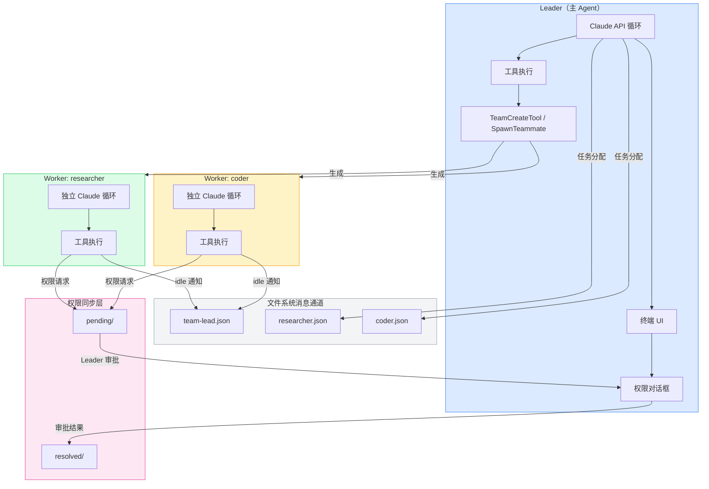

import DifficultyBadge from '@site/src/components/DifficultyBadge';
import SourceRef from '@site/src/components/SourceRef';
import ArticleComplete from '@site/src/components/ArticleComplete';

# Swarm 是什么？Leader-Worker 协作模型概览

<DifficultyBadge level="进阶" />

## 从单 Agent 到 Agent 群体

传统的 Claude Code 工作模式是单 Agent：一个对话循环，一份消息历史，顺序地执行工具调用。这种模式对于大多数任务足够好用，但在面对以下场景时会遇到瓶颈：

- **大型并行任务**：需要同时搜索多个代码库、同时修改多个独立模块
- **职责分工明确的任务**：需要"研究者"查文档、"编码者"写实现、"测试者"验证结果
- **长时间运行的后台任务**：Leader 需要继续交互，同时 Worker 在后台持续执行
- **超长上下文任务**：单个 Agent 的上下文窗口不够，需要分片并行处理

Claude Code 的 **Swarm**（群体）系统正是为此设计的：**让多个 Claude Agent 协同工作，共同完成一个复杂任务**。

## Swarm 的核心概念

### Leader 与 Worker

Swarm 采用 **Leader-Worker** 模型：

- **Leader**（领导者）：发起 Swarm、分配任务、接收汇报、做权限决策的主 Agent。通常就是用户直接交互的那个 Claude 实例。
- **Worker**（工作者，在代码中称为 "Teammate"）：被 Leader 生成的子 Agent。每个 Worker 有自己独立的消息历史和工具执行环境，但共享某些权限上下文。

Worker 的名字来自源码中的 `TeammateIdentity`（队友身份），体现了协作而非单纯的上下级关系。

### 团队（Team）

多个 Worker 加上一个 Leader 构成一个 **Team**（团队）。每个 Team 有：
- 唯一的 `teamName`（团队名称）
- 持久化的 `config.json`（团队配置文件，存储于 `~/.claude/teams/{team_name}/`）
- 独立的 `inboxes/` 目录（每个成员的消息邮箱）
- 共享的 `permissions/` 目录（跨 Agent 权限请求）

```
~/.claude/teams/{team_name}/
├── config.json          # 团队成员、状态、权限路径
├── inboxes/
│   ├── team-lead.json   # Leader 的收件箱
│   ├── researcher.json  # Worker "researcher" 的收件箱
│   └── tester.json      # Worker "tester" 的收件箱
└── permissions/
    ├── pending/         # 待决的权限请求
    └── resolved/        # 已解决的权限请求
```

## Swarm 架构全景



## 三种执行后端

Claude Code 支持三种方式运行 Worker，由 `BackendType` 枚举定义：

| 后端类型 | 标识符 | 描述 |
|---------|--------|------|
| tmux | `'tmux'` | 在 tmux 的独立面板中启动新的 Claude 进程 |
| iTerm2 | `'iterm2'` | 在 iTerm2 的分屏中启动新的 Claude 进程 |
| In-Process | `'in-process'` | 在同一 Node.js 进程内以隔离上下文运行 |

最新版本重点发展的是 **in-process** 模式，它无需额外的终端环境，使用 `AsyncLocalStorage` 实现上下文隔离，Worker 作为独立的任务状态在 `AppState` 中追踪。

```typescript
// source/src/utils/swarm/backends/types.ts
export type BackendType = 'tmux' | 'iterm2' | 'in-process'
```

## Swarm vs 单 Agent：如何选择

| 特征 | 单 Agent | Swarm |
|------|---------|-------|
| 适用任务规模 | 中小型任务 | 大型、可并行任务 |
| 上下文管理 | 单一对话历史 | 每个 Worker 独立历史 |
| 权限管理 | 直接用户确认 | Leader 代理审批 |
| 资源开销 | 低 | 高（多个 API 调用并行） |
| 错误隔离 | 无隔离 | Worker 失败不影响 Leader |
| 适用场景 | 日常编程辅助 | 大规模重构、全栈开发、并行测试 |

**不建议使用 Swarm 的场景**：任务本质上是顺序的、上下文强耦合的、或者任务足够小（Swarm 的协调开销会超过收益）。

## Agent ID 格式

每个 Agent 都有唯一的 `agentId`，格式为 `agentName@teamName`：

```typescript
// 例如：
"researcher@my-project-team"
"coder@my-project-team"
"team-lead@my-project-team"
```

`TEAM_LEAD_NAME` 常量定义了 Leader 的保留名称：

```typescript
// source/src/utils/swarm/constants.ts
export const TEAM_LEAD_NAME = 'team-lead'
```

## 小结

Swarm 系统为 Claude Code 带来了真正的多 Agent 协作能力。理解以下核心要点是深入学习后续章节的基础：

1. **Leader-Worker 模型**：一个主导者协调多个工作者
2. **文件系统作为消息总线**：邮箱、权限请求都通过 `~/.claude/teams/` 下的文件传递
3. **三种执行后端**：tmux、iTerm2、in-process，共同支撑灵活的部署场景
4. **团队配置持久化**：团队状态以 `config.json` 形式存储，支持跨会话恢复

后续章节将逐一深入每个关键组件的实现细节。

<SourceRef file="source/src/utils/swarm/constants.ts" lines="1-34" />
<SourceRef file="source/src/utils/swarm/backends/types.ts" lines="1-50" />
<SourceRef file="source/src/utils/swarm/teamHelpers.ts" lines="64-95" />

<ArticleComplete />
