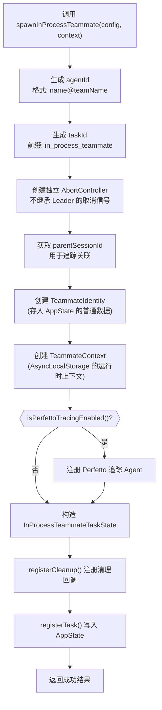

import DifficultyBadge from '@site/src/components/DifficultyBadge';
import SourceRef from '@site/src/components/SourceRef';
import ArticleComplete from '@site/src/components/ArticleComplete';

# spawnInProcess.ts：如何在进程内生成 Teammate

<DifficultyBadge level="深度" />

## 文件职责概述

`spawnInProcess.ts`（328 行）专注于一件事：**在 Node.js 进程内创建并注册一个 in-process Teammate**。

与基于 tmux 或 iTerm2 的外部进程方式不同，in-process 模式不会 `fork()` 新进程，而是在同一个 Node.js 运行时中，通过 **AsyncLocalStorage** 实现 Teammate 的上下文隔离。

文件开头的注释明确了职责边界：

```typescript
/**
 * In-process teammate spawning
 *
 * Creates and registers an in-process teammate task. Unlike process-based
 * teammates (tmux/iTerm2), in-process teammates run in the same Node.js
 * process using AsyncLocalStorage for context isolation.
 *
 * The actual agent execution loop is handled by InProcessTeammateTask
 * component (Task #14). This module handles:
 * 1. Creating TeammateContext
 * 2. Creating linked AbortController
 * 3. Registering InProcessTeammateTaskState in AppState
 * 4. Returning spawn result for backend
 */
```

## 核心数据结构

### SpawnContext — 最小调用上下文

```typescript
export type SpawnContext = {
  setAppState: SetAppStateFn
  toolUseId?: string
}
```

`spawnInProcessTeammate()` 只需要 `setAppState` 函数（用于向 Zustand store 注册任务状态）和可选的 `toolUseId`（用于任务追踪关联）。设计上刻意保持最小化，避免与 `ToolUseContext` 的完整依赖绑定。

### InProcessSpawnConfig — 生成配置

```typescript
export type InProcessSpawnConfig = {
  name: string           // Teammate 的显示名称，如 "researcher"
  teamName: string       // 所属团队名称
  prompt: string         // 初始任务提示词
  color?: string         // 可选的 UI 颜色（用于终端着色）
  planModeRequired: boolean  // 是否需要先进入 plan 模式再实施
  model?: string         // 可选的模型覆盖
}
```

### InProcessSpawnOutput — 生成结果

```typescript
export type InProcessSpawnOutput = {
  success: boolean
  agentId: string          // 格式: "name@team"
  taskId?: string          // AppState 中的任务 ID
  abortController?: AbortController  // 生命周期控制器
  teammateContext?: ReturnType<typeof createTeammateContext>  // AsyncLocalStorage 上下文
  error?: string
}
```

## spawnInProcessTeammate() 的执行流程



关键的代码片段：

```typescript
export async function spawnInProcessTeammate(
  config: InProcessSpawnConfig,
  context: SpawnContext,
): Promise<InProcessSpawnOutput> {
  const { name, teamName, prompt, color, planModeRequired, model } = config
  const { setAppState } = context

  const agentId = formatAgentId(name, teamName)  // "researcher@my-team"
  const taskId = generateTaskId('in_process_teammate')

  // 创建独立 AbortController
  // 注意：Teammate 不随 Leader 的查询中断而中断
  const abortController = createAbortController()
  const parentSessionId = getSessionId()

  // Identity: 存储在 AppState 的普通数据
  const identity: TeammateIdentity = {
    agentId, agentName: name, teamName,
    color, planModeRequired, parentSessionId,
  }

  // Context: AsyncLocalStorage 的运行时对象
  const teammateContext = createTeammateContext({ ...identity, abortController })

  // 构造任务状态
  const taskState: InProcessTeammateTaskState = {
    ...createTaskStateBase(taskId, 'in_process_teammate', description, context.toolUseId),
    type: 'in_process_teammate',
    status: 'running',
    identity,
    prompt,
    model,
    abortController,
    awaitingPlanApproval: false,
    spinnerVerb: sample(getSpinnerVerbs()),
    pastTenseVerb: sample(TURN_COMPLETION_VERBS),
    permissionMode: planModeRequired ? 'plan' : 'default',
    isIdle: false,
    shutdownRequested: false,
    messages: [],
    pendingUserMessages: [],
    // ...
  }

  // 注册清理回调
  taskState.unregisterCleanup = registerCleanup(async () => {
    abortController.abort()
  })

  // 写入 AppState（触发 React 重新渲染，UI 立即显示 Teammate 卡片）
  registerTask(taskState, setAppState)

  return { success: true, agentId, taskId, abortController, teammateContext }
}
```

## 关键设计决策：为什么不用 child_process.fork()？

### 传统方式：fork() 新进程

```
Parent Process            Child Process
    |                          |
    |--- fork() ------------->  |
    |                     独立内存空间
    |                     独立 V8 堆
    |                     IPC 消息传递
```

fork() 的优点是完全隔离，但有明显代价：
- **内存开销大**：每个 Worker 需要完整的 Node.js 堆（几十 MB）
- **启动慢**：需要重新初始化整个运行时
- **IPC 序列化**：跨进程通信必须序列化/反序列化数据
- **权限 UI 无法共享**：Worker 的权限对话框无法出现在 Leader 的终端

### In-Process 方式：AsyncLocalStorage 隔离

```
同一个 Node.js 进程

AsyncLocalStorage.run(teammateContext, () => {
  // 这里执行的所有代码都能通过 getTeamName()、getAgentName() 等
  // 读取到 Teammate 自己的身份信息，而非 Leader 的
  runAgent(...)
})
```

In-process 的优势：
- **内存共享**：工具实现、依赖库、甚至部分缓存都可以共享
- **零启动延迟**：无需新进程初始化
- **权限 UI 直接复用**：Worker 的权限请求可以直接调用 Leader 的 `setToolUseConfirmQueue`，出现在同一个终端
- **状态可观测**：Teammate 的任务状态直接存储在 Leader 的 `AppState` 中，UI 可以实时渲染

### 资源隔离的边界

In-process 并非"零隔离"，以下资源是隔离的：
- **消息历史**：每个 Teammate 维护自己的 `messages` 数组
- **身份信息**：通过 `AsyncLocalStorage` 隔离 `agentId`、`teamName` 等
- **AbortController**：Teammate 有独立的 AbortController，不随 Leader 的中断而停止

以下资源是共享的：
- **工具实现代码**（不可变，安全共享）
- **权限 UI 队列**（通过 `leaderPermissionBridge` 共享）
- **文件系统**（需要显式权限控制）

## AbortController 的独立性

一个重要的设计细节：Teammate 的 `AbortController` **不**链接到 Leader 的 AbortController：

```typescript
// 注释清晰说明了设计意图：
// Create independent AbortController for this teammate
// Teammates should not be aborted when the leader's query is interrupted
const abortController = createAbortController()
```

当用户按 `Ctrl+C` 中断 Leader 的当前查询时，Teammate 仍然继续执行。这个设计符合 Swarm 的语义：Worker 的任务是独立的，不应该因为 Leader 的交互中断而丢失进度。

如果需要强制终止 Teammate，必须显式调用 `killInProcessTeammate()`：

```typescript
export function killInProcessTeammate(
  taskId: string,
  setAppState: SetAppStateFn,
): boolean {
  // 找到对应任务，调用 abortController.abort()
  // 并更新 AppState 中的任务状态
}
```

## permissionMode 的初始值

根据 `planModeRequired` 配置，Teammate 的初始权限模式不同：

```typescript
permissionMode: planModeRequired ? 'plan' : 'default',
```

- `plan` 模式：Teammate 必须先生成执行计划，等待 Leader 批准后才能实施
- `default` 模式：Teammate 直接执行，需要权限时通过 Bridge 询问 Leader

## 小结

`spawnInProcess.ts` 的核心贡献是建立了 **"注册即生成"** 的模式：调用该函数后，Teammate 的任务状态立即出现在 AppState 中（触发 UI 渲染），而实际的 AI 执行循环由 `InProcessTeammateTask` 组件负责驱动。这种设计使得生成操作是轻量级的，不阻塞 Leader 的响应。

<SourceRef file="source/src/utils/swarm/spawnInProcess.ts" lines="1-217" />

<ArticleComplete />
