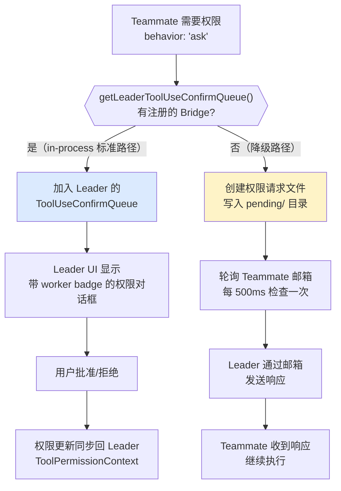

import DifficultyBadge from '@site/src/components/DifficultyBadge';
import SourceRef from '@site/src/components/SourceRef';
import ArticleComplete from '@site/src/components/ArticleComplete';

# inProcessRunner.ts 深度解读：Teammate 运行引擎

<DifficultyBadge level="深度" />

## 概述

`inProcessRunner.ts` 是整个 in-process Swarm 系统中最核心、也最复杂的文件，共 **1552 行**。它负责驱动一个 in-process Teammate 从初始提示词到最终结果的完整执行过程。

如果说 `spawnInProcess.ts` 是"注册 Teammate 到 AppState"，那么 `inProcessRunner.ts` 就是"让 Teammate 真正运行起来"。

## 文件顶层结构

```
inProcessRunner.ts
├── createInProcessCanUseTool()     // 权限检查函数工厂（核心）
├── sendMessageToLeader()           // 发送消息到 Leader 邮箱
├── sendIdleNotification()          // 发送空闲通知
├── findAvailableTask()             // 从任务列表中查找可用任务
├── formatTaskAsPrompt()            // 将任务格式化为提示词
├── tryClaimNextTask()              // 原子性地认领下一个任务
├── formatAsTeammateMessage()       // 格式化为 <teammate-message> XML
├── InProcessRunnerConfig (type)    // 运行配置类型
├── InProcessRunnerResult (type)    // 运行结果类型
├── updateTaskState()               // 更新 AppState 中的任务状态
└── runInProcessTeammate()          // 主入口函数（最核心）
```

## 独立查询循环

`runInProcessTeammate()` 的核心是一个**完整的、独立的 AI-Tool 交互循环**，与 Leader 的主循环完全对称：

```typescript
export async function runInProcessTeammate(
  config: InProcessRunnerConfig,
  setAppState: SetAppStateFn,
): Promise<InProcessRunnerResult> {
  const { identity, taskId, prompt, teammateContext, toolUseContext, abortController } = config

  // 在 AsyncLocalStorage 的 Teammate 上下文中执行
  return runWithTeammateContext(teammateContext, async () => {
    // ... 独立的系统提示、消息历史、工具上下文 ...

    // 主循环：持续认领任务直到没有可用任务
    while (true) {
      // 1. 构建系统提示（包含 TEAMMATE_SYSTEM_PROMPT_ADDENDUM）
      // 2. 调用 runAgent() 执行一轮 AI 交互
      // 3. 处理结果（idle 通知、任务认领、错误处理）
      // 4. 检查邮箱中是否有新任务，有则继续循环
    }
  })
}
```

### runAgent() 调用

Teammate 的实际 AI 调用通过 `runAgent()` 完成，这与 Agent 工具使用的是同一个函数：

```typescript
const agentResult = await runAgent({
  prompt: currentPrompt,
  systemPrompt: buildSystemPrompt(config),
  tools: filteredTools,  // 过滤后的工具集
  toolUseContext: {
    ...toolUseContext,
    canUseTool: createInProcessCanUseTool(identity, abortController),
    // 每个 Teammate 有自己的 getAppState / setAppState 绑定
  },
  abortController,
  model: config.model,
  // ...
})
```

## createInProcessCanUseTool() 权限决策工厂

这是 `inProcessRunner.ts` 中最精妙的设计之一。普通的 `canUseTool` 函数对于 `behavior: 'ask'` 结果会直接拒绝，但 Teammate 需要能够把权限请求升级给 Leader 处理。

```typescript
function createInProcessCanUseTool(
  identity: TeammateIdentity,
  abortController: AbortController,
  onPermissionWaitMs?: (waitMs: number) => void,
): CanUseToolFn {
  return async (tool, input, toolUseContext, assistantMessage, toolUseID, forceDecision) => {
    // 1. 先走正常权限检查
    const result = forceDecision ?? await hasPermissionsToUseTool(...)

    // 2. allow/deny 直接透传
    if (result.behavior !== 'ask') return result

    // 3. 对于 bash 命令，先尝试 classifier 自动审批
    if (feature('BASH_CLASSIFIER') && tool.name === BASH_TOOL_NAME && result.pendingClassifierCheck) {
      const classifierDecision = await awaitClassifierAutoApproval(...)
      if (classifierDecision) return { behavior: 'allow', ... }
    }

    // 4. 路径 A：使用 Leader 的 ToolUseConfirm 对话框（最常用路径）
    const setToolUseConfirmQueue = getLeaderToolUseConfirmQueue()
    if (setToolUseConfirmQueue) {
      return new Promise(resolve => {
        setToolUseConfirmQueue(queue => [
          ...queue,
          {
            tool, description, input,
            workerBadge: identity.color
              ? { name: identity.agentName, color: identity.color }
              : undefined,
            onAllow(updatedInput, permissionUpdates) {
              // 权限更新同步回 Leader 的 ToolPermissionContext
              persistPermissionUpdates(permissionUpdates)
              const setToolPermissionContext = getLeaderSetToolPermissionContext()
              if (setToolPermissionContext && permissionUpdates.length > 0) {
                setToolPermissionContext(updatedContext, { preserveMode: true })
              }
              resolve({ behavior: 'allow', updatedInput })
            },
            onReject(feedback) {
              resolve({ behavior: 'ask', message: SUBAGENT_REJECT_MESSAGE })
            },
          }
        ])
      })
    }

    // 5. 路径 B：回退到文件系统邮箱方式
    return new Promise(resolve => {
      const request = createPermissionRequest({ toolName: tool.name, ... })
      registerPermissionCallback({ requestId: request.id, onAllow, onReject })
      void sendPermissionRequestViaMailbox(request)
      // 轮询邮箱等待响应
      const pollInterval = setInterval(async () => { ... }, PERMISSION_POLL_INTERVAL_MS)
    })
  }
}
```

### 两条权限路径的选择逻辑



## Teammate 的消息历史管理

每个 Teammate 维护**完全独立**的消息历史。消息历史存储在 `InProcessTeammateTaskState.messages` 中，通过 `appendTeammateMessage()` 更新：

```typescript
// 每次 AI 轮次产生新消息时，同步到 AppState
appendTeammateMessage(taskId, newMessages, setAppState)
```

这些消息同时用于：
1. **继续 AI 对话**：下一轮 `runAgent()` 调用时作为历史上下文
2. **UI 展示**：用户可以"进入"某个 Teammate 查看其对话历史
3. **自动压缩**：当 token 数量接近阈值时，触发 `compactConversation()`

### 自动压缩机制

```typescript
const autoCompactThreshold = getAutoCompactThreshold()
const tokenCount = tokenCountWithEstimation(messages)

if (tokenCount > autoCompactThreshold) {
  const compactedMessages = await compactConversation(messages, ...)
  const postCompactMessages = buildPostCompactMessages(compactedMessages, ...)
  messages = postCompactMessages
}
```

Teammate 与 Leader 一样支持自动压缩对话历史，但它们的压缩是独立触发的。

## 任务认领机制（Task Claiming）

Teammate 不仅仅被动接收 Leader 分配的任务，还可以主动从**共享任务列表**中认领任务：

```typescript
async function tryClaimNextTask(
  taskListId: string,
  agentName: string,
): Promise<string | undefined> {
  const tasks = await listTasks(taskListId)

  const task = findAvailableTask(tasks)
  if (!task) return undefined

  // 原子性地标记 owner，防止多个 Teammate 同时认领同一任务
  const claimed = await claimTask(taskListId, task.id, agentName)
  if (!claimed) return undefined

  return formatTaskAsPrompt(task)
}
```

`findAvailableTask()` 的选择逻辑考虑了依赖关系：

```typescript
function findAvailableTask(tasks: Task[]): Task | undefined {
  const unresolvedTaskIds = new Set(
    tasks.filter(t => t.status !== 'completed').map(t => t.id)
  )

  return tasks.find(task => {
    if (task.status !== 'pending') return false
    if (task.owner) return false  // 已被认领
    // 所有阻塞依赖都已完成才可认领
    return task.blockedBy.every(id => !unresolvedTaskIds.has(id))
  })
}
```

## Idle 通知与生命周期

当 Teammate 完成当前任务且没有更多可认领的任务时，进入 **idle（空闲）** 状态：

```typescript
async function sendIdleNotification(
  agentName: string,
  agentColor: string | undefined,
  teamName: string,
  options?: {
    idleReason?: 'available' | 'interrupted' | 'failed'
    summary?: string
    completedTaskId?: string
    completedStatus?: 'resolved' | 'blocked' | 'failed'
    failureReason?: string
  },
): Promise<void> {
  const notification = createIdleNotification(agentName, options)
  await sendMessageToLeader(agentName, jsonStringify(notification), agentColor, teamName)
}
```

Idle 通知通过邮箱发送给 Leader，Leader 收到后可以：
- 给 Teammate 分配新任务（唤醒）
- 决定关闭 Teammate
- 更新 UI 中的状态展示

Idle 通知的 JSON 结构：

```typescript
type IdleNotificationMessage = {
  type: 'idle_notification'
  from: string         // agentName
  timestamp: string    // ISO 时间戳
  idleReason?: 'available' | 'interrupted' | 'failed'
  summary?: string     // 本轮工作的简短总结
  completedTaskId?: string
  completedStatus?: 'resolved' | 'blocked' | 'failed'
  failureReason?: string
}
```

## Plan Mode 审批流程

当 Teammate 配置了 `planModeRequired: true` 时，它必须先生成执行计划，等待 Leader 批准后才能动手实施。这个流程体现在 `awaitingPlanApproval` 状态：

```typescript
// Teammate 完成计划阶段，等待批准
updateTaskState(taskId, task => ({
  ...task,
  awaitingPlanApproval: true,
  isIdle: true,
}), setAppState)

// Leader 批准后，Teammate 进入实施阶段
// Leader 通过发送 approval 消息触发继续执行
```

## 工具过滤机制

Teammate 不是使用全套工具，而是会根据配置过滤：

```typescript
// 排除 Swarm 管理工具（防止 Teammate 创建新团队）
const EXCLUDED_TOOLS_FOR_TEAMMATES = [
  TEAM_CREATE_TOOL_NAME,   // TeamCreateTool
  TEAM_DELETE_TOOL_NAME,   // TeamDeleteTool
]

const filteredTools = tools.filter(t =>
  !EXCLUDED_TOOLS_FOR_TEAMMATES.includes(t.name)
)
```

此外，如果配置了 `allowedTools`，则 Teammate 只能使用指定的工具集：

```typescript
if (config.allowedTools) {
  filteredTools = filteredTools.filter(t =>
    config.allowedTools!.includes(t.name)
  )
}
```

## 进度追踪与 AppState 同步

Teammate 的执行进度实时同步到 AppState，供 UI 渲染使用：

```typescript
// 每次工具执行完成后更新统计
updateTaskState(taskId, task => ({
  ...task,
  progress: getProgressUpdate(agentResult),
  lastReportedToolCount: toolCount,
  lastReportedTokenCount: tokenCount,
}), setAppState)
```

`progress` 字段包含当前执行的工具名称、完成的工具数量等信息，用于在 Teammate 卡片上显示动态进度。

## 小结

`inProcessRunner.ts` 是 Swarm 系统的"发动机"，它将以下关键能力整合在一起：

1. **独立查询循环**：每个 Teammate 有完整的 AI-Tool 交互能力
2. **智能权限升级**：`ask` 权限通过 Bridge 转发给 Leader UI，无缝集成
3. **任务认领**：主动从共享任务池认领工作，实现真正的并行
4. **生命周期管理**：通过 Idle 通知与 Leader 保持同步
5. **资源自治**：独立的消息历史、自动压缩、进度追踪

<SourceRef file="source/src/utils/swarm/inProcessRunner.ts" lines="1-150" />
<SourceRef file="source/src/utils/swarm/inProcessRunner.ts" lines="468-630" />

<ArticleComplete />
