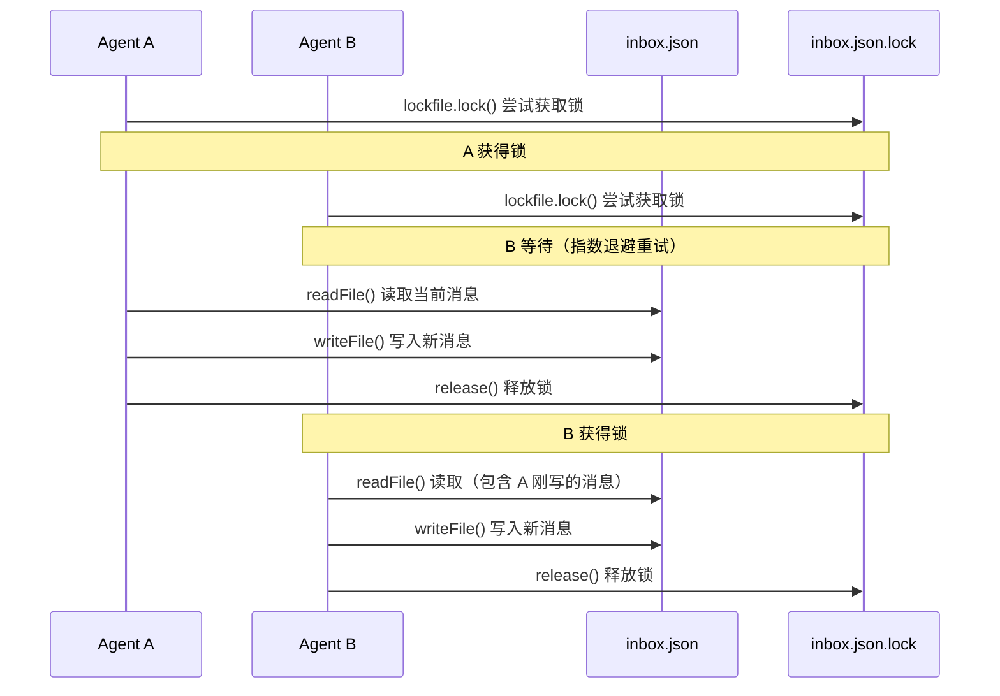
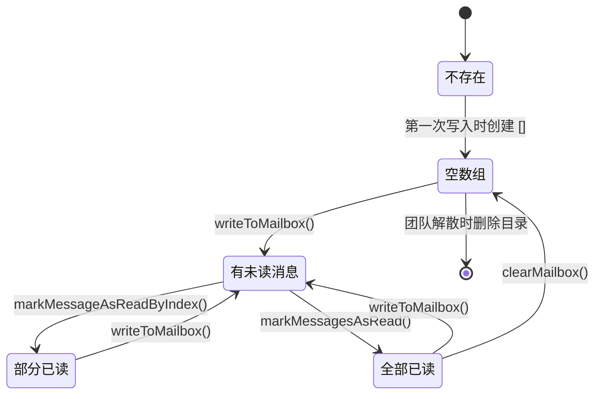

import DifficultyBadge from '@site/src/components/DifficultyBadge';
import SourceRef from '@site/src/components/SourceRef';
import ArticleComplete from '@site/src/components/ArticleComplete';

# teammateMailbox.ts：Agent 间消息邮箱机制

<DifficultyBadge level="深度" />

## 为什么需要邮箱？

在 Swarm 系统中，多个 Agent 同时运行，它们之间需要通信。这个通信机制面临以下挑战：

1. **异步性**：Agent A 发送消息时，Agent B 可能正忙于执行工具，不能实时接收
2. **并发安全**：多个 Agent 可能同时向同一个收件箱写入消息
3. **持久性**：进程崩溃后消息不应丢失
4. **跨进程**：in-process 模式和 tmux 模式的 Agent 需要使用相同的通信基础设施

Claude Code 的解决方案是**基于文件系统的邮箱**：每个 Agent 有一个 JSON 文件作为收件箱，消息通过文件锁保证并发安全。

## 邮箱的物理存储结构

```
~/.claude/teams/{team_name}/inboxes/
├── team-lead.json      # Leader 的收件箱
├── researcher.json     # Worker "researcher" 的收件箱
└── tester.json         # Worker "tester" 的收件箱
```

`getInboxPath()` 函数计算收件箱路径：

```typescript
export function getInboxPath(agentName: string, teamName?: string): string {
  const team = teamName || getTeamName() || 'default'
  const safeTeam = sanitizePathComponent(team)      // 防止路径注入
  const safeAgentName = sanitizePathComponent(agentName)
  const inboxDir = join(getTeamsDir(), safeTeam, 'inboxes')
  return join(inboxDir, `${safeAgentName}.json`)
}
```

`getTeamsDir()` 返回 `~/.claude/teams/`，每个团队有独立的子目录。

## TeammateMessage：消息的数据结构

```typescript
export type TeammateMessage = {
  from: string         // 发送者的 agentName（如 "researcher"）
  text: string         // 消息内容（可以是纯文本或 JSON 字符串）
  timestamp: string    // ISO 8601 时间戳
  read: boolean        // 是否已被收件人读取
  color?: string       // 发送者的颜色（用于 UI 着色）
  summary?: string     // 5-10 词的摘要（用于 UI 预览）
}
```

收件箱文件是一个 `TeammateMessage[]` 的 JSON 数组，按时间顺序追加。

## 核心操作：读写与锁

### readMailbox() — 读取所有消息

```typescript
export async function readMailbox(
  agentName: string,
  teamName?: string,
): Promise<TeammateMessage[]> {
  const inboxPath = getInboxPath(agentName, teamName)
  try {
    const content = await readFile(inboxPath, 'utf-8')
    return jsonParse(content) as TeammateMessage[]
  } catch (error) {
    if (getErrnoCode(error) === 'ENOENT') return []  // 收件箱不存在 = 空
    logError(error)
    return []
  }
}
```

读操作不加锁，因为 JSON 文件读取是原子性的（内核保证单次 `read()` 不会看到部分写入）。

### writeToMailbox() — 写入消息（带文件锁）

```typescript
export async function writeToMailbox(
  recipientName: string,
  message: Omit<TeammateMessage, 'read'>,
  teamName?: string,
): Promise<void> {
  await ensureInboxDir(teamName)
  const inboxPath = getInboxPath(recipientName, teamName)
  const lockFilePath = `${inboxPath}.lock`

  // 确保收件箱文件存在（proper-lockfile 要求文件先存在）
  try {
    await writeFile(inboxPath, '[]', { encoding: 'utf-8', flag: 'wx' })  // 'wx' = 不存在则创建
  } catch (error) {
    if (getErrnoCode(error) !== 'EEXIST') throw error  // EEXIST 是正常的
  }

  let release: (() => Promise<void>) | undefined
  try {
    // 获取文件锁（带指数退避重试）
    release = await lockfile.lock(inboxPath, {
      lockfilePath: lockFilePath,
      retries: { retries: 10, minTimeout: 5, maxTimeout: 100 },
    })

    // 加锁后重新读取（确保看到最新状态）
    const messages = await readMailbox(recipientName, teamName)
    messages.push({ ...message, read: false })

    await writeFile(inboxPath, jsonStringify(messages, null, 2), 'utf-8')
  } finally {
    if (release) await release()  // 必须释放锁
  }
}
```

### 锁机制详解



`proper-lockfile` 库通过创建 `.lock` 目录文件来实现原子锁（目录创建是原子操作）。`LOCK_OPTIONS` 配置了重试策略，确保在高并发下不会因锁争用而失败：

```typescript
const LOCK_OPTIONS = {
  retries: {
    retries: 10,      // 最多重试 10 次
    minTimeout: 5,    // 最短等待 5ms
    maxTimeout: 100,  // 最长等待 100ms（指数退避上限）
  },
}
```

## 消息类型的多态设计

`text` 字段是字符串，但实际内容可以是多种类型，通过 JSON 序列化实现多态：

### 1. 普通文本消息

```json
{
  "from": "researcher",
  "text": "已完成文档搜索，找到 3 个相关接口",
  "timestamp": "2026-04-01T10:30:00Z",
  "read": false
}
```

### 2. Idle 通知

```json
{
  "from": "researcher",
  "text": "{\"type\":\"idle_notification\",\"from\":\"researcher\",\"timestamp\":\"...\",\"idleReason\":\"available\",\"summary\":\"完成 API 文档分析\"}",
  "timestamp": "2026-04-01T10:31:00Z",
  "read": false
}
```

解析时通过 `isIdleNotification()` 检测：

```typescript
export function isIdleNotification(messageText: string): IdleNotificationMessage | null {
  try {
    const parsed = jsonParse(messageText)
    if (parsed && parsed.type === 'idle_notification') {
      return parsed as IdleNotificationMessage
    }
  } catch { /* 非 JSON，不是 idle 通知 */ }
  return null
}
```

### 3. 权限请求响应

```typescript
export function isPermissionResponse(messageText: string): PermissionResponseMessage | null
export function isShutdownRequest(messageText: string): ShutdownRequestMessage | null
```

消息内容的 JSON 判别通过 `type` 字段区分。这是一种简单的**判别联合（discriminated union）**模式。

## 消息已读管理

### markMessageAsReadByIndex() — 按索引标记已读

```typescript
export async function markMessageAsReadByIndex(
  agentName: string,
  teamName: string | undefined,
  messageIndex: number,
): Promise<void> {
  // 加锁 → 读取 → 标记 → 写回 → 释放锁
  release = await lockfile.lock(inboxPath, ...)
  const messages = await readMailbox(agentName, teamName)
  messages[messageIndex] = { ...messages[messageIndex], read: true }
  await writeFile(inboxPath, jsonStringify(messages, null, 2), 'utf-8')
}
```

标记已读也需要加锁，因为两个操作（读取 + 写入）必须是原子的。

## 消息格式化为 XML

当消息需要注入 AI 对话时，使用 XML 格式：

```typescript
export function formatTeammateMessages(
  messages: Array<{ from: string; text: string; timestamp: string; color?: string; summary?: string }>,
): string {
  return messages.map(m => {
    const colorAttr = m.color ? ` color="${m.color}"` : ''
    const summaryAttr = m.summary ? ` summary="${m.summary}"` : ''
    return `<teammate-message teammate_id="${m.from}"${colorAttr}${summaryAttr}>\n${m.text}\n</teammate-message>`
  }).join('\n\n')
}
```

生成的 XML 示例：
```xml
<teammate-message teammate_id="researcher" color="blue" summary="完成 API 文档分析">
已分析了 src/api/ 目录下的 15 个文件，关键接口如下...
</teammate-message>
```

这种格式让 AI 模型能够清晰地识别哪些内容来自哪个队友，并根据颜色/ID 在响应中引用它们。

## 邮箱的生命周期



## IdleNotification 类型详解

```typescript
export type IdleNotificationMessage = {
  type: 'idle_notification'
  from: string
  timestamp: string
  idleReason?: 'available' | 'interrupted' | 'failed'
  summary?: string            // 最后一轮 DM 的简短摘要
  completedTaskId?: string    // 如果完成了某个任务
  completedStatus?: 'resolved' | 'blocked' | 'failed'
  failureReason?: string      // 失败原因
}
```

`idleReason` 的三种语义：
- `available`：正常完成，等待新任务
- `interrupted`：被中断（AbortController 触发）
- `failed`：执行出错

Leader 收到 idle 通知后，根据 `idleReason` 和 `completedStatus` 决定后续策略：继续分配任务、重试、或者关闭 Teammate。

## 防止消息丢失的设计

消息丢失的风险点在于：写操作中途崩溃（如在 `readMailbox()` 之后、`writeFile()` 之前进程退出）。

Claude Code 的设计通过以下方式降低风险：
1. **先创建文件**（`flag: 'wx'`），确保文件存在
2. **写完整 JSON**（而非追加），即使崩溃也只有"旧版本"而非"损坏版本"
3. **锁粒度适当**：只在写入时持锁，避免长时间持锁导致其他写入超时失败

对于已经在 `lockfile.lock()` 等待中的写入，`retries` 配置保证了即使遇到竞争也会重试。

## 小结

`teammateMailbox.ts` 的设计展示了一种**简洁而实用的文件系统消息队列**：

- **简单性**：JSON 文件 + 文件锁，无需额外的消息中间件
- **可靠性**：重试机制 + 读锁后刷新，防止竞态条件
- **灵活性**：`text` 字段支持 JSON 内嵌，通过 `type` 字段区分消息类型
- **可观测性**：文件可以直接用 `cat` 查看，调试方便

这种设计也适合在同一台机器上运行多个 Claude 进程（tmux 模式），因为文件系统是天然的进程间通信媒介。

<SourceRef file="source/src/utils/teammateMailbox.ts" lines="1-100" />
<SourceRef file="source/src/utils/teammateMailbox.ts" lines="130-200" />
<SourceRef file="source/src/utils/teammateMailbox.ts" lines="392-450" />

<ArticleComplete />
