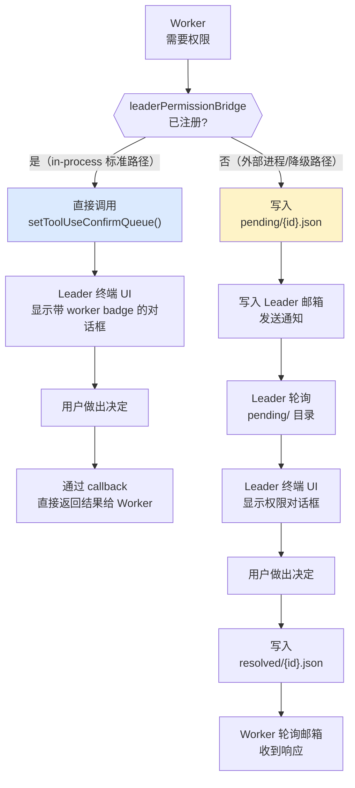

import DifficultyBadge from '@site/src/components/DifficultyBadge';
import SourceRef from '@site/src/components/SourceRef';
import ArticleComplete from '@site/src/components/ArticleComplete';

# permissionSync.ts：跨 Agent 权限同步设计

<DifficultyBadge level="深度" />

## 为什么需要跨 Agent 权限同步？

在 Swarm 模式中，Worker 需要执行各种工具操作（编辑文件、运行命令等）。这些操作可能需要用户确认，但 **Worker 没有自己的终端 UI**——它们运行在后台，无法直接展示权限对话框。

解决方案是 **权限请求委托**：Worker 将权限请求发送给有终端 UI 的 Leader，Leader 展示对话框，用户确认后把结果传回 Worker。

`permissionSync.ts`（928 行）实现了这套委托机制，使用文件系统作为通信通道。

## 整体设计

```
Worker                        文件系统                    Leader
  |                                                         |
  |--- writePermissionRequest() -> pending/{id}.json        |
  |                                                         |
  |                          Leader 轮询 pending/ 目录      |
  |                          发现新请求                      |
  |                                                         |
  |                          Leader UI 展示权限对话框        |
  |                          用户批准/拒绝                   |
  |                                                         |
  |   <- resolvePermissionRequest() <- resolved/{id}.json   |
  |                                                         |
  |  Worker 轮询 resolved/ 或邮箱                           |
  |  收到响应，继续执行                                      |
```

## 核心数据结构：SwarmPermissionRequest

```typescript
export const SwarmPermissionRequestSchema = lazySchema(() =>
  z.object({
    id: z.string(),                  // 唯一请求 ID（格式: perm-{timestamp}-{random}）
    workerId: z.string(),            // Worker 的 CLAUDE_CODE_AGENT_ID
    workerName: z.string(),          // Worker 的 agentName
    workerColor: z.string().optional(), // Worker 颜色（用于 UI 着色）
    teamName: z.string(),            // 团队名称（用于路由到正确的权限目录）
    toolName: z.string(),            // 工具名（如 "Bash"、"Edit"）
    toolUseId: z.string(),           // Worker 上下文中的 toolUseID
    description: z.string(),         // 人类可读的工具操作描述
    input: z.record(z.string(), z.unknown()),  // 序列化的工具输入
    permissionSuggestions: z.array(z.unknown()), // 来自权限检查的建议规则
    status: z.enum(['pending', 'approved', 'rejected']),
    resolvedBy: z.enum(['worker', 'leader']).optional(),
    resolvedAt: z.number().optional(),
    feedback: z.string().optional(),        // 拒绝时的反馈消息
    updatedInput: z.record(z.string(), z.unknown()).optional(), // Leader 修改后的输入
    permissionUpdates: z.array(z.unknown()).optional(), // "始终允许" 规则
    createdAt: z.number(),           // 创建时间戳
  })
)
```

## 目录结构

```
~/.claude/teams/{team_name}/permissions/
├── pending/          # 等待 Leader 处理的请求
│   ├── perm-1234567890-abc123.json
│   └── perm-1234567891-def456.json
└── resolved/         # 已处理的请求（Worker 读取后可清理）
    └── perm-1234567890-abc123.json
```

## 请求 ID 生成

```typescript
export function generateRequestId(): string {
  return `perm-${Date.now()}-${Math.random().toString(36).substring(2, 9)}`
}
// 示例: "perm-1711900800000-k3j2m1p"
```

使用时间戳 + 随机字符串，在同一毫秒内也能保证唯一性。

## 写入权限请求：writePermissionRequest()

```typescript
export async function writePermissionRequest(
  request: SwarmPermissionRequest,
): Promise<SwarmPermissionRequest> {
  await ensurePermissionDirsAsync(request.teamName)

  const pendingPath = getPendingRequestPath(request.teamName, request.id)
  const lockDir = getPendingDir(request.teamName)

  // 目录级别的锁文件（防止并发写入冲突）
  const lockFilePath = join(lockDir, '.lock')
  await writeFile(lockFilePath, '', 'utf-8')

  let release: (() => Promise<void>) | undefined
  try {
    release = await lockfile.lock(lockFilePath)
    await writeFile(pendingPath, jsonStringify(request, null, 2), 'utf-8')
    return request
  } finally {
    if (release) await release()
  }
}
```

写入请求时使用目录级别的锁（而非文件级别），因为多个 Worker 可能同时写入不同的请求文件，目录锁能防止竞争条件。

## 解析权限请求：resolvePermissionRequest()

Leader 在用户做出决定后调用此函数：

```typescript
export async function resolvePermissionRequest(
  teamName: string,
  requestId: string,
  resolution: PermissionResolution,
): Promise<void> {
  const pendingPath = getPendingRequestPath(teamName, requestId)
  const resolvedPath = getResolvedRequestPath(teamName, requestId)

  // 读取原始请求
  const content = await readFile(pendingPath, 'utf-8')
  const request = jsonParse(content) as SwarmPermissionRequest

  // 合并解析结果
  const resolvedRequest: SwarmPermissionRequest = {
    ...request,
    status: resolution.decision === 'approved' ? 'approved' : 'rejected',
    resolvedBy: resolution.resolvedBy,
    resolvedAt: Date.now(),
    feedback: resolution.feedback,
    updatedInput: resolution.updatedInput,
    permissionUpdates: resolution.permissionUpdates,
  }

  // 写入 resolved/ 目录
  await writeFile(resolvedPath, jsonStringify(resolvedRequest, null, 2), 'utf-8')

  // 从 pending/ 删除（原子移动）
  await unlink(pendingPath)
}
```

## 通过邮箱发送权限请求

`permissionSync.ts` 还提供了通过邮箱发送权限请求的方式（供文件系统轮询之外的路径使用）：

```typescript
export async function sendPermissionRequestViaMailbox(
  request: SwarmPermissionRequest,
): Promise<void> {
  // 同时写入文件系统（持久化）和 Leader 邮箱（通知）
  await writePermissionRequest(request)

  // 通过邮箱通知 Leader 有新的权限请求
  await writeToMailbox(
    TEAM_LEAD_NAME,
    {
      from: request.workerName,
      text: createPermissionRequestMessage(request),
      timestamp: new Date().toISOString(),
      color: request.workerColor,
      summary: `需要权限: ${request.toolName}`,
    },
    request.teamName,
  )
}
```

## 权限请求的两条传播路径



**路径 A（Bridge）**：适用于 in-process Teammate，Worker 直接调用 Leader 的 React state setter，UI 立即响应，无需轮询。

**路径 B（文件系统）**：适用于 tmux/iTerm2 Teammate（不同进程），通过文件系统交换数据，Leader 主循环定期扫描 `pending/` 目录。

## 列举待处理请求：listPendingPermissionRequests()

Leader 需要定期扫描待处理请求：

```typescript
export async function listPendingPermissionRequests(
  teamName: string,
): Promise<SwarmPermissionRequest[]> {
  const pendingDir = getPendingDir(teamName)
  try {
    const files = await readdir(pendingDir)
    const jsonFiles = files.filter(f => f.endsWith('.json') && !f.startsWith('.'))

    const requests: SwarmPermissionRequest[] = []
    for (const file of jsonFiles) {
      try {
        const content = await readFile(join(pendingDir, file), 'utf-8')
        const request = jsonParse(content)
        const validated = SwarmPermissionRequestSchema().safeParse(request)
        if (validated.success) {
          requests.push(validated.data)
        }
      } catch {
        // 跳过损坏的文件
      }
    }
    return requests.sort((a, b) => a.createdAt - b.createdAt)  // 按时间排序
  } catch (error) {
    if (getErrnoCode(error) === 'ENOENT') return []
    throw error
  }
}
```

## 权限缓存的一致性保证

当 Worker 通过 Leader 获得了"始终允许"类型的权限决策时，需要将这个决策同步回 Leader 的权限上下文，使后续相同操作自动通过：

```typescript
// 在 inProcessRunner.ts 中，permission onAllow 处理：
async onAllow(updatedInput, permissionUpdates) {
  persistPermissionUpdates(permissionUpdates)  // 持久化到 settings.json

  if (permissionUpdates.length > 0) {
    const setToolPermissionContext = getLeaderSetToolPermissionContext()
    if (setToolPermissionContext) {
      const currentAppState = toolUseContext.getAppState()
      const updatedContext = applyPermissionUpdates(
        currentAppState.toolPermissionContext,
        permissionUpdates,
      )
      // 注意：preserveMode: true 防止 Worker 的 'acceptEdits' 模式
      // 污染 Leader 的权限上下文
      setToolPermissionContext(updatedContext, { preserveMode: true })
    }
  }
}
```

`preserveMode: true` 是一个重要的安全保证：防止 Worker 在 `acceptEdits` 模式下运行时，将该模式"泄露"回 Leader 的主权限上下文。

## 防止权限升级的安全保证

Swarm 系统在权限设计上有几个重要的安全考量：

1. **Worker 不能自行提升权限**：权限请求必须经过 Leader（用户）确认
2. **Worker 不能修改 Leader 的权限模式**：`preserveMode: true` 保证了这一点
3. **请求有唯一 ID**：防止 Leader 重复处理同一请求
4. **请求包含工具名和描述**：用户可以看到具体要执行什么操作，做出知情决策

## 沙箱权限请求（Sandbox Permission）

`permissionSync.ts` 还包含用于沙箱环境的权限请求类型：

```typescript
export function createSandboxPermissionRequestMessage(
  request: SwarmPermissionRequest,
): string
export function createSandboxPermissionResponseMessage(
  requestId: string,
  approved: boolean,
): string
```

沙箱权限请求是一个扩展点，允许在安全的沙盒环境中对工具操作进行额外审查。

## 小结

`permissionSync.ts` 解决了分布式 Agent 系统中的一个核心问题：**如何让没有 UI 的 Worker 获得用户对敏感操作的确认**。

设计亮点：
- **双路径**：in-process Bridge（低延迟）+ 文件系统轮询（跨进程兼容）
- **持久化**：请求写入文件，进程崩溃不丢失
- **安全性**：`preserveMode` 防止权限升级，请求有完整审计信息
- **Zod 验证**：请求和响应都经过 schema 验证，防止格式错误导致安全问题

<SourceRef file="source/src/utils/swarm/permissionSync.ts" lines="1-110" />
<SourceRef file="source/src/utils/swarm/permissionSync.ts" lines="160-260" />

<ArticleComplete />
