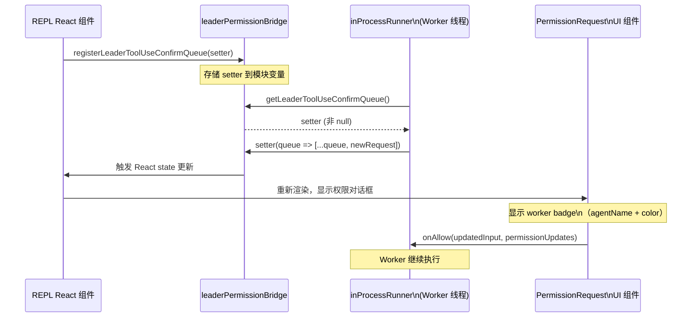

import DifficultyBadge from '@site/src/components/DifficultyBadge';
import SourceRef from '@site/src/components/SourceRef';
import ArticleComplete from '@site/src/components/ArticleComplete';

# leaderPermissionBridge.ts：Leader 权限代理机制

<DifficultyBadge level="深度" />

## 文件背景

`leaderPermissionBridge.ts` 是整个 Swarm 权限系统中最简洁的文件，仅 **54 行**，却扮演着极其关键的角色。

它解决的问题是：**in-process Teammate（Worker）如何访问 Leader 的 React 状态 setter，使得 Worker 的权限请求能直接出现在 Leader 的终端 UI 中？**

## 问题背景

在普通的单 Agent 模式下，权限对话框的工作流程是：

1. `canUseTool()` 返回 `behavior: 'ask'`
2. REPL 的 React 组件调用 `setToolUseConfirmQueue()`，将请求加入队列
3. `PermissionRequest` 组件渲染对话框
4. 用户确认/拒绝，回调触发

但 in-process Teammate 运行在 React 组件树之外（它在 `AsyncLocalStorage` 上下文中执行，不是 React 组件）。Teammate 的权限检查代码（`createInProcessCanUseTool()`）是普通的 async 函数，无法直接访问 React state。

## Bridge 模式：模块级别的全局注册

`leaderPermissionBridge.ts` 使用了经典的 **服务定位器（Service Locator）** 模式，通过模块级变量存储 React setter：

```typescript
// 模块级私有变量
let registeredSetter: SetToolUseConfirmQueueFn | null = null
let registeredPermissionContextSetter: SetToolPermissionContextFn | null = null
```

### 注册端（REPL React 组件）

```typescript
export function registerLeaderToolUseConfirmQueue(
  setter: SetToolUseConfirmQueueFn,
): void {
  registeredSetter = setter
}

export function registerLeaderSetToolPermissionContext(
  setter: SetToolPermissionContextFn,
): void {
  registeredPermissionContextSetter = setter
}
```

REPL 组件在挂载时调用 `register*` 函数，将 React 的 state setter 注入到模块变量中。

### 查询端（inProcessRunner.ts）

```typescript
export function getLeaderToolUseConfirmQueue(): SetToolUseConfirmQueueFn | null {
  return registeredSetter
}

export function getLeaderSetToolPermissionContext(): SetToolPermissionContextFn | null {
  return registeredPermissionContextSetter
}
```

Worker 的权限检查代码调用 `get*` 函数，若返回非 null，则直接调用 setter 将请求加入 Leader 的队列。

### 注销端（组件卸载时）

```typescript
export function unregisterLeaderToolUseConfirmQueue(): void {
  registeredSetter = null
}

export function unregisterLeaderSetToolPermissionContext(): void {
  registeredPermissionContextSetter = null
}
```

## 类型定义

```typescript
export type SetToolUseConfirmQueueFn = (
  updater: (prev: ToolUseConfirm[]) => ToolUseConfirm[],
) => void

export type SetToolPermissionContextFn = (
  context: ToolPermissionContext,
  options?: { preserveMode?: boolean },
) => void
```

这两个类型与 React 的 `useState` setter 完全兼容（接受函数式更新）。

## 完整数据流



## Worker Badge：视觉区分

当 Worker 通过 Bridge 提交权限请求时，可以附带 `workerBadge` 信息：

```typescript
setToolUseConfirmQueue(queue => [
  ...queue,
  {
    assistantMessage,
    tool,
    description,
    input,
    toolUseContext,
    toolUseID,
    permissionResult: result,
    permissionPromptStartTimeMs: permissionStartMs,
    workerBadge: identity.color
      ? { name: identity.agentName, color: identity.color }
      : undefined,
    onAllow(...) { ... },
    onReject(...) { ... },
    // ...
  }
])
```

`workerBadge` 包含 Teammate 的名称和颜色，UI 渲染时会在对话框旁边显示一个有颜色的标识，让用户清楚知道这是哪个 Worker 在请求权限。

## null 检查的回退逻辑

`getLeaderToolUseConfirmQueue()` 返回 `null` 的情况：
- REPL 组件尚未挂载（初始化阶段）
- REPL 组件已卸载（会话结束）
- 在非 in-process 环境中运行的 Worker（tmux 模式）

`inProcessRunner.ts` 中的回退逻辑：

```typescript
const setToolUseConfirmQueue = getLeaderToolUseConfirmQueue()

if (setToolUseConfirmQueue) {
  // 快速路径：直接调用 React setter
  return new Promise(resolve => {
    setToolUseConfirmQueue(queue => [...queue, { ..., onAllow, onReject }])
  })
}

// 降级路径：使用文件系统邮箱
return new Promise(resolve => {
  const request = createPermissionRequest(...)
  registerPermissionCallback({ requestId: request.id, onAllow, onReject })
  void sendPermissionRequestViaMailbox(request)
  const pollInterval = setInterval(/* 轮询邮箱 */, PERMISSION_POLL_INTERVAL_MS)
})
```

## 为什么用模块变量而非 Context 或 Props？

这个设计看起来"不够 React"，但有充分的工程理由：

1. **跨越 React 边界**：Teammate 的执行逻辑不在 React 组件树内，无法通过 Context 注入
2. **无法通过 Props 传递**：Teammate 通过 `runAgent()` 调用，中间隔了多层与 React 无关的函数
3. **替代方案的代价**：
   - 使用 Zustand store：需要在 store 中存储函数，违反序列化原则
   - 使用 EventEmitter：引入事件系统，增加复杂度
   - 模块变量：最简单，清晰表达"每个进程只有一个 Leader"的语义

模块变量在这里是合理的，因为整个应用只有一个 Leader，一个 REPL 实例。

## 生命周期管理

REPL 组件使用 `useEffect` 管理 Bridge 的注册和注销：

```typescript
// 在 REPL 组件中（概念代码）
useEffect(() => {
  registerLeaderToolUseConfirmQueue(setToolUseConfirmQueue)
  registerLeaderSetToolPermissionContext(setToolPermissionContext)

  return () => {
    unregisterLeaderToolUseConfirmQueue()
    unregisterLeaderSetToolPermissionContext()
  }
}, [setToolUseConfirmQueue, setToolPermissionContext])
```

注意 `dependencies` 数组包含 setter 函数。在 React 中，`useState` 返回的 setter 函数引用是稳定的（不会在重渲染时改变），所以这个 effect 只在组件挂载/卸载时运行一次。

## 小结

`leaderPermissionBridge.ts` 是一个设计精巧的"胶水模块"：

- **简洁性**：54 行，没有业务逻辑，纯粹是注册/获取/注销
- **清晰语义**：函数名直白表达意图（register/get/unregister）
- **零依赖**：只依赖类型定义，不引入任何副作用
- **安全性**：null 检查强制调用方处理 Bridge 不可用的情况

它是整个 Swarm 系统中"React 世界"与"纯 TypeScript 世界"之间的唯一桥梁，保持这个桥梁简单是整个架构清晰的关键。

<SourceRef file="source/src/utils/swarm/leaderPermissionBridge.ts" lines="1-54" />

<ArticleComplete />
