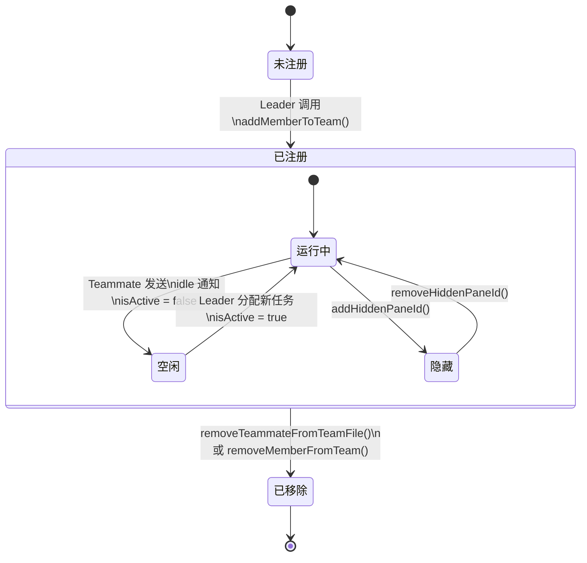

import DifficultyBadge from '@site/src/components/DifficultyBadge';
import SourceRef from '@site/src/components/SourceRef';
import ArticleComplete from '@site/src/components/ArticleComplete';

# teamDiscovery.ts：动态团队发现与注册

<DifficultyBadge level="进阶" />

## 文件职责

`teamDiscovery.ts` 是相对轻量的一个文件（81 行），但它承担着 Swarm 系统中重要的 **"注册表查询"** 职责：**扫描 `~/.claude/teams/` 目录，返回当前活跃的团队及其成员状态，供 UI 展示使用**。

与"发现"相关的核心逻辑（注册团队成员、加入团队）主要在 `teamHelpers.ts` 中实现。`teamDiscovery.ts` 专注于**只读查询**：从持久化文件中读取状态，转换为 UI 友好的类型。

## 核心类型定义

```typescript
export type TeamSummary = {
  name: string           // 团队名称
  memberCount: number    // 总成员数（不含 team-lead）
  runningCount: number   // 正在运行的成员数
  idleCount: number      // 空闲的成员数
}

export type TeammateStatus = {
  name: string             // 成员名称（如 "researcher"）
  agentId: string          // 完整 Agent ID（"researcher@my-team"）
  agentType?: string       // 角色类型（如 "researcher", "test-runner"）
  model?: string           // 使用的模型
  prompt?: string          // 初始任务提示词
  status: 'running' | 'idle' | 'unknown'
  color?: string           // 分配的颜色
  idleSince?: string       // 变为 idle 的 ISO 时间戳
  tmuxPaneId: string       // tmux 面板 ID（或 in-process 的虚拟 ID）
  cwd: string              // 工作目录
  worktreePath?: string    // git worktree 路径
  isHidden?: boolean       // 是否在 swarm 视图中隐藏
  backendType?: PaneBackendType  // 后端类型（tmux/iterm2）
  mode?: string            // 当前权限模式
}
```

## getTeammateStatuses()：读取团队成员状态

```typescript
export function getTeammateStatuses(teamName: string): TeammateStatus[] {
  const teamFile = readTeamFile(teamName)
  if (!teamFile) return []

  const hiddenPaneIds = new Set(teamFile.hiddenPaneIds ?? [])
  const statuses: TeammateStatus[] = []

  for (const member of teamFile.members) {
    // 排除 team-lead 自身（Leader 不在成员列表中展示）
    if (member.name === 'team-lead') continue

    // isActive 字段决定状态：undefined 或 true → running，false → idle
    const isActive = member.isActive !== false
    const status: 'running' | 'idle' = isActive ? 'running' : 'idle'

    statuses.push({
      name: member.name,
      agentId: member.agentId,
      // ...其他字段直接从 teamFile 读取
      isHidden: hiddenPaneIds.has(member.tmuxPaneId),
      backendType: member.backendType && isPaneBackend(member.backendType)
        ? member.backendType
        : undefined,
    })
  }

  return statuses
}
```

### isActive 字段的语义

```typescript
isActive?: boolean  // false = idle，undefined/true = active（正在运行）
```

`isActive` 是 `TeamFile` 成员记录中的一个字段，由 Teammate 自身在变为 idle 时写入 `false`。这种设计（默认为 active）避免了初始化顺序问题：新成员注册时不需要显式设置 `isActive: true`。

## 团队配置文件的结构（TeamFile）

`teamDiscovery.ts` 依赖 `teamHelpers.ts` 中的 `readTeamFile()` 函数，后者读取如下格式的 JSON：

```json
{
  "name": "my-project-team",
  "description": "全栈开发团队",
  "createdAt": 1711900800000,
  "leadAgentId": "team-lead@my-project-team",
  "leadSessionId": "550e8400-e29b-41d4-a716-446655440000",
  "hiddenPaneIds": ["%3"],
  "teamAllowedPaths": [
    {
      "path": "/Users/admin/project/src",
      "toolName": "Edit",
      "addedBy": "team-lead",
      "addedAt": 1711900900000
    }
  ],
  "members": [
    {
      "agentId": "team-lead@my-project-team",
      "name": "team-lead",
      "joinedAt": 1711900800000,
      "tmuxPaneId": "%1",
      "cwd": "/Users/admin/project",
      "subscriptions": []
    },
    {
      "agentId": "researcher@my-project-team",
      "name": "researcher",
      "agentType": "researcher",
      "model": "claude-opus-4-6",
      "color": "blue",
      "joinedAt": 1711900810000,
      "tmuxPaneId": "%2",
      "cwd": "/Users/admin/project",
      "isActive": true,
      "subscriptions": ["task-updates"],
      "backendType": "tmux"
    },
    {
      "agentId": "coder@my-project-team",
      "name": "coder",
      "isActive": false,
      "tmuxPaneId": "%3",
      "cwd": "/Users/admin/project",
      "joinedAt": 1711900820000,
      "subscriptions": []
    }
  ]
}
```

## 团队发现的完整生命周期



## teamHelpers.ts 中的注册逻辑

团队成员的注册通过 `teamHelpers.ts` 中的 `addMemberToTeam()` 完成。这个函数在 Teammate 启动时调用，将成员信息写入 `config.json`：

```typescript
// 来自 teamHelpers.ts（概念示意）
export function addMemberToTeam(
  teamName: string,
  member: TeamFileMember,
): void {
  const teamFile = readTeamFile(teamName) ?? createNewTeamFile(teamName)
  teamFile.members.push(member)
  writeTeamFile(teamName, teamFile)
}
```

### 团队文件路径计算

```typescript
// ~/.claude/teams/{sanitized-team-name}/config.json
export function getTeamFilePath(teamName: string): string {
  return join(getTeamDir(teamName), 'config.json')
}

export function getTeamDir(teamName: string): string {
  return join(getTeamsDir(), sanitizeName(teamName))
}

// sanitizeName: 非字母数字字符替换为 "-"，全部小写
export function sanitizeName(name: string): string {
  return name.replace(/[^a-zA-Z0-9]/g, '-').toLowerCase()
}
```

## 隐藏面板（hiddenPaneIds）

Swarm 视图支持隐藏特定的 Teammate 面板，例如当 Teammate 已完成任务但需要保留日志时，可以将其面板移出主视图。

```typescript
// 隐藏一个面板
export function addHiddenPaneId(teamName: string, paneId: string): boolean {
  const teamFile = readTeamFile(teamName)
  if (!teamFile) return false

  const hiddenPaneIds = teamFile.hiddenPaneIds ?? []
  if (!hiddenPaneIds.includes(paneId)) {
    hiddenPaneIds.push(paneId)
    teamFile.hiddenPaneIds = hiddenPaneIds
    writeTeamFile(teamName, teamFile)
  }
  return true
}

// 重新显示一个面板
export function removeHiddenPaneId(teamName: string, paneId: string): boolean {
  const teamFile = readTeamFile(teamName)
  if (!teamFile) return false

  const hiddenPaneIds = teamFile.hiddenPaneIds ?? []
  const index = hiddenPaneIds.indexOf(paneId)
  if (index !== -1) {
    hiddenPaneIds.splice(index, 1)
    teamFile.hiddenPaneIds = hiddenPaneIds
    writeTeamFile(teamName, teamFile)
  }
  return true
}
```

## 团队允许路径（teamAllowedPaths）

团队级别的权限快捷方式，允许所有成员对特定路径执行操作而无需逐次确认：

```typescript
export type TeamAllowedPath = {
  path: string      // 绝对目录路径
  toolName: string  // 工具名（如 "Edit"、"Write"）
  addedBy: string   // 由哪个 Agent 添加
  addedAt: number   // 时间戳
}
```

这是一种粗粒度的权限快捷方式，适合团队已经决定信任某个目录下所有操作的场景。

## Sync vs Async：两套读写 API

`teamHelpers.ts` 提供了同步和异步两套 API：

```typescript
// 同步（用于 React render 路径，不能使用 await）
readTeamFile(teamName): TeamFile | null
writeTeamFile(teamName, teamFile): void

// 异步（用于工具处理器等异步上下文）
readTeamFileAsync(teamName): Promise<TeamFile | null>
writeTeamFileAsync(teamName, teamFile): Promise<void>
```

`teamDiscovery.ts` 使用同步 API，因为它被 React 组件（UI 渲染路径）直接调用。

## 小结

`teamDiscovery.ts` 展示了一种简单但有效的团队发现机制：

- **无需中心注册表服务**：所有状态写入文件，任何进程都可以读取
- **最终一致性**：成员状态通过 `isActive` 字段懒更新，不需要实时同步
- **容错设计**：找不到文件返回空数组，UI 优雅降级
- **排除 team-lead**：Leader 不在自己的成员列表中展示，避免自我显示的混乱

<SourceRef file="source/src/utils/teamDiscovery.ts" lines="1-81" />
<SourceRef file="source/src/utils/swarm/teamHelpers.ts" lines="64-170" />

<ArticleComplete />
