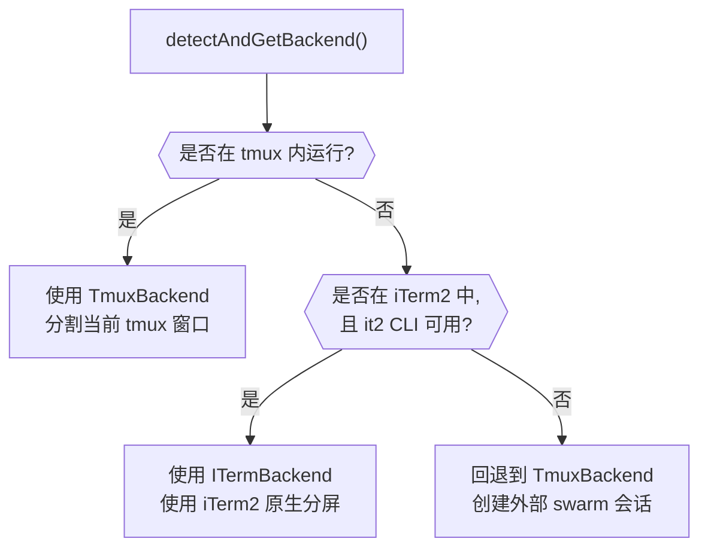

import DifficultyBadge from '@site/src/components/DifficultyBadge';
import SourceRef from '@site/src/components/SourceRef';
import ArticleComplete from '@site/src/components/ArticleComplete';

# teammateLayoutManager.ts：多 Teammate 的终端 UI 布局

<DifficultyBadge level="进阶" />

## 文件职责

`teammateLayoutManager.ts`（107 行）是一个**抽象层**，对上提供统一的布局管理 API，对下委托给后端实现（`TmuxBackend` 或 `ITermBackend`）。

这个文件的核心思想是：调用方不需要知道当前环境是 tmux 还是 iTerm2，只需调用 `createTeammatePaneInSwarmView()`、`sendCommandToPane()` 等函数，内部会自动选择合适的后端。

## 颜色分配系统

每个 Teammate 都需要一个独特的颜色，用于面板边框和文字着色，让用户能快速区分不同的 Teammate。

```typescript
// 存储颜色分配（per session，不跨会话持久化）
const teammateColorAssignments = new Map<string, AgentColorName>()
let colorIndex = 0

// 可用颜色从 agentColorManager.ts 的 AGENT_COLORS 获取：
// ['red', 'blue', 'green', 'yellow', 'purple', 'orange', 'pink', 'cyan']
```

### assignTeammateColor() — 轮询分配颜色

```typescript
export function assignTeammateColor(teammateId: string): AgentColorName {
  // 已有分配则直接返回（幂等）
  const existing = teammateColorAssignments.get(teammateId)
  if (existing) return existing

  // 轮询分配下一个颜色
  const color = AGENT_COLORS[colorIndex % AGENT_COLORS.length]!
  teammateColorAssignments.set(teammateId, color)
  colorIndex++

  return color
}
```

轮询（round-robin）分配确保：
- 前 8 个 Teammate 各有不同颜色
- 超过 8 个时循环复用
- 同一个 `teammateId` 的颜色在会话内保持不变

### clearTeammateColors() — 会话清理

```typescript
export function clearTeammateColors(): void {
  teammateColorAssignments.clear()
  colorIndex = 0
}
```

团队解散时清理，为下一次 Swarm 创建准备干净的状态。

## 后端探测与自动选择

```typescript
async function getBackend(): Promise<PaneBackend> {
  // detectAndGetBackend() 内部缓存结果，多次调用不会重复探测
  return (await detectAndGetBackend()).backend
}
```

`detectAndGetBackend()` 的探测逻辑（来自 `backends/detection.ts`）：



## 核心 API：createTeammatePaneInSwarmView()

```typescript
export async function createTeammatePaneInSwarmView(
  teammateName: string,
  teammateColor: AgentColorName,
): Promise<{ paneId: string; isFirstTeammate: boolean }> {
  const backend = await getBackend()
  return backend.createTeammatePaneInSwarmView(teammateName, teammateColor)
}
```

### tmux 环境下的布局策略

当 Leader 在 tmux 内运行时（最常见场景），新 Teammate 面板通过水平分割添加到右侧：

```
第一个 Teammate：
┌─────────────────────────────────┐
│  Leader (30%)  │ Researcher (70%) │
└─────────────────────────────────┘

第二个 Teammate（重新平衡）：
┌──────────────────────────────────────┐
│  Leader (30%)  │ Res  │ Coder (各35%) │
└──────────────────────────────────────┘
```

`isFirstTeammate` 标志用于决定是否需要先创建分割布局（Leader 占 30%），还是直接在现有的右侧区域再分割。

### 外部 tmux 会话（不在 tmux 内）

当 Leader 在普通终端运行时，`TmuxBackend` 创建一个名为 `claude-swarm` 的外部 tmux 会话：

```
外部 tmux 会话 "claude-swarm"：
┌─────────────────────────────────────┐
│ (Leader 输出镜像)  │ Teammate 1     │
│                    │                │
│                    ├─────────────── │
│                    │ Teammate 2     │
└─────────────────────────────────────┘
```

使用独立的 socket 名称（`claude-swarm-{pid}`）隔离不同 Claude 实例的 swarm 会话：

```typescript
// constants.ts
export function getSwarmSocketName(): string {
  return `claude-swarm-${process.pid}`
}
```

## sendCommandToPane() — 向面板发送命令

```typescript
export async function sendCommandToPane(
  paneId: string,
  command: string,
  useSwarmSocket = false,
): Promise<void> {
  const backend = await getBackend()
  return backend.sendCommandToPane(paneId, command, useSwarmSocket)
}
```

这个函数用于在指定的 tmux 面板中执行 shell 命令（通常是启动 Claude Teammate 的命令）：

```typescript
// 典型用法：在新面板中启动 Teammate
const claudeCmd = buildTeammateCommand({
  agentId,
  teamName,
  color: teammateColor,
  prompt,
  model,
})

await sendCommandToPane(paneId, claudeCmd)
```

## 面板边框与标题

```typescript
export async function enablePaneBorderStatus(
  windowTarget?: string,
  useSwarmSocket = false,
): Promise<void> {
  const backend = await getBackend()
  return backend.enablePaneBorderStatus(windowTarget, useSwarmSocket)
}
```

启用面板边框状态显示后，每个 Teammate 面板顶部会显示其名称和状态：

```
┌── researcher (blue) ──────────────┐
│ Analyzing source files...         │
│ > Running: Bash                   │
└───────────────────────────────────┘
```

## InProcessBackend：无 UI 的虚拟后端

在 in-process 模式下，Teammate 不创建实际的终端面板，而是通过 React/Ink 组件渲染在 Leader 的终端内。`InProcessBackend` 实现了 `PaneBackend` 接口但不做实际的 tmux 操作：

```typescript
// source/src/utils/swarm/backends/InProcessBackend.ts（概念示意）
export class InProcessBackend implements PaneBackend {
  readonly type: BackendType = 'in-process'
  readonly displayName = 'In-Process'
  readonly supportsHideShow = true

  async createTeammatePaneInSwarmView(): Promise<CreatePaneResult> {
    // 不创建实际面板，返回虚拟面板 ID
    const paneId = `in-process-${Date.now()}`
    return { paneId, isFirstTeammate: false }
  }

  async sendCommandToPane(): Promise<void> {
    // in-process 不通过命令启动，通过 spawnInProcessTeammate() 启动
  }
}
```

## Ink 组件中的 Teammate 视图

对于 in-process Teammate，UI 展示通过 React/Ink 组件（而非 tmux 面板）实现。每个 Teammate 在 Leader 的终端中有一张"卡片"：

```
 ● researcher                    🔵 [进行中]
   Analyzing 15 files in src/api/
   Tools used: 7  |  Tokens: 2.3k
─────────────────────────────────────────────
 ● coder                         🟡 [等待权限]
   Editing: src/auth/middleware.ts
   Tools used: 3  |  Tokens: 1.1k
```

每张卡片显示：
- 名称 + 颜色标识
- 当前执行状态
- 工具使用计数和 token 使用量
- 当前执行的工具名称

## tmux 颜色映射

`TmuxBackend` 中将 Claude Code 的颜色名称映射到 tmux 颜色：

```typescript
function getTmuxColorName(color: AgentColorName): string {
  const tmuxColors: Record<AgentColorName, string> = {
    red: 'red',
    blue: 'blue',
    green: 'green',
    yellow: 'yellow',
    purple: 'magenta',      // tmux 没有 purple，用 magenta
    orange: 'colour208',    // tmux 的 256 色
    pink: 'colour205',      // tmux 的 256 色
    cyan: 'cyan',
  }
  return tmuxColors[color]
}
```

## 面板创建的并发锁

多个 Teammate 同时创建时，`TmuxBackend` 使用一个 Promise 链实现顺序创建，避免面板布局混乱：

```typescript
// 顺序创建锁：链式 Promise 确保一次只创建一个面板
let paneCreationLock: Promise<void> = Promise.resolve()

function acquirePaneCreationLock(): Promise<() => void> {
  let release: () => void
  const newLock = new Promise<void>(resolve => { release = resolve })
  const previousLock = paneCreationLock
  paneCreationLock = newLock
  return previousLock.then(() => release!)
}
```

## 小结

`teammateLayoutManager.ts` 虽然短小，但承担了重要的抽象职责：

1. **颜色管理**：轮询分配，会话内稳定，支持清理
2. **后端抽象**：统一 API，自动探测并选择 tmux/iTerm2/in-process
3. **面板操作**：创建、发送命令、设置标题和颜色
4. **布局策略**：Leader 占 30%，Teammate 分享右侧空间

这种分层设计使得布局逻辑与具体终端技术解耦，未来可以轻松添加新的后端（如 VS Code 内嵌终端）。

<SourceRef file="source/src/utils/swarm/teammateLayoutManager.ts" lines="1-107" />
<SourceRef file="source/src/utils/swarm/backends/types.ts" lines="1-80" />

<ArticleComplete />
